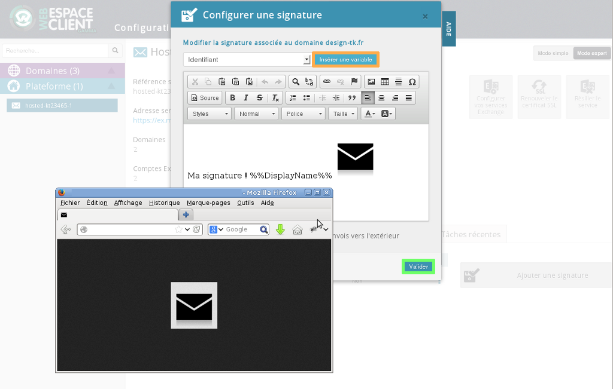

## Step 1
Crea una firma da aggiungere ai tuoi messaggi email, accedendo al tuo [Spazio Cliente](https://www.ovh.com/manager/web/login.html).

Seleziona la tua offerta Exchange 2013 in "Piattaforma".

Scegli "Firma" e "Aggiungi una firma".

Devi aver selezionato "Modalità esperto" nel tuo Spazio Cliente.

{.thumbnail}

## Step 2
Utilizza gli strumenti a tua disposizione per personalizzare e impostare la tua firma. 

Sono disponibili diverse variabili che ti consentono di personalizzare la firma generica con le coordinate dei tuoi collaboratori.

Aggiungi un'immagine o un logo, inserendo l'URL dopo aver cliccato sul pulsante "Immagine".

Per aggiungere più rapidamente un'immagine o un logo alla tua firma, trascina l'immagine nel campo della firma direttamente dal tuo browser, come indicato in figura.

{.thumbnail}

## Step 3
Ridimensiona l'immagine.

Puoi decidere di attivare la firma solo per gli invii di mail verso l'esterno (verso indirizzi non collegati al tuo dominio) selezionando questa opzione.

Clicca su "Conferma" per salvare la tua firma da associare a tutti gli indirizzi del tuo dominio.

{.thumbnail}

## Step 4
Una volta impostata, la tua firma appare nel tuo Spazio Cliente.

Puoi modificarla o eliminarla.

La tabella di sintesi ti fornisce le informazioni generali sulla tua firma.

{.thumbnail}

## Esempio di email - Step 1
Qui trovi alcune indicazioni su come aggiungere una firma alle email che invii dall'interfaccia  [Webmail Exchange 2013](https://ex.mail.ovh.net/owa/).

Accedi con il tuo indirizzo email completo e la password.

Nella sezione "Messaggistica" seleziona "Nuovo messaggio" in alto a sinistra.

Scrivi il messaggio e per aggiungere la tua firma, seleziona "Inserisci" poi "Firma".

La firma non viene visualizzata nel corpo del messaggio: è normale.

Completa l'invio cliccando su "Invia".

{.thumbnail}

## Esempio di email - Step 2
La mail è stata ricevuta correttamente, con firma annessa.

{.thumbnail}

