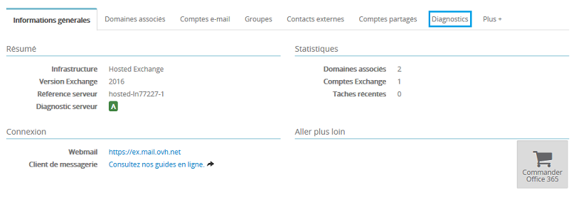
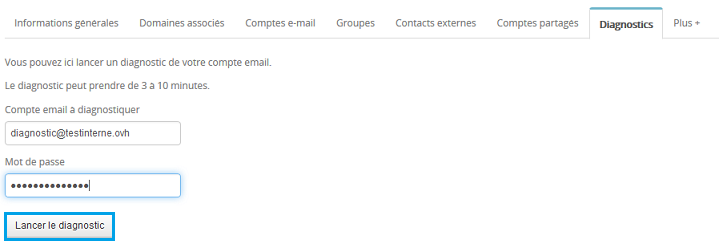

## Realizar un diagnóstico
Conéctese al [área de cliente de OVH](https://www.ovh.com/manager/web/login/).

En la columna izquierda, haga clic en «Microsoft» > «Exchange» y seleccione su servicio Exchange.

{.thumbnail}
A continuación, abra la pestaña «Diagnóstico» e introduzca la cuenta de correo Exchange que quiera diagnosticar y su contraseña.

El diagnóstico Exchange puede tardar entre 3 y 10 minutos.

{.thumbnail}
En la imagen puede ver un posible resultado de diagnóstico de una cuenta de correo Exchange.

Desde ahí puede realizar las siguientes acciones:

- «Nuevo diagnóstico»: Realizar otro diagnóstico. 
- «Crear una solicitud de asistencia»: Permite enviar un tíquet de soporte con el resultado del diagnóstico.

{.thumbnail}

## Si el diagnóstico revela errores
A continuación explicamos los detalles de cada error posible para ayudarle a resolverlos.

ATENCIÓN: La cuenta ha sido bloqueada por envío de spam

Significa que los envíos desde la cuenta están desactivados temporalmente. La recepción no se ve afectada.

Cuando la cuenta está bloqueada por spam, se indica en la pestaña «Cuentas de correo» del servicio Exchange correspondiente mediante un botón «SPAM». Haga clic sobre dicho botón para ver el email recibido tras el bloqueo.

Para desbloquear la cuenta es necesario responder a dicho email.

{.thumbnail}
ATENCIÓN: La suscripción a la cuenta ha expirado

Significa que la suscripción ya no está activa. La recepción y el envío están desactivados. Para reactivar el servicio, es necesario contactar con el soporte en el 902 106 113.
ATENCIÓN: La cuenta ha sido bloqueada por la política de seguridad

Desde su servicio Exchange puede establecer una política de seguridad que permita bloquear la cuenta durante un intervalo de tiempo determinado.

Puede configurarla para que la cuenta se bloquee al cabo de un número determinado de intentos de conexión infructuosos durante un tiempo determinado.

Si encuentra un bloqueo de este tipo, puede esperar a que transcurra el tiempo indicado y se desbloquee la cuenta, o realizar una solicitud de asistencia para contactar con nuestro soporte.
ATENCIÓN: La autenticación en el webmail no ha podido realizarse

Puede deberse a que la contraseña introducida para la realización del diagnóstico no sea correcta. En ese caso, puede realizar un nuevo diagnóstico con la contraseña correcta.

También puede actualizar la contraseña desde su servicio Exchange, en la pestaña «Cuentas de correo» y luego volver a realizar el diagnóstico. Si el problema sigue presente, puede crear una solicitud de asistencia.
ATENCIÓN: El registro MX del dominio no es válido

Este error, que aparecerá junto al error «ATENCIÓN: El mensaje de correo de prueba no se ha recibido», revela que no es posible recibir mensajes de correo.

Los servidores MX válidos para el servicio Exchange son los siguientes:

|Exchange solo|mx1.mail.ovh.net|
|---|
|Exchange solo|mx1.mail.ovh.net|
|Exchange + Correo POP/IMAP alojado en OVH|mx1.mail.ovh.net|
|Exchange + Correo POP/IMAP no alojado en OVH|ex.mail.ovh.net o ex2.mail.ovh.net|

ATENCIÓN: El registro SRV del dominio no es válido

El registro SRV es necesario para la configuración automática de la cuenta Exchange en un cliente de correo compatible como Outlook 2010, 2013 o 2016.

Puede comprobar el registro SRV en la zona DNS del dominio.

Este es el registro SRV necesario para la solución Exchange:

|Prioridad|0|
|Peso|0|
|Puerto|443|
|Destino (Hosted)|ex.mail.ovh.net o ex2.mail.ovh.net|
|Destino (Private)|nombre-de-su-host|

ATENCIÓN: El mensaje de correo de prueba no ha podido enviarse desde la cuenta

Este error indica que no es posible enviar mensajes de correo desde la cuenta.

Puede deberse a varias causas:

- La cuenta ha sido suspendida.
- La contraseña indicada no es correcta.
- La cuenta ha sido bloqueada por envío de spam.
- Incidencia en la infraestructura Exchange.

Si aparece este error, consulte las indicaciones anteriores para corregirlo o realice una solicitud de asistencia.

