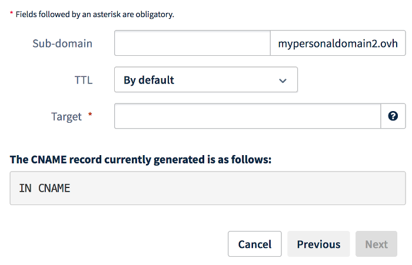

**Poslední aktualizace 09/03/2018**

## Cíl

Při přidávání domény ke službě Exchange může být zapotřebí provést úpravy CNAME záznamu v DNS zóně Vaší domény. Aby bylo potřebné úpravy možné provést, je nutné disponovat administrátorskými právy pro danou doménu.

Zjistěte, k čemu slouží CNAME záznam a jak ho přidat v rozhraní OVH

## Prerekvizity

- Přístup do [Zákaznického prostoru OVH](https://www.ovh.com/auth/?action=gotomanager){.external}.
- Administrátorská práva ke službě Exchange v [Zákaznickém prostoru OVH](https://www.ovh.com/auth/?action=gotomanager){.external}.
- Předtím, než požádáte o přidání CNAME záznamu, musíte ke své službě Exchange přidat doménu.
- Dostatečná práva pro provádění úprav v konfiguraci domény (resp. v její DNS zóně).

## Postup

### Fáze 1: seznámení s diagnostikou CNAME v rozhraní OVH

Pokud požádáte o přidání domény ke své službě Exchange, může se za určitých okolností objevit diagnostické políčko **CNAME** (Canonical Name). 

Jeho účelem je ověřit, zda skutečně disponujete administrátorskými právy k doméně, kterou ke službě Exchange přidáváte.

Diagnostické políčko se může objevit v následujících případech:

- Přidávaná doména není registrovaná u OVH
- Přidávaná doména není spravována Vaším zákaznickým identifikátorem
- Přidávaná doména není nakonfigurována na DNS servery OVH

{.thumbnail}

### Fáze 2: získání informací o konfiguraci CNAME záznamu OVH

V základním rozhraní pro správu služby Exchange přejděte do záložky `Asociované domény`{.action} a u příslušné domény rozklikněte červené políčko `CNAME`{.action}.

Následně se zobrazí dialogové okno s příslušnými informacemi o CNAME záznamu. Tyto informace si poznamenejte.

{.thumbnail}

Následující postup je rozdělen do dvou možných scénářů:

- **Pokud je Vaše doména nakonfigurována na DNS servery OVH**, můžete potřebné změny provést prostřednictvím Zákaznického prostoru OVH.

- **Pokud Vaše doména není nakonfigurována na DNS servery OVH**, musíte změny provést pomocí příslušného rozhraní pro správu domény.

> [!primary]
>
> Pokud je Vaše doména registrována u OVH, můžete její konfiguraci ověřit pomocí Zákaznického prostoru OVH. Za tímto účelem přejděte do základního rozhraní pro správu domény a vyberte záložku `DNS servery`{.action}.
>

### Fáze 3: vytvoření CNAME záznamu v rozhraní OVH

V levém postranním panelu Zákaznického prostoru vyberte sekci `Domény`{.action} a kliknutím na příslušnou doménu přejděte do základního rozhraní pro její správu. Následně přejděte do záložky `DNS zóna`{.action}.

Zobrazí se tabulka obsahující seznam DNS záznamů Vaší OVH domény (jeden DNS záznam na řádek).  

Pro přidání CNAME záznamu klikněte na tlačítko `Přidat záznam`{.action}.

{.thumbnail}

Zobrazí se nabídka DNS záznamů. Klikněte na políčko `CNAME`{.action} a do kolonky „cíl“ zadejte informace, které jste získali v předcházející fázi (rozkliknutím červeného políčka CNAME v rozhraní pro správu služby Exchange).

{.thumbnail}

Po vyplnění všech potřebných údajů klikněte na tlačítko `Další`{.action}. Zkontrolujte správnost zadaných údajů a klikněte na tlačítko `Schválit`{.action}.

> [!primary]
>
> Propagace změn v DNS zóně může trvat 4 až 24 hodin.
>

Správnost konfigurace můžete ověřit v rozhraní pro správu služby Exchange záložka `Asociované domény`{.action}. Pokud zde namísto původně červeného políčka CNAME vidíte pouze zelená políčka, Vaše doména je nakonfigurována správně. V opačném případě je možné, že prozatím nedošlo k úplné propagaci provedených změn.

{.thumbnail}

## Kam dál

Sdílejte své zkušenosti s uživatelskou komunitou na [https://community.ovh.com](https://community.ovh.com){.external}.