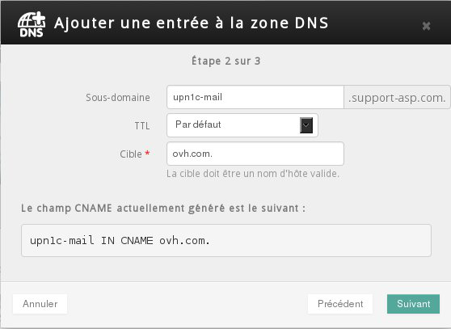

## ¿Qué indica el botón de diagnóstico CNAME?
El botón de diagnóstico CNAME (de Canonical Name) aparece en casos concretos al declarar un dominio en la plataforma Exchange.

Este botón le permite demostrar que usted es el administrador del dominio declarado.

{.thumbnail}

## ¿Por qué aparece este botón de diagnóstico?
Puede aparecer por los siguientes motivos:

- El dominio no está registrado en OVH: al declararlo seleccionó la opción «Introducir un dominio no registrado con OVH del que sea propietario».

- El dominio está registrado con OVH y apunta a los servidores DNS de OVG, pero no está administrado por el mismo identificador de cliente (NIC) que el servicio Exchange.

- El dominio está registrado en OVH pero no apunta a los servidores DNS de OVH.

{.thumbnail}

## ¿Cómo crear el registro CNAME?
Para empezar, haga clic en el botón de diagnóstico CNAME para obtener la información necesaria para crear el registro CNAME.

{.thumbnail}

## Si el dominio no está registrado con OVH:
Cree el registro CNAME en su actual proveedor de DNS.

OVH pone a su disposición dos herramientas con las que podrá conocer cuál es el proveedor de DNS: [Dig](https://www.ovh.es/soporte/herramientas/dig_domain.pl) y [Whois](https://www.ovh.es/soporte/herramientas/check_whois.pl).

También es posible que los servidores DNS utilizados sean los de OVH, en cuyo caso deberá añadir el registro CNAME desde el [área de cliente web](https://www.ovh.com/manager/web/login.html). 

Más adelante se explica cómo.

## Si el dominio está registrado con OVH y apunta a los servidores DNS de OVH pero no está administrado por el mismo identificador de cliente (NIC) que el servicio Exchange:
Cree el registro CNAME desde el [área de cliente web](https://www.ovh.com/manager/web/login.html), conectándose con el identificador del administrador del dominio.

Seleccione el dominio correspondiente, abra la pestaña «Zona DNS» y haga clic en «Añadir un registro».

{.thumbnail}

## Cómo añadir el registro CNAME en la zona DNS
Cree el registro CNAME con la información obtenida anteriormente y finalice la creación del registro.

En este caso, el cambio se aplicará enseguida: alrededor de una hora debería ser suficiente.

{.thumbnail}

## Si el dominio está registrado con OVH pero no apunta a los servidores DNS de OVH:
En este caso también deberá determinar a qué servidores DNS apunta el dominio y crear el registro CNAME en su proveedor. 

Para ello puede utilizar las herramientas que OVH pone a su disposición: [Dig](https://www.ovh.es/soporte/herramientas/dig_domain.pl) y [Whois](https://www.ovh.es/soporte/herramientas/check_whois.pl).

## Dig:
En el ejemplo de la imagen, los servidores DNS utilizados son:

DNS108.ovh.net
NS108.ovh.net

{.thumbnail}

## Whois:
En el ejemplo de la imagen, los servidores DNS utilizados son:

DNS108.ovh.net
NS108.ovh.net

{.thumbnail}

## ¿Cómo saber si el registro CNAME se ha añadido correctamente?
La creación de un registro CNAME está sujeta a la propagación DNS, por lo que puede tardar de 4 a 24 horas. No obstante, las operaciones en este tipo de registro suelen aplicarse muy rápidamente. Así podrá seguir configurando su plataforma Exchange.

Si recarga la página de su área de cliente, el botón de diagnóstico CNAME debe haber desaparecido y habrán aparecido los botones de diagnóstico MX y SRV.

{.thumbnail}

