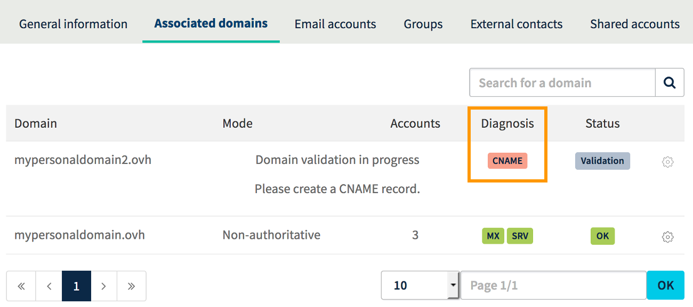
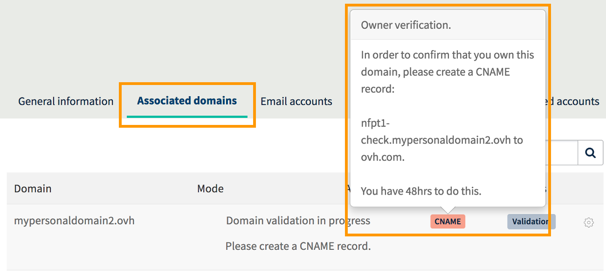

**Päivitetty 8.1.2018**

## Tavoite

Kun lisäät Exchange-palveluusi verkkotunnuksen, CNAME-kentän (DNS) konfigurointia saatetaan vaatia. Tämän tarkoituksena on varmistua, että kyseessä olevan verkkotunnuksen lisäys on oikeutettua.

**Opi, miksi CNAME-kentän lisäystä saatetaan vaatia ja kuinka se lisätään OVH:lla.**

## Edellytykset

- Olet kirjautunut [hallintapaneeliin](https://www.ovh.com/auth/?action=gotomanager){.external}
- Sinulla on valtuudet hallinnoida Exchange-palvelua [hallintapaneelistasi](https://www.ovh.com/auth/?action=gotomanager){.external}
- Olet lisännyt verkkotunnuksen Exchange-palveluun, joka pyytää CNAME-kentän lisäystä
- Voit muokata verkkotunnuksesi konfiguraatiota (DNS-aluetta)

## Käytännössä

### 1. vaihe: OVH:n CNAME-diagnostiikka

Diagnostiikkapyörylä **CNAME** (Canonical Name) ilmestyy tietyissä erikoistapauksissa ilmoitettaessa verkkotunnusta Exchange-palveluusi.

Sen tarkoitus on todistaa, että olet ilmoittamasi verkkotunnuksen administraattori.

Tämä diagnostiikka voi ilmestyä seuraavissa tapauksissa:

- ilmoitettua verkkotunnusta ei ole rekisteröity OVH:lle.
- asiakastunnuksesi ei hallinnoi ilmoitettua verkkotunnusta.
- ilmoitettu verkkotunnus ei käytä OVH:n konfiguraatiota (nimipalvelimia).

{.thumbnail}

### 2. vaihe: OVH:n CNAME-konfiguraation hakeminen

Siirry välilehdelle `Liitetyt verkkotunnukset`{.action} ja klikkaa punaista `CNAME`{.action}-pyörylää tarvittavien tietojen hakemiseksi.

CNAME-kenttä tulee näkyviin.

{.thumbnail}

Nyt on olemassa kaksi vaihtoehtoa:

- **verkkotunnuksesi käyttää OVH:n konfiguraatiota**: voit suorittaa alla kuvatun menettelyn hallintapaneelissa.

- **verkkotunnuksesi ei käytä OVH:n konfiguraatiota**: sinun on tehtävä muokkaukset käyttöliittymässä, jossa voit hallita verkkotunnuksesi konfiguraatiota.

> [!primary]
>
> Jos verkkotunnuksesi on OVH:n ylläpitämä, voit tarkistaa käyttääkö se konfiguraatiotamme hallintapaneelisi `Nimipalvelimet`{.action}-välilehdeltä kyseessä olevan verkkotunnuksen kohdalta.
>

### 3. vaihe: CNAME-kentän luominen OVH:n konfiguraatiossa

Klikkaa kohtaa `Verkkotunnukset`{.action} valikossa hallintapaneelin vasemmassa reunassa ja tämän jälkeen kyseessä olevaa verkkotunnusta. Valitse sitten välilehti `DNS-alue`{.action}.

Näkyviin pitäisi tulla taulukko. Siinä on näkyvissä verkkotunnuksesi konfiguraatio OVH:lla. Se koostuu useista DNS-tietueista, joita kutakin symboloi yksi taulukon rivi.

Klikkaa CNAME-kentän lisäämiseksi painiketta `Lisää tietue`{.action}.

{.thumbnail}

Näkyviin tulevassa ikkunassa tarjotaan useita DNS-kenttiä. Klikkaa kohtaa `CNAME`{.action} ja täytä sitten kentät Exchange-diagnostiikasta saaduilla tiedoilla.

{.thumbnail}

Kun tiedot on annettu, klikkaa painiketta `Seuraava`{.action}. Varmista, että näytetyt tiedot ovat oikein, klikkaa sitten `Vahvista`{.action}.

> [!primary]
>
> Muokkaus tarvitsee 4 - 24 tunnin propagaatioajan ennen kuin muutos on astunut täysin voimaan.
>

Tarkistaaksesi, että verkkotunnus on konfiguroitu oikein, mene uudelleen Exchange-palvelusi taulukkoon `Liitetyt verkkotunnukset`{.action}. Jos pyörylä on vihreä, verkkotunnus on konfiguroitu oikein. Mikäli näin ei ole, on mahdollista, että propagaatio ei ole vielä päättynyt.

{.thumbnail}

## Lue lisää aiheesta

Viesti käyttäjäyhteisömme kanssa osoitteessa [https://ovh-hosting.fi/community/foorumi](https://ovh-hosting.fi/community/foorumi){.external}.