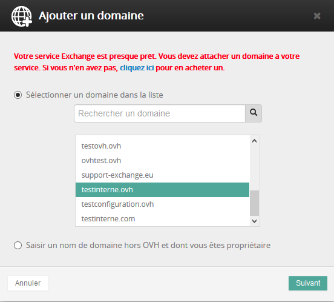
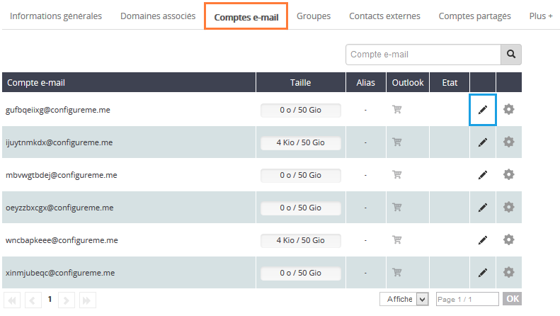
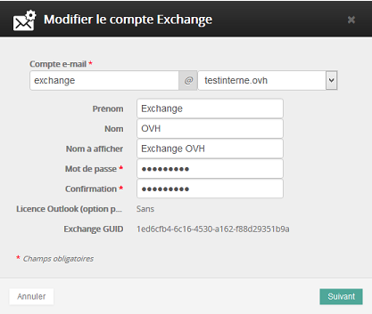

## Mise en place

### Étape 1 &#58; Acces au service

> [!success]
>
> Si vous venez de réaliser le paiement de votre offre Dedicated Exchange, il est nécessaire de suivre le guide suivant <legacy:2074> avant de pouvoir réaliser les différentes actions ci-dessous.
> 

Rendez-vous sur l'espace client via ce lien : [Espace client OVH](https://www.ovh.com/manager/web/login.html){.external}

Une fois connecté, vous avez accès à cette interface :

** Dans notre cas, il s'agit d'une offre Dedicated*

Dans la colonne de gauche, dans plateforme, sélectionnez l'offre Dedicated.

Voici les différentes fonctionnalités directement accessibles :

- Informations Générales
- Domaines associés
- Comptes e-mail
- Groupes : {.ref}
- Contacts externes
- Comptes partagés

Depuis l'onglet "Plus+" :

- Ressources : {.ref}
- Pied de page : {.ref}
- Tâches récentes
- Gestion de la politique de sécurité

{.thumbnail}

### Étape 2 &#58; Ajout du domaine.
Lors de la sélection de votre plateforme Exchange, une pop-up s'ouvre de manière automatique afin de lier votre domaine à votre service Exchange.

Sélectionnez le domaine dans la liste, si celui-ci est enregistré chez OVH.

Si le domaine est déposé ailleurs, ou s'il s'agit d'un sous-domaine, vous pouvez le renseigner manuellement.

**ATTENTION** Si vous ne possédez pas de domaine, un lien dans le pop-up vous permettra de réaliser la commande d'un nom de domaine.

Pour la configuration d'un domaine externe (non hébergé par OVH), il vous est demandé, dans l'espace client, l'ajout d'un champ de type CNAME sur un sous-domaine de votre domaine.

{.ref}

Sélectionnez "Suivant" pour accéder à l'étape suivante.

{.thumbnail}

### Étape 3 &#58; Configuration du domaine.
Lors de cette étape, 2 actions vous seront proposées :

- Avec les DNS OVH :

Cochez "Configurer automatiquement le SRV" si le  **domaine est géré sur le même identifiant OVH que votre plateforme Exchange** .

*Le champ SRV sert à configurer automatiquement votre logiciel de messagerie. Obligatoire avec outlook 2016*

Cochez l'option "Configurer automatiquement les MX". Cette action est nécessaire pour recevoir vos e-mails via votre service Exchange, et impliquera une modification automatique de vos serveurs mails.

- Si vous ne souhaitez pas modifier vos serveurs de réception : laissez cette option décochée, vous pourrez depuis l'onglet "Domaines associés" cliquer sur le diagnostic MX en rouge et valider la modification.

{.thumbnail}

- Sans les DNS OVH :

vous devrez  **configurer manuellement le champ SRV**  sur votre domaine :

Le SRV se compose d'un sous-domaine :  **_autodiscover._tcp.votre-domaine.com.**

- Vous devrez indiquer les informations ci-dessous :

|---|---|
|---|---|
|La priorité|0|
|Le poids|0|
|Le port|443|
|La cible offre Dedicated|Votre-nom-d-hôte.|

Concernant les serveurs de réception (MX), il faudra manuellement les modifier depuis la zone DNS de votre domaine :

|---|---|---|
|---|---|---|
|Offre Dedicated sans antispam|mode non autoritatif + e-mail pop/imap non hébergés par OVH|Votre-nom-d-hôte|

|---|---|---|---|---|
|---|---|---|---|---|
|Offre Dedicated avec antispam (mode autoritatif ou non autoritatif avec e-mail pop/imap hébergés par OVH)|mx0.mail.ovh.net|mx1.mail.ovh.net|mx2.mail.ovh.net|mx3.mail.ovh.net|

Si vous avez coché la configuration automatique des MX (nécessaire pour la réception des e-mails) et que vous devez passer en mode non autoritatif (compatibilité avec un service e-mail pop/imap non hébergé par OVH) :

- cliquez sur le diagnostic MX en rouge (depuis la section "domaines associés") puis choisissez le serveur de réception : Votre-nom-d-hôte.

"Suivant" puis "Valider" pour finaliser l'opération.

### Étape 4 &#58; Configuration des comptes.
Sélectionnez ensuite l'onglet "Compte e-mail". Les comptes se présentent sous la forme suivante : [gufbqeiixg@configureme.me](mailto:gufbqeiixg@configureme.me){.external}.

Pour le(s) configurer il faut cliquez sur le stylo noir à droite du compte.

*Si vous supprimez l'un de vos comptes e-mail, il réapparaîtra après quelques minutes sous la forme d'un compte vierge. Celui-ci, est toujours soumis à facturation.* *Pour supprimer définitivement ce compte* :

- Rendez-vous dans l'onglet "Mode de facturation"
- Cochez "Aucun" et "valider"

{.thumbnail}

Voici l'interface disponible via le bouton "Configuration" :

**Mot de passe**

Les mots de passe doivent respecter les exigences minimales suivantes :

- Ne pas contenir tout ou partie du nom du compte de l'utilisateur
- Avoir une longueur d'au moins 8 caractères
- Contenir des caractères de trois des quatre catégories suivantes :
Caractères majuscules de l'alphabet (A à Z) Caractères minuscules de l'alphabet (a à z) Chiffres de la base 10 (0 à 9) Caractères non alphabétiques (par exemple: !, $, #, %)

{.thumbnail}

### Finalisation
Votre service Dedicated Exchange est à présent configuré !

*Il vous est possible de consulter vos e-mails via l'owa* :

Pour aller plus loin, consultez nos différents [Guides Exchange](https://www.ovh.com/fr/emails/hosted-exchange/guides/){.external} et retrouvez notre [FAQ en ligne](https://www.ovh.com/fr/emails/hosted-exchange-2013/faq/){.external}.