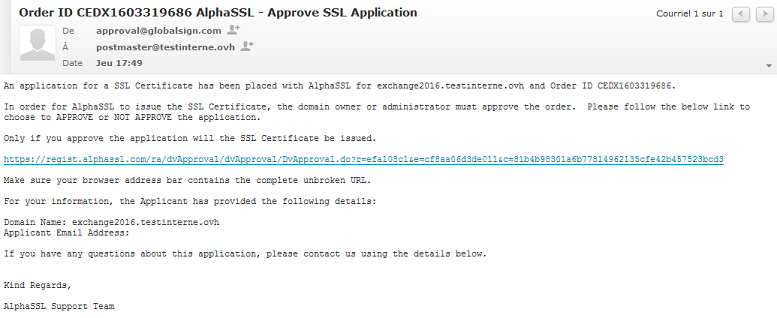

## Schritt 1: Empfang der Konfigurations-E-Mail für Ihren Server
Wenn Sie Ihren Bestellschein bezahlt haben, erhalten Sie eine E-Mail zur Installation Ihres "Private" Servers.
Diese E-Mail wird an die in Ihrem Kundencenter hinterlegte E-Mail-Adresse gesendet. Sie können sie auch direkt über das Kundencenter abrufen.
Wenn Sie diese E-Mail aus Ihrem Kundencenter abrufen möchten:


- Klicken Sie auf Ihre Kennung (rechts oben, in der Form ab12345-ovh) und anschließend auf "Mein Account"


{.thumbnail}

- Empfangene E-Mails


{.thumbnail}
Hier finden Sie die Nachricht, die Ihnen zur Konfiguration Ihres Private Exchange Servers zugeschickt wurde:


- Betreff der Nachricht:

"Ihre Dienstleistung Private Exchange 2016v1 wird bereitgestellt!"


{.thumbnail}
Inhalt dieser Nachricht:


```
Guten Tag,

Ihr E-Mail-Service Private Exchange #VERSION# wird bereitgestellt.

Nur wenige Schritte trennen Sie noch von der Nutzung Ihres Private Exchange 2016v1 Servers:

- Personalisierung Ihres Webmail-Zugangslinks (dediziertes SSL-Zertifikat)
- Kontakt-E-Mail-Adresse für die Validierung Ihres Zertifkats angeben (Achtung: Diese Adresse muss bereits existieren und Sie müssen Zugriff darauf haben)

Klicken Sie hierfür bitte auf folgenden Link:

https://www.ovh.de/emails/bestellung/?offer=private#/identification

Loggen Sie sich mit Ihrem NicHandle (in der Form ab12345-ovh) und dem zugehörigen Passwort ein.

ACHTUNG: Wenn Sie diese beiden Schritte erledigt haben, bleibt noch ein Schritt: gewünschte Subdomain der IP Ihres Servers zuweisen (diese wird Ihnen in einer zweiten E-Mail mitgeteilt).

Falls Sie noch Hilfe brauchen, finden Sie hier alle Guides zum Thema Exchange:
https://www.ovh.de/emails/hosted-exchange/anleitungen/
```


## Schritt 2: Automatische Konfiguration der DNS Zone
Klicken Sie auf den Link in der eingegangenen E-Mail. Sie werden dann auf die Konfigurationsseite Ihres Servers geleitet.

{.thumbnail}

- "Name Ihres Servers": Sie müssen den Namen Ihres Servers oder auch den Zugangslink zu Webmail angeben. Hier stehen verschiedene Möglichkeiten zur Auswahl.


Beispiel:


- mail
- exchange
- exchange2016


Wenn Sie die Subdomain ausgewählt haben, müssen Sie eine gültige Domain angeben. Der Zugang zu Webmail (owa) ist zum Beispiel: exchange2016.ihredomain.de
Anschließend müssen Sie eine E-Mail-Adresse angeben, an die die Validierungsmail für Ihr SSL-Zertifikat gesendet werden soll. Es muss sich dabei um eine gültige E-Mail-Adresse handeln. Andernfalls können Sie Ihr SSL-Zertifikat nicht validieren.

Die Liste der Vorschläge umfasst generische E-Mail-Adressen wie etwa:


- postmaster@ihredomain.de
- administrator@ihredomain.de
- admin@ihredomain.de


Wenn Ihre Domain von OVH gehostet wird und Sie nicht über diesen Messaging-Service verfügen, können Sie von Ihrem Kundencenter aus eine Weiterleitung (Alias) von einer adresse@ihredomain auf eine existierende Adresse einrichten.
Die Option DNS Assist: Diese Option ermöglicht Ihnen die automatische Konfiguration Ihrer DNS Zone (Erstellung des Eintrags ipv4 (A) entsprechend der gewünschten Subdomain).
Damit Sie diese Option nutzen können, muss Ihre Domain über dieselbe Kundenkennung verwaltet werden, über die die Bestellung Ihres Private Servers abgewickelt wurde. Andernfalls muss die Konfiguration der DNS Zone manuell vorgenommen werden.
In unserem Beispiel wurde die Option DNS Assist aktiviert. Sie können die Konfiguration anschließend bestätigen. Wenn Sie die Option DNS Assist verwenden, können Sie den folgenden Schritt 3 überspringen.


## Schritt 3: Manuelle Konfiguration der DNS Zone
Wenn Ihre Domain nicht über dieselbe Kundenkennung verwaltet oder nicht bei OVH gehostet wird, erhalten Sie eine zweite E-Mail mit den für die Konfiguration Ihrer DNS Zone nötigen Informationen.

Inhalt dieser Nachricht:


```
Betreff: [OVH Info] Ihr Exchange Server ist fast einsatzbereit!

Guten Tag,

um das SSL Zertifikat für Ihren Server bestellen zu können, ist es notwendig, dessen Adresse in Ihrer DNS Zone einzutragen.

Die von Ihnen gewählte Adresse ist: exchange2016.testinterne.ovh
Die IP-Adresse Ihres Servers ist: 149.202.xxx.103

Bitte erstellen Sie in der DNS Zone Ihrer Domain einen A Eintrag (A Record) für diese IP-Adresse.
```


Hierfür müssen Sie einen Eintrag des Typs A erstellen:


- exchange2016.testinterne.ovh A 149.202.xxx.103


## Schritt 4: Validierung Ihres SSL-Zertifikats
Wenn Ihre DNS Zone (automatisch oder manuell) konfiguriert wurde, erhalten Sie eine Validierungs-E-Mail an die bei der Personalisierung Ihres Webmail-Zugangs ausgewählte Adresse.
Es kann bis zu vier Stunden dauern, bis diese E-Mail bei Ihnen eingeht.
Inhalt der Nachricht:

{.thumbnail}
Klicken Sie auf den  Link , um Ihr SSL-Zertifikat zu validieren.
Sie werden nun auf das Interface von Global Sign umgeleitet, wo Sie Ihr SSL-Zertifikat validieren können. Klicken Sie hierfür auf "I APPROVE".

{.thumbnail}


## Fertigstellung
Wenn Ihr SSL-Zertifikat validiert wurde, kann es noch bis zu vier Stunden dauern, bis Ihr Service bereitgestellt wird. Während dieser Zeit wird Ihr Private Exchange Server noch nicht in Ihrem Kundencenter angezeigt.

Wenn Ihr Server verfügbar ist, erhalten Sie eine Bestätigungs-E-Mail. Diese finden Sie auch in Ihrem Kundencenter.

Betreff dieser E-Mail: [OVH Info] Ihre Private Exchange 2016 Dienstleistung ist bereit!

Wenn Sie Ihren E-Mail-Dienst konfigurieren möchten, hilft Ihnen unsere Anleitung zum Thema[Konfiguration der Dienstleistung](https://www.ovh.de/g1311.configuration-service).

