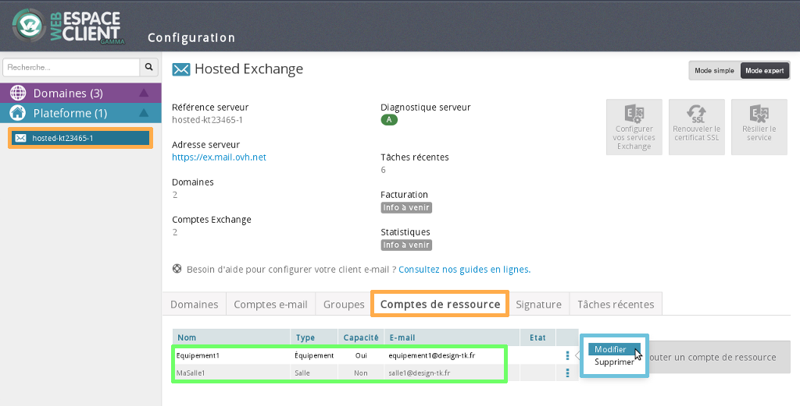

## Creazione della risorsa: step 1
Per creare la risorsa, accedi al tuo [Spazio Cliente](https://www.ovh.com/manager/web/login.html).

Seleziona la tua offerta Exchange 2013 in "Piattaforma".

Entra in "Account di risorsa" poi "Aggiungi un account di risorsa".

Devi aver selezionato "Modalità esperto" a destra, nel tuo Spazio Cliente.

{.thumbnail}

## Creazione della risorsa: step 2
Compila i campi che seguono.

Nome della risorsa:  indica il nome della risorsa che vuoi che venga visualizzato.

Email della risorsa:  scegli l'indirizzo email della risorsa. Non può essere un indirizzo email esistente.

Capacità:  indica, a titolo informativo, la dimensione della tua risorsa.

Permettere i conflitti:  se selezioni questa casella, quando un utente cerca di prenotare una sala o uno strumento già in utilizzo, i messaggi di avvertimento non vengono visualizzati.

Tipo di risorsa:  sono disponibili account "Sala" o "Strumenti".

Clicca su "Avanti" per passare al secondo step e poi finalizza l'operazione cliccando su "Crea".

{.thumbnail}

## Creazione della risorsa: step 3
Dopo aver creato le risorse, puoi modificarle o eliminarle.

Nella tabella di sintesi trovi il nome, il tipo (sala o strumenti), la capacità e l'indirizzo email della tua risorsa.

Proseguiamo nella descrizione dell'utilizzo degli account, dopo averli attivati.

{.thumbnail}

## Calendario di una risorsa: step 1
Per visualizzare il calendario di una risorsa utilizzando OWA, accedi alla [Webmail Exchange 2013](https://ex.mail.ovh.net/owa/), utilizzando il tuo indirizzo email completo e la password del tuo account email.

Seleziona "Calendario", clicca con il tasto destro su "ALTRI CALENDARI" e scegli "Apri il calendario".

{.thumbnail}

## Calendario di una risorsa: step 2
Inserisci il nome della tua risorsa. Il server Exchange 2013 la recupera automaticamente nella GAL (Global Address List).

Seleziona "Apri" per finalizzare l'operazione.

{.thumbnail}

## Calendario di una risorsa: step 3
I calendari delle risorse vengono visualizzati nell'interfaccia OWA.

In alto a sinistra trovi il pulsante "Nuovo Evento", che puoi selezionare per creare un evento per i tuoi collaboratori.

{.thumbnail}

## Gestione di una risorsa: step 1
Creiamo un evento utilizzando le risorse create in precedenza.

Nella sezione "Calendario", seleziona "nuovo evento".

Nell'interfaccia visualizzata, compila i campi che seguono.

Evento:  il nome che vuoi dare al tuo evento.

Location:  puoi aggiungere la tua risorsa di tipo "Sala" a questo livello.

Partecipanti:  aggiungi i tuoi collaboratori e le risorse di tipo "Strumenti".

Avvio:  inserisci la data di inizio del tuo evento.

Durata:  indica la durata del tuo evento.

Appari come:  inserisci lo status che vuoi che appaia sul calendario.

Promemoria:  definisci il momento in cui viene inviato un promemoria.

Ripeti:  inserisci la periodicità del tuo evento.

Seleziona "Invia" per concludere l'aggiunta dell'evento.

{.thumbnail}

## Gestione di una risorsa: step 2
L'evento "Riunione" è stato accettato dalla risorsa "MiaSala1" di tipo Sala e la risorsa "Strumenti1" di tipo Strumenti.

È stata richiesta una risposta via mail e ora hai ricevuto le notifiche di accettazione o di rifiuto dell'evento.

{.thumbnail}

## Gestione di una risorsa: step 3
Visualizza lo status delle risorse, dall'interfaccia del calendario.

Visualizza l'evento che hai aggiunto e lo status delle risorse che ora risulta "Occupato".

{.thumbnail}

## Gestione di una risorsa: step 4
Aggiungi un nuovo evento nella stessa data del precedente.

Nello stesso modo ricevi le notifiche di accettazione o rifiuto dell'evento.

Per il secondo evento "Discorso", la risorsa "MiaSala1" rifiuta l'avvenimento a causa di un conflitto. 
È già previsto un avvenimento in questa data e, non avendo autorizzato i conflitti su questa risorsa, rifiuta la richiesta di creazione dell'evento.

La risorsa "Strumenti1" ha accettato l'evento. 
Per questa data è già previsto un evento, ma la gestione dei conflitti è stata disattivata su questa risorsa, quindi è stato accettato.

{.thumbnail}

