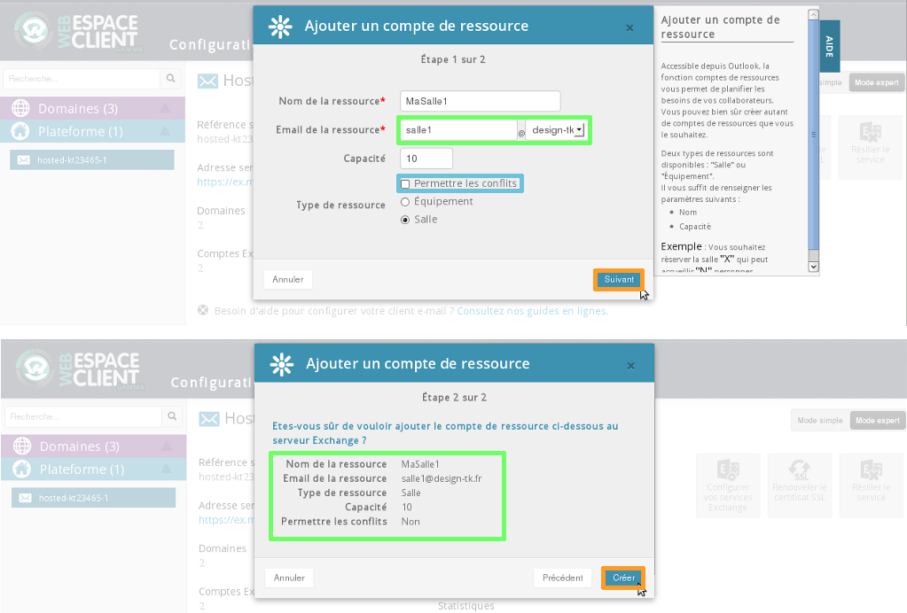

## Resurso kūrimas: 1 dalis
Resursų kūrimas atliekamas [kliento sąsajoje](https://www.ovh.com/manager/web/login.html).

Prisijungę, skyriuje Platformos, pasirinkite Exchange.

Spragtelėkite Resursų paskyros, po to Pridėti resursų paskyrą.

Kliento sąsajos dešinėje pusėje pasirinkite Eksperto režimas.

{.thumbnail}

## Resurso kūrimas 2 dalis
Užpildykite laukus:

Resurso pavadinimas: įveskite resurso pavadinimą.

Resurso el. paštas: nurodykite resurso el. paštą. Tai negali būti egzistuojantis el. pašto adresas.

Talpa: informaciniais tikslais nurodykite resurso talpą.

Leisti konfliktus: jeigu laukelis pažymėtas, vartotojui, bandančiam rezervuoti resursą, kuris jau rezervuotas nebus rodomas įspėjimas.

Resurso tipas: galimi du resursų tipai: Salė ir Įranga.

Spragtelėkite Toliau, kad pereitumėte prie kito etapo ir užbaikite operaciją spragtelėję Sukurti.

{.thumbnail}

## Resurso kūrimas 3 dalis
Kai resursas sukurtas, jį galima redaguoti ar ištrinti.

Suvestinėje matysite resurso pavadinimą, tipą (įranga ar salė), talpą ir resurso adresą.

Resursų paskyros bus aktyvios, toliau šiame gide pateikiamas jų naudojimas.

{.thumbnail}

## Resursų kalendorius 1 dalis
Resursų kalendoriaus peržiūra per OWA:

Prisijunkite prie [Exchange Webmail](https://ex.mail.ovh.net/owa/).

Prisijungimui naudokite savo el. pašto adresą ir slaptažodį.

Spragtelėkite Kalendoriai, po to dešiniuoju klavišu spragtelėkite Kiti kalendoriai ir Atidaryti kalendorių.

{.thumbnail}

## Resursų kalendorius 2 dalis
Įveskite resurso pavadinimą. Exchange 2013 serveris automatiškai patikrins GAS (globalų adresų sąrašą).

Po to spragtelėkite Atidaryti.

{.thumbnail}

## Resursų kalendorius 3 dalis
Sukurti resursų kalendoriai bus matomi OWA sąsajoje.

Jie atveriami kairiajame viršutiniame kampe spragtelėjus Naujas įvykis. Galėsite pasirinkti arba sukurti naują įvykį.

{.thumbnail}

## Resurso valdymas 1 dalis
Iš pradžių sukursime įvykį, kuriame bus naudojamas anksčiau sukurtas resursas.

Tai atliekama skyriuje Kalendoriai, po to spragtelėkite Naujas įvykis.

Matysite tokį langą.

Užpildykite reikiamus laukus:

Įvykis: įvykio pavadinimas.

Vieta: čia galima pridėti Salės tipo resursą.

Dalyviai: čia nurodomi bendradarbiai ir Įrangos tipo resursai.

Pradžia: įvykio pradžia.

Trukmė: šiame lauke nurodykite įvykio trukmę.

Rodyti kaip: būsena, kuri bus matoma kalendoriuje.

Priminimas: nurodykite, ar priminti apie įvykį.

Kartoti: įvykio periodiškumas.

Po to spragtelėkite Siųsti, kad užbaigtumėte skirsnio kūrimą.

{.thumbnail}

## Resurso valdymas: 2 dalis
Įvykis Susirinkimas (réunion) vyks MaSalle1 vietoje (Salės tipo resursas), bus naudojama Equipement1 įranga (Įrangos tipo resursas).

Taip pat įjungtas patvirtinimas el. paštu, todėl būsite informuoti, ar jūsų prašymas bus patvirtintas, ar atmestas.

{.thumbnail}

## Resurso valdymas: 3 dalis
Kalendoriuje galite matyti resurso būseną.

Matome, kad atėjus sukurtam įvykiui resurso būsena yra Užimta.

{.thumbnail}

## Resurso valdymas: 4 dalis
Sukursime naują įvykį, kuris vyks tuo pačiu metu, kaip prieš tai sukurtas.

Tokiu pat būdu būsime informuojami apie prašymo patvirtinimą ar atmetimą.

Antrojo įvykio (discours) resursas MaSalle1 buvo atmestas dėl konflikto. Numatytu laiku jau užregistruotas įvykis ir konfliktai neleidžiami, todėl prašymas atmestas.

Resursas Equipement1 buvo patvirtintas. Nors šis resursas rezervuotas tam pačiam laikui, konfliktų draudimas yra išjungtas, todėl resursas buvo patvirtintas.

{.thumbnail}

