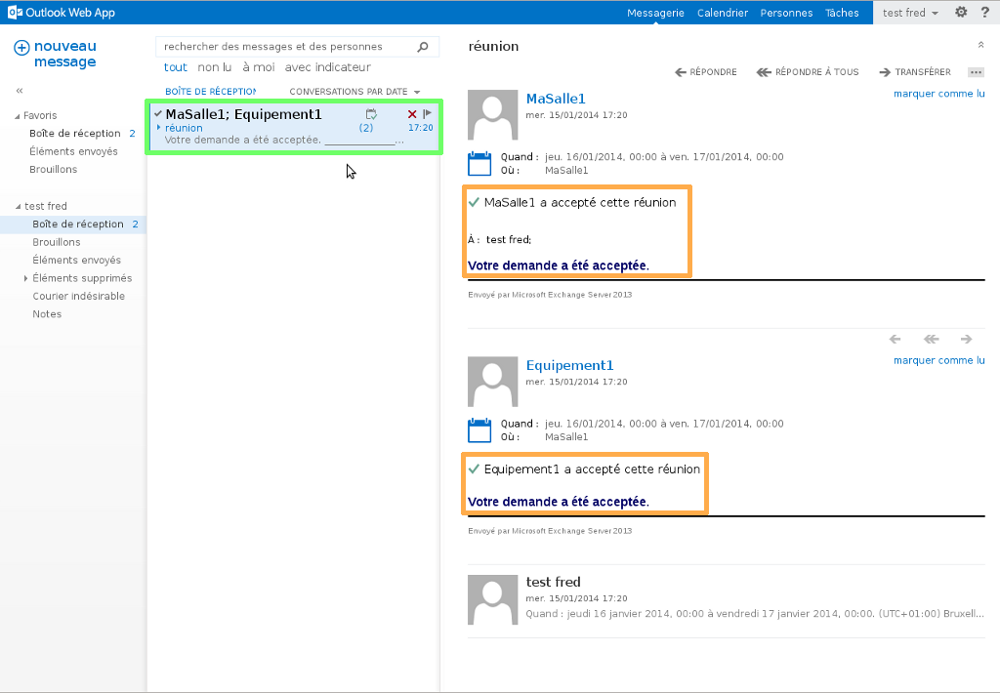

## Criação dos recursos Parte 1
Para que possa criar os seus recursos ligue-se ao seu [Espaço de cliente](https://www.ovh.com/manager/web/login.html).

Selecione a sua oferta Exchange em "Plataforma".

Escolha o separador "Contas de recursos" e depois "Adicionar uma conta de recurso".

Deve selecionar "Modo expert" à direita no seu Espaço de Cliente.

{.thumbnail}

## Criação dos recursos Parte 2
Introduza os campos pedidos:

Nome do recurso:  indique o nome que deseja para o recurso.

E-mail do recurso:  escolha o endereço de e-mail do recurso. Não deve ser um endereço de e-mail existente.

Capacidade: a título informativo, indique o tamanho do seu recurso.

Permitir conflitos:  se esta opção estiver ativada não será enviada nenhuma mensagem de alerta quando um utilizador tentar reservar uma sala ou equipamento que já tem uma reserva.

Tipo de recurso:  estão disponíveis dois tipos de recurso: "Sala" ou "Equipamento".

Clique em "Seguinte" para aceder à etapa 2 e finalize a operação ao clicar em "Criar".

{.thumbnail}

## Criação dos recursos Parte 3
Uma vez criados os recursos, é possível que os modifique ou elimine-os.

Uma tabela resumo irá mostrar-lhe as informações do nome dos recursos, o seu tipo (equipamento ou sala), a sua capacidade ou ainda o e-mail do seu recurso.

As contas de recurso estão ativas, e neste guia iremos mostrar-lhe como pode utilizá-las.

{.thumbnail}

## Calendário de um recurso Parte 1
Veja como visualizar o calendário de um recurso via OWA.

Aceda ao [Webmail Exchange](https://ex.mail.ovh.net/owa/).

Identifique-se com o seu endereço de e-mail completo e a respetiva password.

Selecione de seguida o separador "Calendário", e faça um clique direito em "OUTROS CALENDÁRIOS" e depois selecione "Abrir o calendário".

{.thumbnail}

## Calendário de um recurso Parte 2
Introduza o nome do seu recurso. O servidor Exchange obtém o recurso automaticamente pois faz parte do GAL (Global address list).

Selecione "Abrir" para terminar a operação.

{.thumbnail}

## Calendário de um recurso Parte 3
Os calendários dos recursos criados são visíveis na interface OWA.

À direita terá um botão "novo evento". Terá então a possibilidade de o selecionar para criar um novo evento para os seus colaboradores.

{.thumbnail}

## Gestão de um recurso Parte 1
Num primeiro tempos vamos criar um evento utilizando um dos nossos recursos que previamente criámos

Para tal, na parte "Calendário", selecione "novo evento".

A inteface aparece como em baixo.

Introduza os campos pedidos:

Evento:  o nome desejado para o seu evento

Emplacement :  vous pouvez à présent ajouter votre ressource de type "Salle" à ce niveau.

Participantes:  adicione aqui os colaboradores e os recursos do tipo "equipamento".

Início:  indique aqui a hora de início do seu evento.

Duração:  pode escolher aqui a duração do seu evento.

Mostrar como:  define o estado que aparece nos calendários.

Lembrete:  define quando o lembrete do evento é enviado.

Repetir:  define a periodicidade do seu evento.

Selecione "Enviar" para finalizar a adição do seu evento.

{.thumbnail}

## Gestão de um recurso Parte 2
O evento "reunião" foi aceite pelo recurso "AMinhaSala1" do tipo sala, e o recurso "Equipamento1" do tipo equipamento.

O pedido de resposta por e-mail foi pedido, será notificado da validação ou da não validação do seu pedido.

{.thumbnail}

## Gestão de um recurso Parte 3
A partir da interface do calendário é possível consultar o estado dos recursos.

Podemos ver que após o evento ter sido adicionado, o estado dos recursos estão atualmente como "Ocupados".

{.thumbnail}

## Gestão de um recurso Parte 4
Adicionamos um novo evento com a mesma data que o anterior.

Da mesma forma, somos notificados da validação ou da recusa do pedido.

Para o segundo evento "discurso" do recurso "AMinhaSala1" foi recurso devido a conflitos.
Um evento já se encontra previsto para essa data e não estão autorizados conflitos para esse recurso, e como tal, o evento é recusado.

O recurso "Equipamento1" aceitou o evento.
Um evento já se encontra previsto para essa data mas a gestão de conflitos está desativa para este recurso, e como tal, o seu pedido foi aceite.

{.thumbnail}

