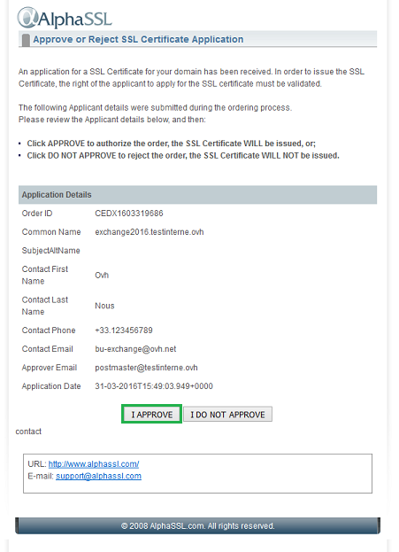

## Etapa 1: receção do e-mail de configuração do seu servidor
Após a encomenda paga receberá um e-mail para que possa realizar a instalação do seu servidor "Private".
O e-mail é enviado para o endereço de contacto indicado no seu Espaço Cliente, e o e-mail está igualmente disponível no seu Espaço Cliente.
Para consultar este e-mail a partir do seu Espaço Cliente deve:


- clicar no seu identificador (canto superior direito, sob a forma de ab12345-ovh) e depois "A minha conta"


{.thumbnail}

- Emails recebidos


{.thumbnail}
Encontrará nessa secção o e-mail que lhe foi enviado para que possa efetuar a configuração do seu servidor private Exchange:


- o assunto do e-mail é:

"O seu serviço Exchange 2016v1 está em curso de entrega!"


{.thumbnail}
Deixamos o e-mail 'template' que recebeu:


```
OVH.HOSTING LDA - http://www.ovh.pt
Avenida Miguel Bombarda, 133-6ºA
1050-164 LISBOA

Estimado(a) Cliente,

A sua oferta de e-mail Exchange Private 2016v1 está em curso de entrega.

No entanto, são necessárias algumas etapas a fim de poder utilizar o seu servidor Exchange Private 2016v1 

- Personalizar o sue link de acesso ao nosso website (certificado SSL dedicado)
- Introduzir o seu endereço de e-mail correspondente para validar o seu certificado (atenção: este endereço de e-mail deve existir, e deverá poder aceder ao mesmo)

Para tal, clique no seguinte link:

https://www.ovh.pt/emails/encomenda/?orderId=5035xxxx&orderPassword=nqiJ#/serverConfig

Deverá ser necessário autenticar-se com a ajuda do seu Nichandle (ab12345-ovh) e a respetiva password.

IMPORTANTE: uma vez efetuadas ambas as ações, basta uma última etapa: apontamento do subdomínio escolhido para o IP do seu servidor (este IP ser-lhe-á comunicado num segundo e-mail).

Necessita de ajuda?
Descubra todos os nossos guias Exchange :

https://www.ovh.pt/emails/hosted-exchange-2013/guias/

Cordialmente,

O seu serviço ao Cliente OVH
```


## Etapa 2: Configuração automática da zona DNS
Clique no link contido no e-mail recebido e será reencaminhado para a página de configuração do seu servidor.

{.thumbnail}

- "Nome do seu servidor": Deve definir o nome do seu servidort o ainda o link de acesso ao webmail. Serão apresentadas várias propostas.


Exemplo:


- mail
- exchange
- exchange2016


Após o subdomínio selecionado é necessário indicar um domínio válido. O link de acesso ao webmail (owa) será, por exemplo,: exchange2016.seudominio.pt
A segunda etapa consiste em escolher um endereço de e-mail para a receção do e-mail de validação do seu certificado SSL. Este endereço deverá ser válido. Caso não seja, não conseguirá validar o seu certificado SSL.

A lista proposta contém os endereços de e-mail genéricos tais como:


- postmaster@seudominio.pt
- administrateur@seudominio.pt
- admin@seudominio.pt


Se o seu domínio está alojado na OVH e não possui este serviço de e-mail, poderá criar um reencaminhamento (Alias) de um endereco@oseudominio para um endereço existente para o seu Espaço Cliente.

É igualmente possível que crie um reencaminhamento de e-mail para um endereço existente.
A opção Assistente DNS: Esta opção permite a configuração automática da sua zona DNS  (Criação do campo do tipo ipv4 (A) em função do subdomínio selecionado)
É necessário que o seu domínio seja gerido pelo mesmo identificador (nichandle) que o utilizado para a encomenda do seu servido private. Caso contrário, a configuração da zona DNS deve ser efetuada de forma manual.
No nosso exemplo, a opção "Assistente DNS" está selecionada, e vamos de seguida validar a configuração. Se utiliza a opção Assistente DNS é necessário efetuar a etapa 3.


## Etapa 3: Configuração manual da zona DNS
Se o seu domínio não é gerido pelo mesmo identificador de cliente (nichandle) ou não está alojado na OVH, um segundo e-mail ser-lhe-á enviado com as informações necessárias à modificação da sua zona DNS.

Veja o conteúdo do e-mail:


```
OVH.HOSTING LDA - http://www.ovh.pt
Avenida Miguel Bombarda, 133-6ºA
1050-164 LISBOA

Estimado(a) Cliente,

Assunto: [OVH-EXCHANGE] O seu servidor exchange está quase pronto!

Estimado(a) Cliente,

Para poder encomendar o certificado SSL do seu servidor é necessário criar o seu endereço na zona DNS. 

O endereço que escolheu foi:: exchange2016.testinterne.ovh
O IP do seu servidor é o: 149.202.xxx.103

Agradecemos que crie o registo A para o endereço escolhido.

Cordialmente,

O seu Serviço ao Cliente OVH
```


É então necessário que crie o registo do tipo A correspondente a:


- exchange2016.testinterne.ovh A 149.202.xxx.103


## Etapa 4: Validação do seu certificado SSL
Após a sua zona DNS estar configurada de forma automática ou manual, receberá o e-mail de validação no endereço escolhido aquando da personalização do seu link de acesso ao webmail.
Poderemos levar até 4h a enviar-lhe o e-mail.
Veja o conteúdo do e-mail recebido:

{.thumbnail}
Clique de seguida no  link  para que possa validar o seu certificado SSL.
Será depois reencaminhado para a interface da Global Sign para que possa validar o seu certificado SSL. Será necessário que clique em "I APPROVE" para o validar.

{.thumbnail}


## Término da operação
Após o seu certificado SSL estar validado, podem ser necessárias 4 horas para a entrega final do seu serviço.
Durante estas etapas o seu servidor Private Exchange não será visível no seu Espaço Cliente.

Assim que o seu servidor estiver pronto e disponível, receberá um e-mail de configuração e o seu servidor Private Exchange aparecerá no seu Espaço Cliente.

O ssunto do e-mail é: O seu serviço Private Exchange 2016 está pronto!

Para realizar a configuração do seu serviço de e-mails consulte o nosso [guia de primemira configuração do serviço](https://www.ovh.pt/g1311.configuracao-servico).

