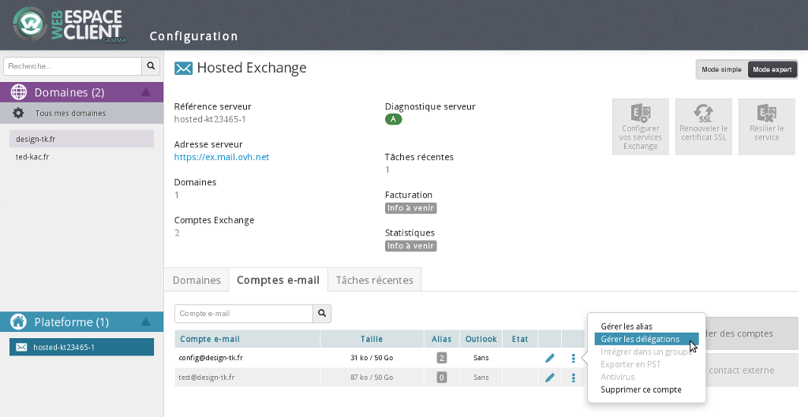
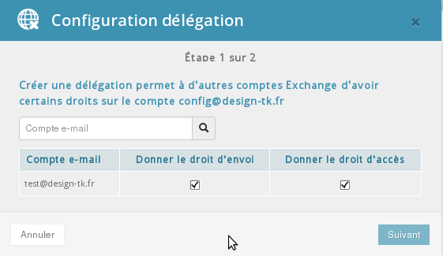

## Deel 1: Het instellen van de "Full Access" rechten
Dit moet worden uitgevoerd via het[Web Control Panel](https://www.ovh.com/manager/web/login.html).

Zodra u bent ingelogd, selecteert u uw Exchange dienst. 

Ga naar "Email accounts", klik vervolgens op de icon uiterst rechts met de drie blauwe stippen en selecteer "Manage delegations".

{.thumbnail}

## Deel 2: Het instellen van de "Full Access" rechten
Het delegatie configuratie venster zal openen, waar u  verzendrechten of toegangsrechten kunt toewijzen aan de gekozen account.

Vink de vakjes aan en klik vervolgens op "Next".

{.thumbnail}

## Deel 3: Het instellen van de "Full Access" rechten
Op de volgende pagina kunt u de geselecteerde rechten bevestigen.

Het kan enige ogenblikken duren voordat de instellingen actief worden.

Klik op "Bevestigen".

{.thumbnail}

## Deel 1: Instellen op de Outlook Web App
U kunt nu controleren of de account van de andere gebruiker zichtbaar is voor de eerste account.

Indien u alles in een interface wilt zien, klik dan met de rechtermuisknop op uw e-mailaccountnaam aan de linkerkant en selecteer vervolgens "add shared folder"[/ green].

{.thumbnail}

## Deel 2: Instellen met de Outlook Web App
Voeg de e-mail inbox "config" toe, en klik vervolgens op "toevoegen".

{.thumbnail}

## Deel 3: Instellen op de Outlook Web App
De "config" e-mailaccount verschijnt nu correct in de [Webmail Exchange](https://ex.mail.ovh.net/owa).

{.thumbnail}

