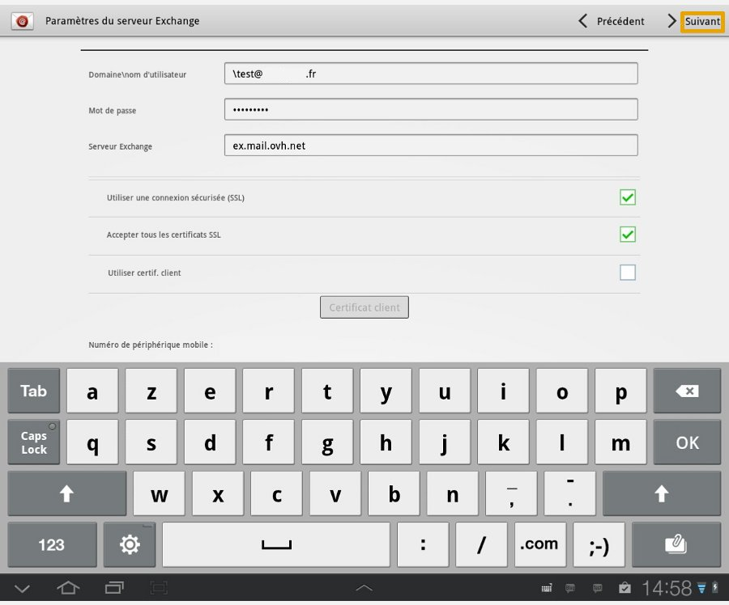
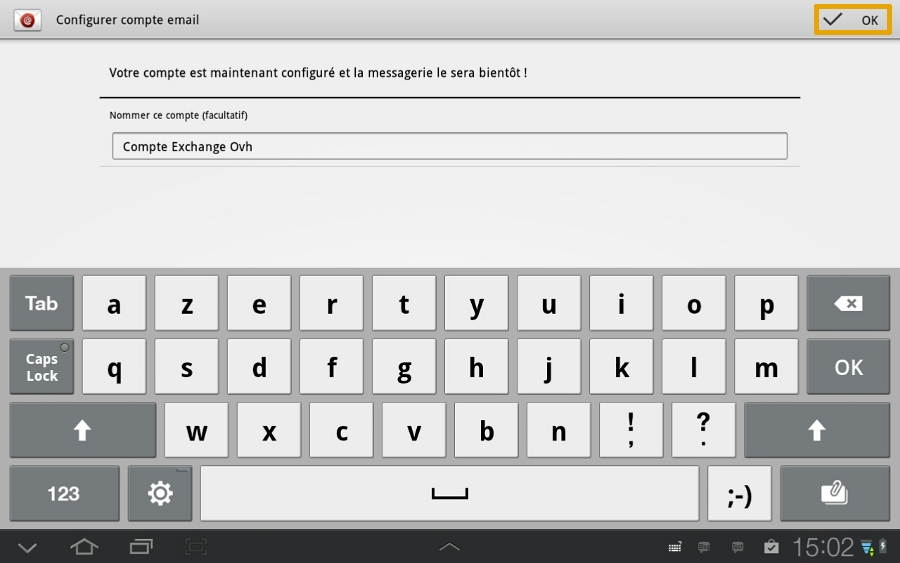

## Teil 1: E-Mail
Klicken Sie auf das Icon "E-Mail".

In unserem Beispiel wird ein Hosted Exchange Account verwendet, der auf einem Samsung Tablet mit Android 4.1.2 konfiguriert wird.

Stellen Sie vor dem Hinzufügen des Accounts sicher, dass Ihre 3G- oder WLAN-Verbindung aktiv ist.

{.thumbnail}

## Teil 2: Konfiguration des E-Mail-Accounts
Geben Sie Ihre vollständige Exchange E-Mail-Adresse und das in Ihrem [OVH Kundencenter](https://www.ovh.com/manager/web/login.html) für den Exchange Account angegebene Passwort ein.

Klicken Sie anschließend auf "Manuelles Einrichten", um fortzufahren.

{.thumbnail}

## Teil 3: Typ des E-Mail-Accounts
Wählen Sie hier "Microsoft Exchange ActiveSync" aus, um mit der Konfiguration Ihres Exchange Accounts fortzufahren.

{.thumbnail}

## Teil 4: Einstellungen des Exchange Servers
Für alle nach dem 26.04.2016 getätigten Bestellungen ist der Exchange Server für ein Hosted Angebot: ex2.mail.ovh.net.
Tragen Sie hier die Angaben Ihres Exchange E-Mail-Accounts ein.

"Domain \ Benutzername": tragen Sie hier einen Backslash ("\") gefolgt von der vollständigen Exchange E-Mail-Adresse ein.

"Passwort": das in Ihrem [OVH Kundencenter](https://www.ovh.com/manager/web/login.html) für den Exchange Account angegebene Passwort.

"Exchange Server": Der Server Ihres Exchange Accounts.
In unserem Beispiel eines Hosted Exchange Angebots handelt es sich um den Server ex.mail.ovh.net
Bei einem Private Exchange Angebot müssen Sie den Namen des Servers angeben, den Sie bei der Installation ausgewählt haben.

"Verschlüsselte Verbindung verwenden (SSL)": muss ausgewählt sein.

"Alle SSL Zertifikate akzeptieren": muss ausgewählt sein.

Klicken Sie anschließend auf "Weiter".

{.thumbnail}

## Teil 5: Aktivierung
Es wird nun ein Hinweis zu den Datenschutzbedingungen angezeigt, der mit einem Klick auf "OK" bestätigt werden muss.

{.thumbnail}

## Teil 6: Sicherheitsabfrage
Ein zweiter Hinweis zu den Sicherheitsfunktionen wird angezeigt, der mit einem Klick auf "OK" bestätigt werden muss.

{.thumbnail}

## Teil 7: Account-Optionen
Sie können nun verschiedene Konfigurationseinstellungen für die Exchange E-Mail-Adresse tätigen.

Sobald dies erfolgt ist klicken Sie auf "Weiter".

{.thumbnail}

## Teil 8: Remote-Sicherheitsverwaltung
In diesem Interface werden die Rechte der "E-Mail" App von Android aufgeführt.

Klicken Sie auf "Aktivieren" um fortzufahren.

{.thumbnail}

## Teil 9: Fertigstellung
Sie können nun noch eine Bezeichnung für Ihren E-Mail-Account angeben.

Klicken Sie auf "OK", um die Installation Ihres Exchange Accounts abzuschließen.

{.thumbnail}

## E-Mail Interface
Hier sehen Sie ein Bild des E-Mail Interfaces, wie es auf Ihrem Gerät angezeigt wird.

Mit einem Klick auf das Icon oben rechts gelangen Sie zu den Einstellungen des Exchange Accounts.

{.thumbnail}

## Konfigurations-Interface
Hier sehen Sie ein Bild des Konfigurations-Interfaces, wie es auf Ihrem Gerät angezeigt wird.

{.thumbnail}

