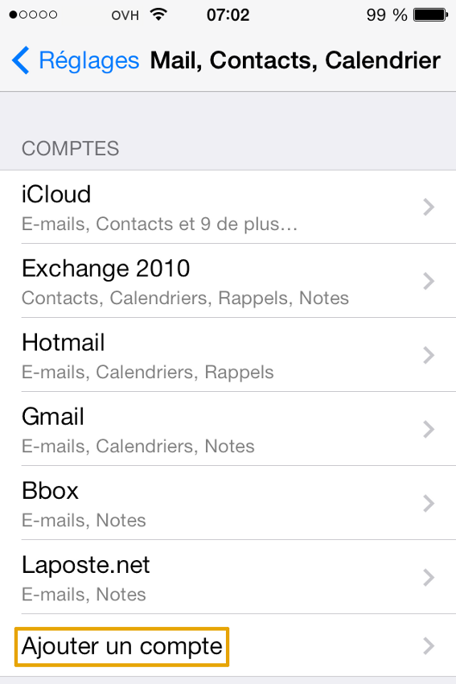
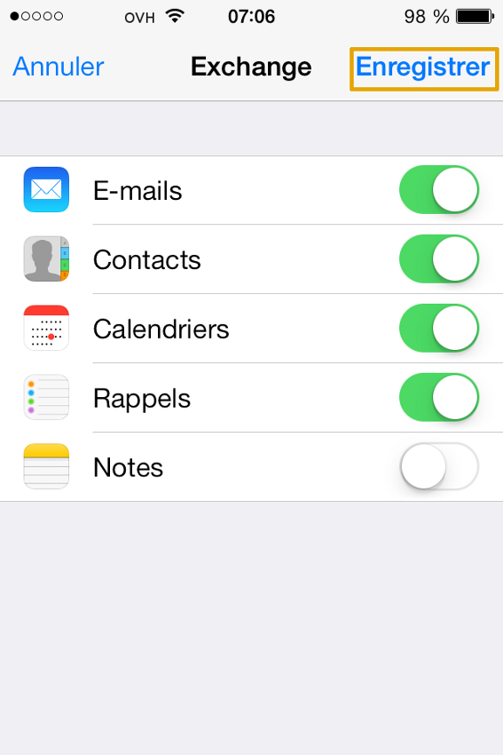

## Teil 1: Einstellungen
Klicken Sie auf das Icon "Einstellungen".

In unserem Beispiel wird ein Hosted Exchange Account verwendet, der auf einem iPhone 4 mit iOS 7.0.3 konfiguriert wird.

Bei dem Private Exchange Angebot müssen Sie den Namen des Servers angeben, den Sie bei der Installation ausgewählt haben (siehe Teil 6).

Stellen Sie vor dem Hinzufügen des Accounts sicher, dass Ihre 3G- oder WLAN-Verbindung aktiv ist.

{.thumbnail}

## Teil 2: Mail, Kontakte, Kalender
Klicken Sie in den "Einstellungen" auf "Mail, Kontakte, Kalender".

Dort können Sie dann Ihren Exchange Account hinzufügen.

{.thumbnail}

## Teil 3: Einen E-Mail-Account hinzufügen
In diesem Fenster werden Ihre installierten E-Mail-Adressen aufgelistet.

Klicken Sie auf "Einen Account hinzufügen" um fortzufahren.

{.thumbnail}

## Teil 4: Typ des E-Mail-Accounts
Sie werden nun aufgefordert, den gewünschten Account-Typ auszuwählen.

Wählen Sie "Exchange" aus, um mit der Installation des E-Mail-Accounts fortzufahren.

{.thumbnail}

## Teil 5: Einstellungen des E-Mail-Accounts
Tragen Sie hier die Angaben Ihres Exchange E-Mail-Accounts ein.

"Adresse": die vollständige Exchange E-Mail-Adresse.

"Kennwort": das in Ihrem [OVH Kundencenter](https://www.ovh.com/manager/web/login.html) für den Exchange Account angegebene Passwort.

"Beschreibung": Der Name des E-Mail-Accounts, der in Ihrem E-Mail-Programm angezeigt wird.

Sie können die Einstellungen Ihres Hosted Exchange Accounts über das [OWA Webmail-Interface](https://ex.mail.ovh.net/owa/) testen.

Klicken Sie anschließend auf "Weiter".

{.thumbnail}

## Teil 6: Weitergehende Einstellungen des E-Mail-Accounts
Für alle nach dem 26.04.2016 getätigten Bestellungen ist der Exchange Server für ein Hosted Angebot: ex2.mail.ovh.net.
Tragen Sie hier die Angaben Ihres Exchange E-Mail-Accounts ein.

"Adresse": die vollständige Exchange E-Mail-Adresse.

"Server": Der Server Ihres Exchange Accounts.
In unserem Beispiel eines Hosted Exchange Angebots handelt es sich um den Server ex.mail.ovh.net
Bei einem Private Exchange Angebot müssen Sie den Namen des Servers angeben, den Sie bei der Installation ausgewählt haben.

"Domain": Diese Angabe ist optional. Es wird empfohlen, hier nichts einzutragen.

"Benutzername": Tragen Sie hier die vollständige E-Mail-Adresse ein.

"Kennwort": das in Ihrem [OVH Kundencenter](https://www.ovh.com/manager/web/login.html) für den Exchange Account angegebene Passwort.

"Beschreibung": Der Name des E-Mail-Accounts, der in Ihrem E-Mail-Programm angezeigt wird.

Klicken Sie anschließend auf "Weiter".

{.thumbnail}

## Teil 7: Synchronisierung der Exchange Dienste
In diesem Interface können Sie die Dienstleistungen auswählen, die Sie mit Ihrem Exchange Account synchronisieren möchten.

Klicken Sie auf "Speichern", um die Konfiguration abzuschließen.

{.thumbnail}

## Teil 8: Fertigstellung
Ihr Account ist nun korrekt konfiguriert.

Sie sehen nun folgende Anzeige bei Ihren Accounts sowie im "Mail" Programm von Apple.

{.thumbnail}

