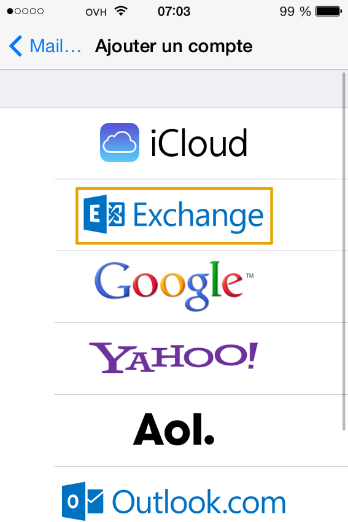
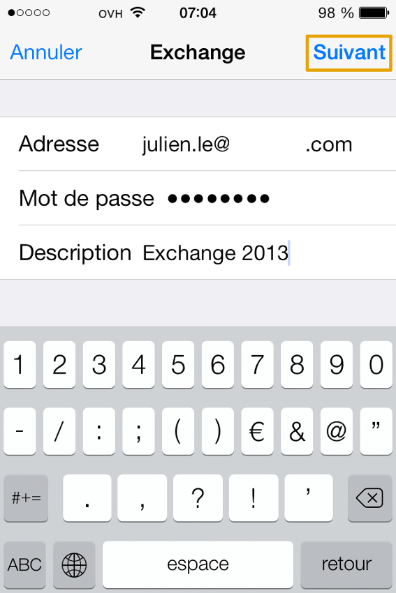

## Parte 1 : Parametrização
Clique no ícone "Configurações".

No nosso exemplo, a conta Exchange é uma conta do tipo Hosted, a mesma está configurada num iPhone 4 com iOS 7.0.3.

Para uma oferta Private, deverá introduzir o nome do servidor que escolheu durante a instalação (Cf, Parte 6).

Durante a adição da conta, verifique que a sua ligação 3G ou Wi-fi está ativa.

{.thumbnail}

## Parte 2 : Mail, Contactos, Calendário
Na secção "Configuração", aceda a "Mail, Contactos, Calendário".

Terá assim a possibilidade de adicionar a sua conta Exchange.

{.thumbnail}

## Parte 3 : Adicionar uma conta de email.
Encontrará nesta nova janela uma lista dos diferentes endereços de email instalados.

A fim de prosseguir, selecione "Adicionar uma conta".

{.thumbnail}

## Parte 4 : Tipo de conta de email
Ser-lhe-á pedida a seleção do tipo de conta desejada.

Deverá selecionar "Exchange" a fim de continuar a instalação da conta de email.

{.thumbnail}

## Parte 5 : Configuração da conta de email
Deverá introduzir as informações da sua conta de email Exchange.

"Endereço": O seu endereço de email completo.

"Palavra-passe": a palavra-passe que definiu no seu url="https://www.ovh.com/manager/web/login.html"]espaço cliente[/url] para a sua conta Exchange 2013.

"Descrição": o nome que será apresentado no seu software cliente de receção/envio de email para essa conta.

Tem a possibilidade de testar os parâmetros da sua conta Hosted Exchange a partir do [webmail Exchange](https://ex.mail.ovh.net/owa/).

Clique em "Seguinte" para continuar.

{.thumbnail}

## Parte 6 : Configuração avançada da conta de email
Para todas as encomendas efetuadas a partir de 26/04/2016, o servidor Exchange para uma oferta Hosted é: ex2.mail.ovh.net.
Deve introduzir as informações da sua conta de email Exchange.

"Endereço": O seu endereço de email completo.

"Servidor": o servidor da sua conta Exchange.
No caso de exemplo, uma oferta Hosted, o servidor é ex.mail.ovh.net
Para uma oferta Private deverá introduzir o nome de servidor que escolheu na instalação.

"Domínio": É um dado facultativo. É aconselhada a não introdução deste valor.

"Nome de utilizador": Deve introduzir o seu endereço de email completo.

"Palavra-passe": A palavra-passe definida no seu [Espaço Cliente](https://www.ovh.com/manager/web/login.html).

"Descrição": O nome que será apresentado para esta conta no seu software cliente de envio/receção de email.

Clique em "Seguinte" para continuar.

{.thumbnail}

## Parte 7: Sincronização de serviços Exchange
Pode escolher nesta interface os diferentes serviços que deseja sincronizar com a sua conta Exchange.

Clique em "Gravar" para continuar.

{.thumbnail}

## Parte 8 : Finalização
A sua conta de email está agora corretamente configurada.

Eis um aspeto do que verá na sua interface de gestão, bem como na aplicação "Mail" da Apple.

{.thumbnail}

