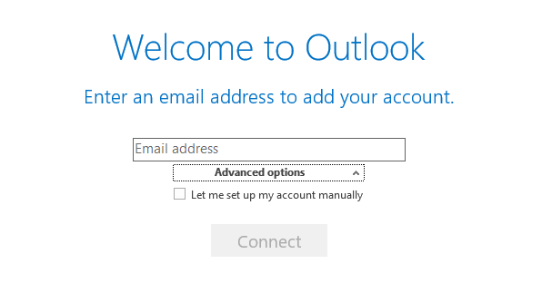
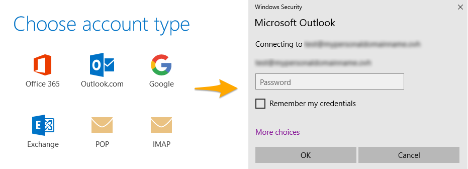

**Ultimo aggiornamento: 23/08/2018**

## Obiettivo

Gli account Exchange possono essere configurati su client di posta compatibili, per permetterti di utilizzare il tuo account email dal dispositivo che preferisci. 

**Questa guida ti mostra come configurare un account Exchange su Outlook 2016 per Windows.**

## Prerequisiti

- Disporre di una soluzione [Exchange](https://www.ovh.it/emails/){.external}
- Aver installato il programma Microsoft Outlook sul tuo dispositivo
- Disporre delle credenziali associate allíaccount email da configurare 
- Il campo SRV di OVH deve essere configurato correttamente nella zona DNS del dominio

> [!primary]
>
> Se utilizzi Outlook 2016 per Windows, consulta la nostra guida: [Configurare un account Exchange su Outlook 2016 per Windows](https://docs.ovh.com/it/microsoft-collaborative-solutions/configurazione-exchange-outlook-2016-windows){.external}
>

## Procedura

### Step 1: aggiungi il tuo account

Una volta avviata líapplicazione Outlook sul tuo dispositivo, puoi aggiungere un nuovo account in due modi diversi:

- **Al primo avvio dellíapplicazione**: un wizard appare sullo schermo e ti invita a inserire il tuo indirizzo email.

- **Se hai gi‡ configurato un account:** clicca su `File`{.action} nella barra del menu in alto e poi su `Aggiungi account`{.action}.

{.thumbnail}

Inserisci il tuo indirizzo email e clicca su `Opzioni avanzate`{.action}. Seleziona la voce accanto a `Configurare un account manualmente`{.action} e poi clicca su `Connetti`{.action}. Tra i tipi di account, scegli **Exchange**.

A questo punto compare una finestra in cui inserire la **password** dellíindirizzo email: una volta inserita, seleziona la voce per memorizzarla, dopodichÈ clicca su `OK`{.action}.

> [!primary]
>
> Se un messaggio ti indica che Outlook non ha potuto configurare il tuo account, ciÚ potrebbe indicare che il campo SRV di OVH non Ë stato configurato correttamente nella zona DNS del tuo dominio. 
>
> Ti consigliamo di verificare la configurazione del dominio impostato per il tuo servizio Exchange attraverso lo [Spazio Cliente OVH](https://www.ovh.com/auth/?action=gotomanager){.external} > scheda `Domini associati`{.action} > colonna `Diagnostica`{.action}
>

Se la configurazione del tuo dominio Ë corretta, apparir‡ un messaggio di richiesta di autorizzazione per una connessione verso il server OVH.  Accetta questa connessione per consentire la configurazione automatica del tuo account Exchange. 

Dopo aver configurato correttamente il tuo account e averlo reso accessibile da Outlook 2016, puoi effettuare un test díinvio per verificare se líaccount funziona correttamente. 

{.thumbnail}

### Step 2: utilizza il tuo account

Una volta configurato líindirizzo email, non ti resta che utilizzarlo: da questo momento puoi infatti inviare e ricevere messaggi.

OVH ti propone uníapplicazione Web che dispone di [funzioni collaborative](https://www.ovh.it/emails/){.external},  disponibile allíindirizzo [https://www.ovh.it](https://www.ovh.it){.external}. Puoi collegarti utilizzando le credenziali del tuo account.

## Per saperne di pi˘

[Configurare un indirizzo email compreso nellíofferta MX Plan o in uníofferta di hosting web su Outlook 2016 per Windows](https://docs.ovh.com/it/emails/configurazione-outlook-2016/){.external}

[Configurare un account Email Pro su Outlook 2016 per Windows](https://docs.ovh.com/it/emails-pro/configurazione-outlook-2016/){.external}

Contatta la nostra Community di utenti allíindirizzo [https://www.ovh.it/community/](https://www.ovh.it/community/){.external}.