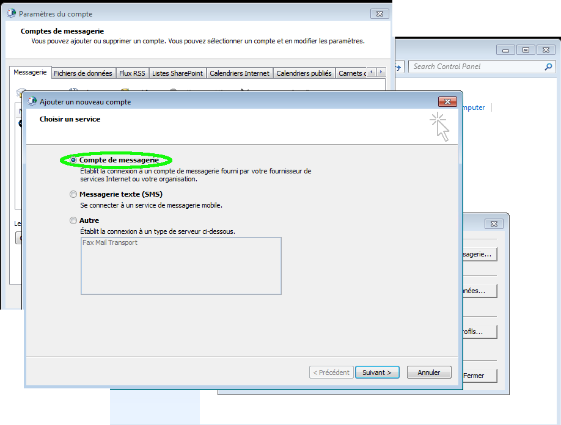

## Abruf der Exchange GUID
Um Ihr Outlook manuell konfigurieren zu können müssen Sie zuerst die Exchange GUID in Ihrem OVH Kundencenter abrufen. Klicken Sie dazu rechts neben der zu konfigurierenden Adresse auf "Konfiguration".

Hängen Sie anschließend an die GUID Ihren Domainnamen in der Form "@ihre-domain.tld" an.

In unserem Beispiel ergibt dies:
45c94143-1a29-4ef8-a990-06b54f9d6ad7@support-exchange.eu

{.thumbnail}
Die Outlook Version 2016 lässt ausschließlich die automatische Konfiguration via SRV-Eintrag zu. Klicken Sie [url="https://www.ovh.de/g1245.exchange-configuration-automatique-outlook[blue]hier[/blue][/url], um die Hilfe zur automatischen Konfiguration zu lesen.

## Systemsteuerung
Die Konfiguration in diesem Beispiel erfolgt auf einem Computer mit einem Windows Betriebssystem.

Rufen Sie zuerst die Systemsteuerung Ihres Computers auf.

Klicken Sie unter "Benutzerkonten" auf "E-Mail". Sie können diese Schaltfläche auch direkt von Outlook aus aufrufen.

Klicken Sie dann auf "E-Mail-Konten"

{.thumbnail}

## Schritt 2: Hinzufügen des neuen E-Mail-Accounts
Klicken Sie auf "Neu", um einen Exchange Account hinzuzufügen.

{.thumbnail}

## Schritt 3: E-Mail-Konto
Wählen Sie "E-Mail-Konto" aus und klicken Sie dann auf "Weiter".

{.thumbnail}

## Schritt 4: Manuelle Account-Konfiguration
Setzen Sie ein Häkchen bei "Servereinstellungen oder zusätzliche Servertypen manuell konfigurieren"

Klicken Sie danach auf "Weiter".

{.thumbnail}

## Schritt 5: Dienstleistung auswählen
Wählen Sie "Microsoft Exchange" aus.

Klicken Sie anschließend auf "Weiter".

{.thumbnail}

## Schritt 6: Server-Einstellungen
Microsoft Exchange-Server: Tragen Sie in diesem Feld die zuvor ermittelte Exchange GUID gefolgt von @ihre-domain.tld ein.

Benutzername: Tragen Sie hier die vollständige Exchange E-Mail-Adresse ein.

Klicken Sie anschließend auf "Weitere Einstellungen..."

{.thumbnail}

## Schritt 7: Exchange-Proxyeinstellungen
Setzen Sie in der Rubrik "Verbindung" ein Häkchen bei der Option "Verbindung mit Microsoft Exchange über HTTP herstellen".

Klicken Sie anschließend auf "Exchange-Proxyeinstellungen".

{.thumbnail}

## Schritt 8: Verbindungseinstellungen
Tragen Sie im Feld "Diese URL für die Verbindung mit dem Exchange-Proxyserververwenden" "ex.mail.ovh.net" ein.

Setzen Sie ein Häkchen bei "Nur SSL für Verbindung verwenden" sowie bei "Verbindung nur mit Proxyservern herstellen, deren Zertifikat den folgenden Prinzipalnamen enthält" und tragen Sie "msstd:ex.mail.ovh.net" in das Feld ein.

Setzen Sie ebenfalls Häkchen bei "Bei schnellen Netzwerken zuerst eine Verbindung über HTTP herstellen, dann über TCP/IP" und "Bei langsamen Netzwerken zuerst eine Verbindung über HTTP herstellen, dann über TCP/IP".

Klicken Sie abschließend auf "OK.

{.thumbnail}
Für die "Private" Angebote ersetzen Sie den Server ex.mail.ovh.net durch den Namen des SSL-Zertifikats Ihres Servers.
Für die Migration einzelner Exchange Konten von 2010 auf 2013 (erster Schritt), ersetzen Sie den Server ex.mail.ovh.net durch den Zugangslink zu Ihrem Webmail, zum Beispiel: xc12.mail.ovh.net. Diesen finden Sie in Ihrem Kundencenter, im Menüpunkt "Microsoft" unter "Exchange".
Für alle seit dem 26.04.2016 getätigten Bestellungen ist der Exchange Server für ein Hosted Angebot: ex2.mail.ovh.net.

## Schritt 9: Authentifizierung
Es öffnet sich ein Fenster für die Authentifizierung beim Exchange Server.
Tragen Sie Ihre vollständige E-Mail-Adresse und das dazugehörige Passwort ein.

Vergessen Sie nicht, ein Häkchen bei "Kennwort speichern" zu setzen.

Ihr Account ist nun korrekt konfiguriert, und Sie können ihn mit Ihrem Outlook E-Mail-Programm verwenden.

{.thumbnail}

