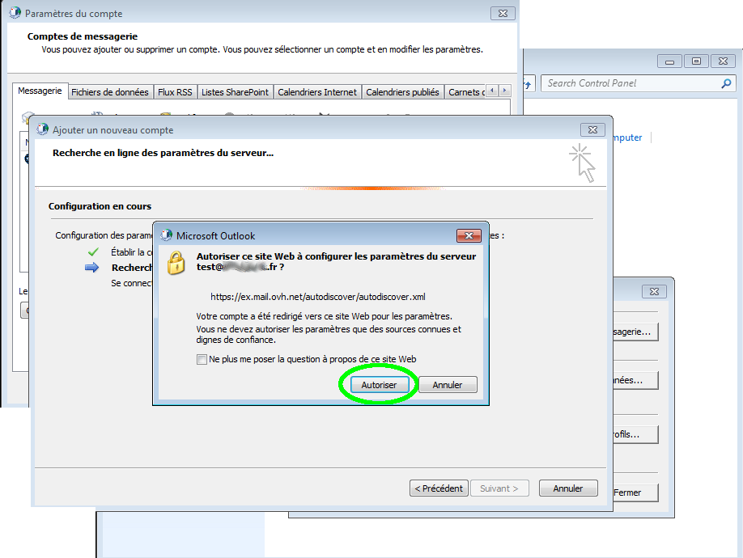
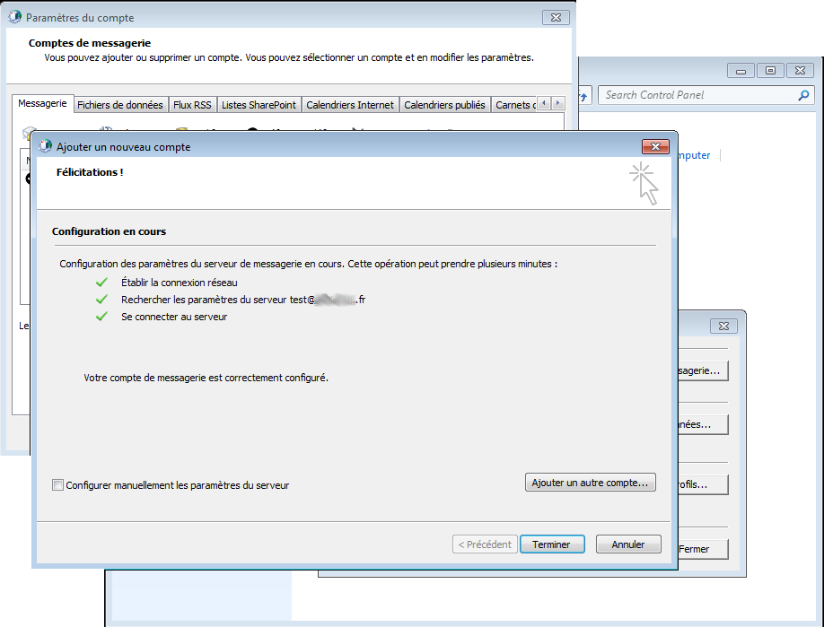
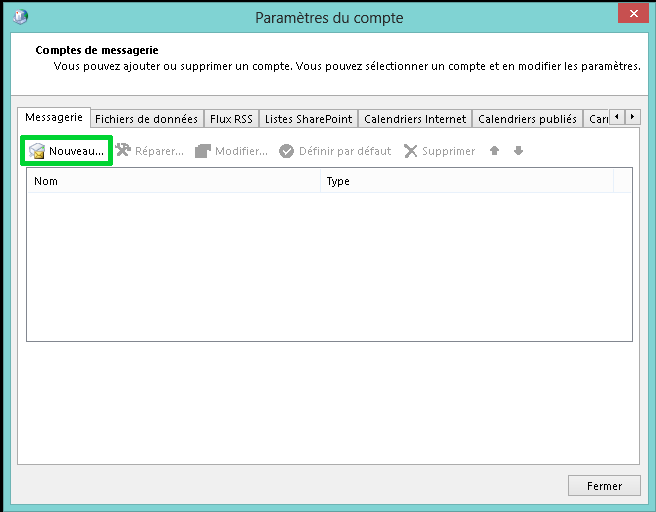
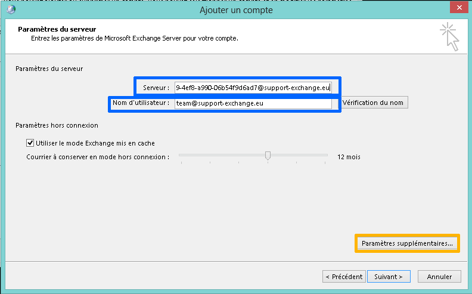

La configuration d'un compte Exchange depuis le panneau de configuration peut s'effectuer de deux manières : automatiquement ou manuellement.

> [!warning]
>
> OVH met à votre disposition des services dont la configuration, la gestion et la responsabilité vous incombent. Il vous revient de ce fait d'en assurer le bon fonctionnement.
> 
> Nous mettons à votre disposition ce guide afin de vous accompagner au mieux sur des tâches courantes. Néanmoins, nous vous recommandons de faire appel à un prestataire spécialisé et/ou de contacter l'éditeur du service si vous éprouvez des difficultés. En effet, nous ne serons pas en mesure de vous fournir une assistance. Plus d'informations dans la section « Aller plus loin » de ce guide.
> 

Poursuivez la lecture de cette documentation selon la configuration que vous souhaitez réaliser :

- [Configuration automatique d’un compte Exchange depuis le panneau de configuration](https://docs.ovh.com/fr/microsoft-collaborative-solutions/exchange-configuration-automatique-sous-outlook/#configuration-automatique){.external}
- [Configuration manuelle d’un compte Exchange depuis le panneau de configuration](https://docs.ovh.com/fr/microsoft-collaborative-solutions/exchange-configuration-automatique-sous-outlook/#configuration-manuelle){.external}

Vous utilisez Outlook 2016 pour Windows ? Consultez notre documentation : [Configurer son compte Exchange sur Outlook 2016 pour Windows](https://docs.ovh.com/fr/microsoft-collaborative-solutions/exchange-configuration-automatique-sous-outlook-2016/){.external}

## Configuration automatique

Avant de réaliser ces manipulations, assurez-vous que le champ SRV de votre nom de domaine est correctement configuré. Cliquez [ici](https://www.ovh.com/fr/emails/hosted-exchange/guides/){.external} pour retrouver nos différents guides Outlook 2007 n'est pas compatible avec Exchange 2016 et ultérieur.

### Étape 1 : Panneau de configuration
Les manipulations réalisées sont effectuées sur un poste équipé du système d'exploitation Windows.

Pour commencer, vous devez vous rendre dans le panneau de configuration de votre ordinateur.

Cliquez sur l'onglet "Courrier" ou  "Courrier (32-bit)" qui se trouve généralement à cet endroit ou dans les comptes utilisateurs. A noter qu'il vous est aussi possible d'y accéder depuis Outlook directement.

Cliquez ensuite sur "Comptes de messagerie"

Dans le panneau de configuration, pensez à sélectionner "afficher les petites icônes" afin de faire apparaître les icônes "Courrier" ou "Courrier (32-bit)"

Attention, pour Outlook 2007 la configuration automatique sera fonctionnelle uniquement si vous disposez au minimum de la version SP1 d'Outlook 2007.

Il est possible que le champ SRV ne soit pas reconnu sur la version 2007 du logiciel Outlook.

Un correctif est disponible sur le site de Microsoft en cliquant [ici](http://support.microsoft.com/kb/939184){.external}.

{.thumbnail}

### Étape 2 : Ajout du nouveau compte e-mail
Il faudra ensuite sélectionner le bouton "Nouveau" afin d'ajouter notre compte e-mail Exchange.

{.thumbnail}

### Étape 3 : Compte de messagerie
Sélectionnez "Compte de messagerie" puis cliquez sur "Suivant".

{.thumbnail}

### Étape 4 : Configuration de compte automatique
Nom : le nom d'affichage dans Outlook Adresse de messagerie : votre adresse e-mail complète. Mot de passe : le mot de passe choisi lors de la création de votre compte Exchange via votre [espace client](https://www.ovh.com/manager/web/login.html){.external}.

Cliquez ensuite sur "Suivant".

{.thumbnail}

### Étape 5 : Validation autodiscover
Vous devez autoriser l'autodiscover à configurer les paramètres serveurs de votre compte Exchange.

Cliquez sur "Autoriser".

{.thumbnail}

### Étape 6 : Finalisation installation
Votre compte doit à présent être configuré avec succès.

Lancez votre logiciel Outlook. Votre identifiant (Compte e-mail Exchange) ainsi que votre mot de passe vous sont demandés.

Une première synchronisation sera initiée avec les informations présentes sur le serveur Exchange une fois votre logiciel Outlook démarré.

{.thumbnail}

## Configuration manuelle

Il est parfois nécessaire de configurer Outlook manuellement soit lorsque le champ SRV n'est pas résolu par votre fournisseur d'accès à Internet, soit si le bureau d'enregistrement de votre domaine ne permet pas l'ajout d'un champ SRV.

Cliquez [ici](https://www.ovh.com/fr/emails/hosted-exchange-2013/documents/){.external} pour retrouver nos différents guides.

Pour configurer manuellement votre Outlook, il faut récupérer au préalable le GUID disponible dans votre espace client en cliquant sur "Configuration" à droite de l'adresse à configurer.

Ajoutez à la suite du GUID "@votre-domaine.com".

Dans notre exemple, cela donnera : [45c94143-1a29-4ef8-a990-06b54f9d6ad7@support-exchange.eu](mailto:45c94143-1a29-4ef8-a990-06b54f9d6ad7@support-exchange.eu){.external}

{.thumbnail}

### Étape 1 : Panneau de configuration

Les manipulations réalisées sont effectuées sur un poste équipé du système d'exploitation Windows.

Pour commencer, vous devez vous rendre dans le panneau de configuration de votre ordinateur.

Pensez à sélectionner "afficher les petites icônes" afin de faire apparaître les icônes "Courrier" ou "Courrier (32-bit)"

Cliquez sur l'onglet "Courrier" ou  "Courrier (32-bit)" qui se trouve généralement à cet endroit ou dans les comptes utilisateurs. Notez qu'il est aussi possible d'y accéder depuis Outlook directement.

Cliquez ensuite sur "Comptes de messagerie"

{.thumbnail}

### Étape 2 : ajout du nouveau compte e-mail
Cliquez sur "Nouveau" afin d'ajouter un compte e-mail Exchange.

{.thumbnail}

### Étape 3 : compte de messagerie
Sélectionnez "Compte de messagerie" puis cliquez sur "Suivant".

{.thumbnail}

### Étape 4 : configuration manuelle de compte
Cochez "Configuration manuelle ou types de serveurs supplémentaires"

Cliquez ensuite sur "Suivant".

{.thumbnail}

### Étape 5 : choisir un service
Selectionnez "Microsoft Exchange Server ou un service compatible"

Cliquez ensuite sur "Suivant".

{.thumbnail}

### Étape 6 : parametres du serveur
Serveur : renseignez dans ce champ le GUID Exchange précédemment récupéré suivi de "@votre_domaine".

Nom d'utilisateur : renseignez dans ce champ votre adresse e-mail Exchange complète.

Cliquez ensuite sur "Paramètres supplémentaires..."

{.thumbnail}

### Étape 7 : parametres proxy Exchange
Dans l'onglet "Connexion", cochez l'option "Se connecter à Microsoft Exchange avec HTTP".

Cliquez ensuite sur "Paramètres proxy Exchange".

{.thumbnail}

### Étape 8 : parametres de connexion
Dans le champ "Utiliser cette URL pour la connexion à mon serveur proxy pour Exchange", veuillez taper: "ex.mail.ovh.net"

Cochez ensuite "Se connecter en utilisant SSL uniquement" et "Se connecter uniquement aux serveurs proxy dont le certificat comporte ce nom principale" tapez : "msstd:ex.mail.ovh.net"

Cochez également les cases "Sur des réseaux rapides, se connecter d'abord avec HTTP, puis se connecter avec TCP/IP" et "Sur des réseaux lents, se connecter d'abord avec HTTP, puis se connecter avec TCP/IP".

Enfin, cliquez sur OK.

{.thumbnail}

> [!success]
>
> Pour les offres "Private", remplacez le serveur ex.mail.ovh.net par le nom du certificat SSL de votre serveur.
> 

> [!success]
>
> Dans notre exemple nous utilisons comme serveur : ex.mail.ovh.net. Il se peut que votre serveur soit différent.
> Vous pouvez retrouver l'information dans la section `Informations Générales`{.action}
> de votre service Exchange puis rubrique Connexion et Webmail.
> Il est nécessaire d'enlever le https://.
> 

### Étape 9 : Authentification
Une fenêtre s'ouvre pour vous authentifier sur le serveur Exchange, vous devez renseigner votre adresse e-mail complète et votre mot de passe .

N'oubliez pas de cocher "Mémoriser ces informations".

Votre compte est à présent correctement configuré : vous pouvez démarrer votre logiciel de messagerie Outlook.

{.thumbnail}

## Aller plus loin

Échangez avec notre communauté d'utilisateurs sur <https://community.ovh.com>.
