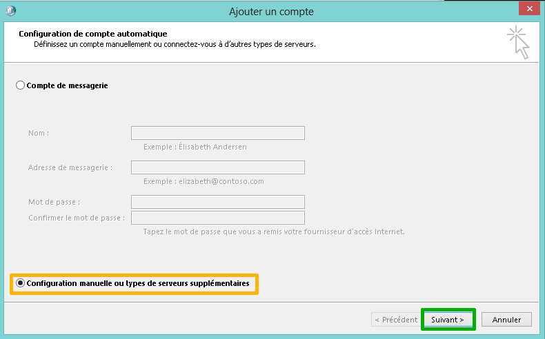

## Recupero del GUID Exchange
Per configurare manualmente Outlook, è necessario recuperare il GUID disponibile nel tuo Spazio Cliente OVH cliccando su "Configurazione" a destra dell'indirizzo da configurare.

Dopo il GUID, aggiungi "@tuodominio.com".

Nel nostro esempio il risultato è 45c94143-1a29-4ef8-a990-06b54f9d6ad7@support-exchange.eu

{.thumbnail}
La versione Outlook 2016 non consente di effettuare la configurazione automatica tramite un record di tipo SRV.
Per consultare la guida sulla confogurazione automatica, clicca [qui](https://www.ovh.it/g1245.exchange-2013-configurazione-automatica-outlook).

## Pannello di configurazione
Le modifiche vengono effettuate con un sistema operativo Windows.

Accedi al pannello di configurazione del tuo computer.

Seleziona Visualizza icone piccole per visualizzare le icone "Posta" o "Posta (32-bit)"

Clicca su Posta o Posta (32-bit). È possibile accedere anche direttamente da Outlook.

Clicca su Account di posta

{.thumbnail}

## Step 2: aggiungi un nuovo account email
Clicca su Nuovo per aggiungere un nuovo account Exchange.

{.thumbnail}

## Step 3: account di posta
Seleziona Account di posta e clicca su Avanti.

{.thumbnail}

## Step 4: configurazione manuale dell'account
Seleziona Configurazione manuale o tipi di server aggiuntivi

Clicca su Avanti.

{.thumbnail}

## Step 5: scegli un servizio
Seleziona Microsoft Exchange Server o server compatibile

Clicca su Avanti.

{.thumbnail}

## Step 6: parametri del server
Server: inserisci il GUID Exchange che hai recuperato prima da "@tuodominio".

Nome utente: inserisci il tuo indirizzo Exchange completo.

Clicca su Impostazioni aggiuntive

{.thumbnail}

## Step 7: impostazioni proxy Exchange
In Connessione, seleziona "Accedi a Microsoft Exchange in HTTP".

Clicca su Parametri proxy Exchange.

{.thumbnail}

## Step 8: parametri di connessione
Nel campo "Utilizza questo URL per accedere al mio server proxy per Exchange", inserisci ex.mail.ovh.net

Seleziona "Accedi utilizzando solo l'SSL" e "Accedi solo ai server proxy il cui certificato ha questo nome principale" e inserisci msstd:ex.mail.ovh.net

Seleziona anche "Su reti veloci, accedi in HTTP e poi in TCP/IP" e "Su reti lente, accedi in HTTP e poi in TCP/IP".

Clicca su OK.

{.thumbnail}
Per le offerte "Private", sostituisci il server "ex.mail.ovh.net" con il nome del certificato SSL del tuo server.
Per aggiornare il tuo account Exchange personale 2010 alla versione 2013, sostituisci il server "ex.mail.ovh.net" con il link di accesso alla tua Webmail, ad esempio "xc12.mail.ovh.net". Questo link è indicato nel tuo Spazio Cliente OVH, nel menu 
Microsoft, poi Exchange.
Per gli ordini effettuati dal 26/04/2016, per il server Exchange per un'offerta Hosted è: ex2.mail.ovh.net.

## Step 9: autenticazione
Nella finestra di autenticazione sul server Exchange, inserisci il tuo indirizzo email completo e la tua password.

Ricordati di selezionare "Memorizza i dati".

Il tuo account è configurato correttamente, avvia Outlook!

{.thumbnail}

