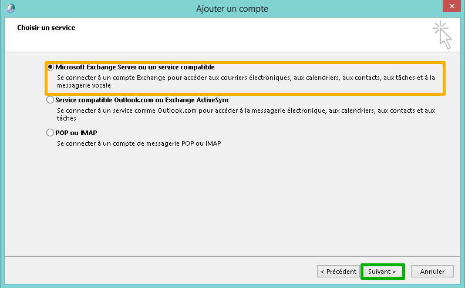
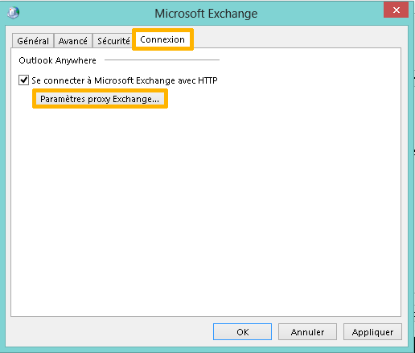

## Recuperação do GUID Exchange
Para configurar manualmente o seu Outlook é necessário recuperar antes o GUID disponível no seu espaço cliente ao clicar em "Configuração" à direita do endereço a configurar,.

Adicione depois do GUID "@seu-dominio.com".

No nosso exemplo teremos o seguinte:
45c94143-1a29-4ef8-a990-06b54f9d6ad7@support-exchange.eu

{.thumbnail}
A versão Outlook 2016 no autoriza a configuração automática através de um campo do tipo SRV. Clique [aqui](https://www.ovh.pt/g1245.exchange-configuracao-automatica-outlook) para consultar o guia de configuração automática.

## Painel de configuração
As manipulações realizadas foram levadas a cabo num computador equipado com Sistema Operativo Windows.

Para começar deverá aceder ao painel de controlo do seu computador.

Deve selecionar "mostrar os ícones pequenos" para que apareçam os ícones "Email" ou "Email (32-bit)"

Clique no separador "Email" ou "Email (32-bit)" que pode encontrar nessa parte ou nas contas de utilizaadores.
Tenha em atenção que é possível aceder ao Outlook diretamente.

Clique de seguida em "Contas de e-mail"

{.thumbnail}

## Etapa 2: adição da nova conta de e-mail
Clique em "Novo" para adicionar uma conta de e-mail Exchange.

{.thumbnail}

## Etapa 3: Conta de e-mail
Selecione "Conta de e-mail" e depois clique em "Seguinte".

{.thumbnail}

## Etapa 4: Configuração manual da conta
Selecione "Configuração manual ou tipos de servidores suplementares"

Clique de seguida em "Seguinte".

{.thumbnail}

## Etapa 5: Escolher um serviço
Selecione "Microsoft Exchange Server ou um serviço compaatível"

Clique de seguida em "Seguinte".

{.thumbnail}

## Etapa 6: Parâmetros do servidor
Servidor: introduza nesrte campo o GUID Exchange obtido anteriormente seguido de "@seu-dominio".

Nome do utilizador: introduza neste campo o seu endereço de E-mail na íntegra.

Clique de seguida em "Parâmetros suplementares..."

{.thumbnail}

## Etapa 7: Parâmetros proxy Exchange
No separador "Ligação", selecione a opção "Estabelecer ligação ao Microsoft Exchange com HTTP".

Clique de seguida em "Parâmetros proxy Exchange".

{.thumbnail}

## Etapa 8: Parâmetros de ligação
No campo "Utilizar este URL para a ligação do meu servidor proxy para o Exchange" queira introduzir: "ex.mail.ovh.net"

De seguida selecione "Ligar-se utilizando unicamente SSL" e "Ligar-me unicamente aos servidores proxys em que o certificado comporta o nome principal" introduza: "msstd:ex.mail.ovh.net" 

Selecione igualmente as opções "Em redes rápidas ligar-me com HTTP e depois com TCP/IP" e em "Redes lentas ligar-me com HTTP e depois TCP/IP".

Depois, clique em OK.

{.thumbnail}
Para as ofertas "Private", substituía o servidor ex.mail.ovh.net pelo nome do certificado SSL do seu servidor.
Para a migração das contas Exchange individual 2010 para 2013 (Primeira etapa), substitua o servidor ex.mail.ovh.net pelo link de acesso ao seu webmail. Exemplo: xc12.mail.ovh.net. Este nome é-lhe indicado no seu Espaço Cliente, menu Microsoft e depois Exchange.
Para todas as encomendas efetuadas a partir de 26/04/2016, o servidor Exchange para uma oferta Hosted é: ex2.mail.ovh.net.

## Etapa 9: Autenticação
Irá aprecer uma janela para que se autentique no servidor Exchange e deverá introduzir o seu endereço de e-mail completo e a sua password .

Não se esqueça de selecionar "Memorizar estas informações".

A sua conta está corretamente configurada: pode iniciar o seu software de e-mails Outlook.

{.thumbnail}

