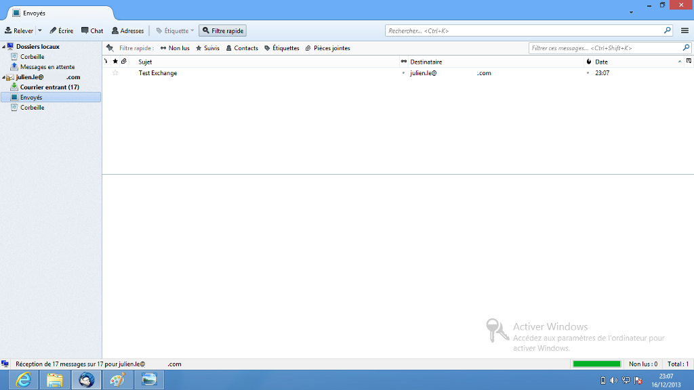
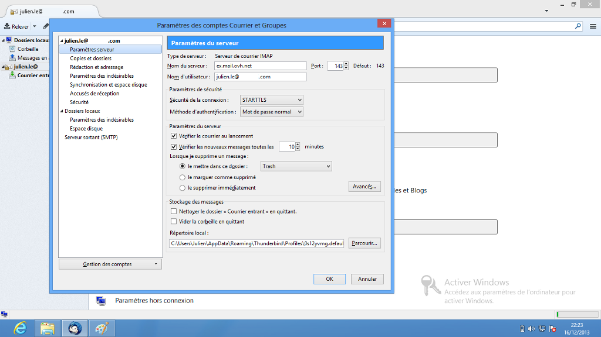

## Teil 1: Start
Öffnen Sie das "Thunderbird" Programm auf Ihrem Computer.

Standardmäßig wird folgendes Interface angezeigt, wenn noch keine E-Mail-Adressen konfiguriert sind. Ansonsten können Sie über das Menü ("Datei", "Neu") das Hinzufügen eines neuen Accounts anstoßen.

Wählen Sie "E-Mail" aus.

{.thumbnail}

## Teil 2: Start (Fortsetzung)
Um mit der Installation der E-Mail-Adresse fortzufahren wählen Sie "Überspringen und meine existierende E-Mail-Adresse verwenden" aus.

{.thumbnail}

## Teil 3: Erstellung des Accounts
Tragen Sie hier folgende Angaben ein:

"Ihr Name": tragen Sie hier den Namen ein, der für den Account angezeigt werden soll.

"E-Mail-Adresse": die vollständige Exchange E-Mail-Adresse.

"Passwort": das in Ihrem [OVH Kundencenter](https://www.ovh.com/manager/web/login.html) für den Exchange Account angegebene Passwort.

"Passwort speichern": muss ausgewählt sein.

Klicken Sie auf "Weiter", um mit der Installation fortzufahren.

{.thumbnail}

## Teil 4: Konfiguration
Für alle nach dem 26.04.2016 getätigten Bestellungen ist der Exchange Server für ein Hosted Angebot: ex2.mail.ovh.net.
Nach einem Klick auf "Manuell bearbeiten" wird folgendes Interface angezeigt.

Überprüfen Sie, dass folgende Angaben korrekt eingetragen sind:

"Posteingang-Server: IMAP":
Für einen Hosted Exchange Account
Server-Adresse: ex.mail.ovh.net.
Port: 143.
SSL: STARTTLS.
Authentifizierung: Passwort, normal.

"Postausgang-Server: SMTP":
Für einen Hosted Exchange Account
Server-Adresse: ex.mail.ovh.net.
Port: 587.
SSL: STARTTLS.
Authentifizierung: Passwort, normal.

"Benutzername": die vollständige E-Mail-Adresse.

Bei einem Private Exchange Angebot müssen Sie den Namen des Servers angeben, den Sie bei der Bestellung ausgewählt haben.

Wenn die Authentifizierung mit "Passwort, normal" nicht funktioniert, können Sie stattdessen auch "NTLM" angeben.

Klicken Sie auf "Fertig", um die Installation abzuschließen.

{.thumbnail}

## Teil 5: Fertigstellung
Ihr Exchange Account ist nun korrekt mit IMAP konfiguriert.

Das E-Mail-Interface sieht wie folgt aus:

{.thumbnail}

## Einstellungen der Accounts für den Posteingangsserver
In diesem Bild sehen Sie einen Überblick über die Einstellungen des Accounts "für den Posteingang-Server".

{.thumbnail}

## Einstellungen der Accounts für den Postausgangsserver
In diesem Bild sehen Sie einen Überblick über die Einstellungen des Accounts "für den Postausgang-Server".

{.thumbnail}

