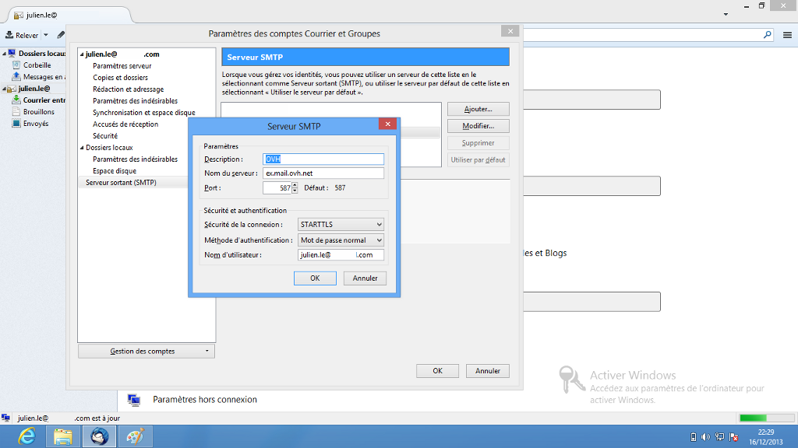

## Part 1: Startup
Open the Thunderbird application installed on your computer.

This screen will appear if you haven't configured any email accounts.

To create a new email account, click on the "Email" icon to continue.

{.thumbnail}

## Part 2: Startup
A new window will open asking if you would like to create a new email address. To add your existing email address, click on "Skip this and use my existing email".

{.thumbnail}

## Part 3: Creating an account
In the Mail Account Setup wizard, enter the following information:

Your name: Enter the name you wish to be displayed.

Email address: Your full email address.

Password: Your Exchange 2013 account password as defined in the [Web Control Panel](https://www.ovh.com/manager/web/login.html).

Tick the Remember password: option if you don't want to enter it every time you use Thunderbird.

Click on "Continue" and the wizard will retrieve for the configuration settings.

{.thumbnail}

## Part 4: Advanced configuration
You will see this screen if you click on "Manual configuration".

Please check that the following elements are entered correctly:

"Incoming server: IMAP"
For Hosted Exchange accounts;
Server hostname: ex.mail.ovh.net
Port: 143
SSL/u]: STARTTLS
Authentication: Normal password.

"Outgoing server: SMTP"
For Hosted Exchange accounts;
Server hostname: ex.mail.ovh.net
Port: 587
SSL: STARTTLS
Authentication: Normal password.

"Username": Your full email address.

For Private Exchange accounts, enter the server selected at the time of ordering the Exchange server.

Then click on "Done" to continue to the final stages of installation.

{.thumbnail}

## Part 5: Finalisation
Your Exchange 2013 account is now correctly configured in IMAP.

See screenshot for an overview of how it will be displayed in Thunderbird.

{.thumbnail}

## Incoming server settings
See image for a reminder of how to view the account settings "for the incoming server".

{.thumbnail}

## Outgoing server settings
See image for a reminder of how to view the account settings "for the outgoing server".

{.thumbnail}

