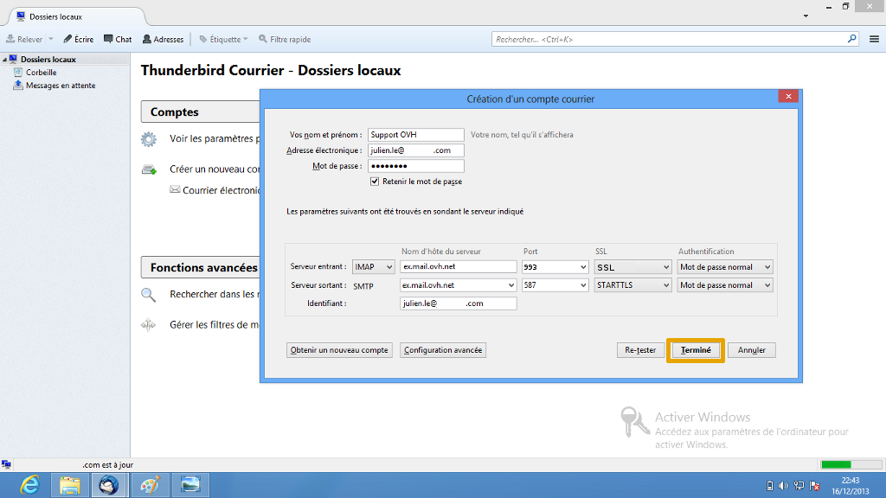

## Parte 1 :  Início
Num primeiro tempo, aceda à sua aplicação "Thunderbird" instalada no seu computador.

Eis a interface que verá aparecer de forma padrão se ainda não tem nenhuma outra conta configurada. Se já tem uma conta configurada, aceda ao menu para efetuar a adição de uma nova conta.

Selecione "Correio eletrónico" para continuar.

{.thumbnail}

## Parte 2 : Início (continuação)
A fim de continuar com a instalação do endereço de email, selecione ignorar esta etapa e utilizar um endereço existente para continuar.

{.thumbnail}

## Parte 3 : Criação de conta
Efetue o preenchimento dos seguintes campos :

"Primeiro e último nome": Introduza o nome de conta que pretende que seja apresentado na interface.

"Endereço de email": O seu endereço de email completo.

"Palavra-passe": A palavra-passe escolhida no seu [Espaço Cliente](https://www.ovh.com/manager/web/login.html) para a conta Exchange.

"Guardar a palavra-passe": deve marcar esta opção.

Clique "Continuar" para continuar as etapas de instalação.

{.thumbnail}

## Parte 4 : Configuração Avançada
Para todas as encomendas efetuadas a partir de 26/04/2016, o servidor Exchange para uma oferta Hosted é: ex2.mail.ovh.net.
Depois de ter clicado em "Configuração manual" eis o aspeto da interface que será apresentada.

Verifique que estes elementos são corretamente introduzidos:

"Servidor de receção: IMAP":
Para uma conta do tipo Hosted
O nome do servidor: ex.mail.ovh.net.
porta: 993.
Método de encriptação: STARTTLS.
Autenticação: Palavra-passe normal.

"Servidor de envio: SMTP" :
Para uma conta de tipo Hosted
O nome do servidor: ex.mail.ovh.net.
Porta: 587.
Método de encriptação: STARTTLS.
Autenticação: Palavra-passe normal.

"Identificador": O seu endereço de email completo.

Para as contas do tipo Private, é o que foi escolhido durante a configuração do servidor Exchange.

Clique em "Concluído" para prosseguir a instalação.

{.thumbnail}

## Parte 5 : Finalização
A sua conta Exchange está agora corretamente configurada em IMAP.

Eis o aspeto da interface que encontrará.

{.thumbnail}

## Configurações de servidor de receção de email
Eis uma imagem com os parâmetros das contas.

"Para o servidor de receção"

{.thumbnail}

## Configurações de servidor de envio de email
"Para o servidor de envio"

{.thumbnail}

