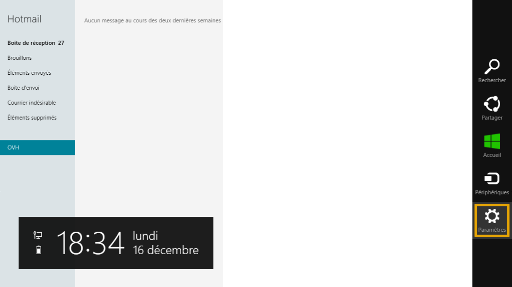
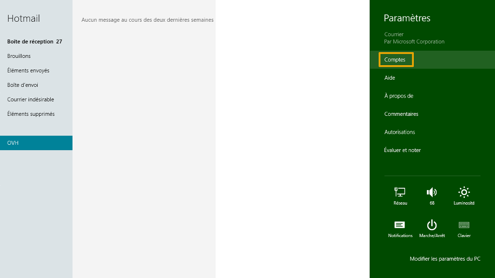
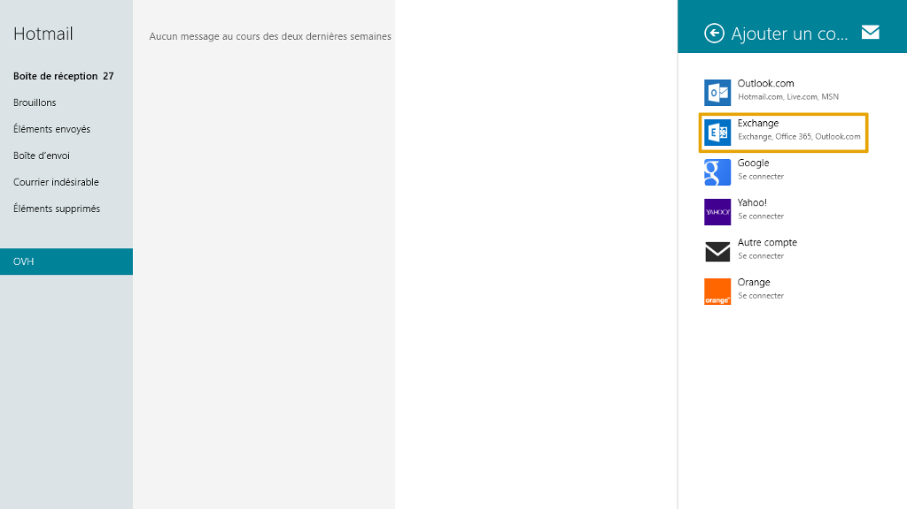
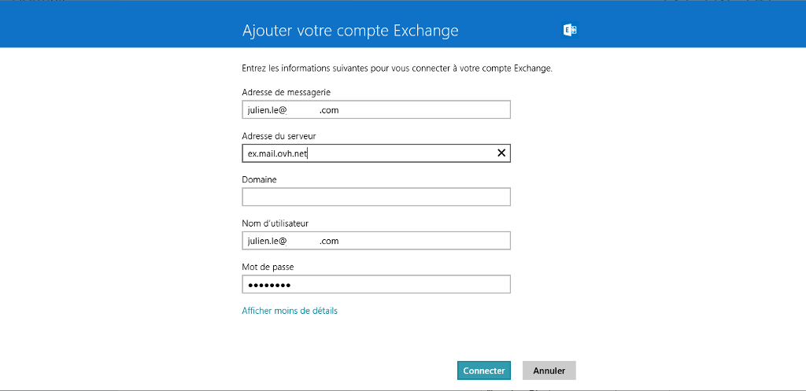
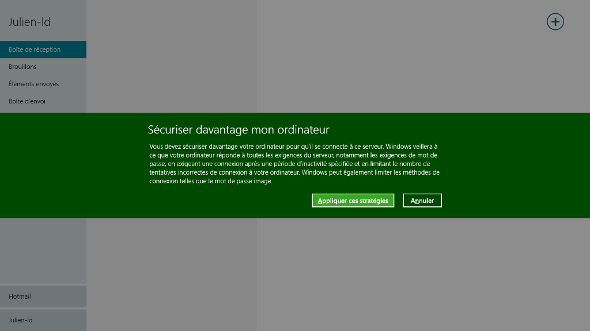
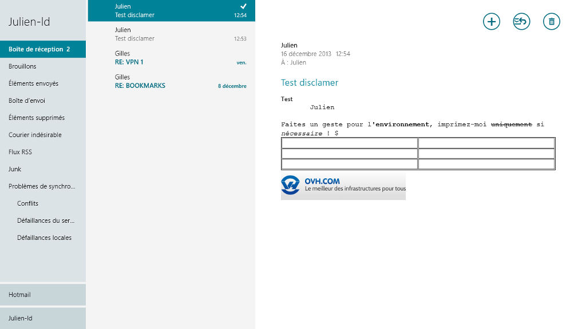

## Część 1: Uruchamianie
W pierwszej kolejności otwórz aplikację "Poczta elektroniczna" w systemie Windows 8 na ekranie komputera.

Podczas pierwszego uruchomienia zostaniesz poproszony o wskazanie adresu poczty elektronicznej i przypisanego hasła w innym interfejsie niż ten wskazany tutaj.

Jeśli masz już konto, pojawi się ten interfejs.

Umieść kursor w części z prawej strony i wybierz "Ustawienia".

{.thumbnail}

## Część 2: Konta
Następnie kliknij na "Konta", aby dodać nowe konto e-mail Exchange.

{.thumbnail}

## Część 3: Dodawanie konta
Widzimy jeden adres e-mail. 

Po dodaniu konta Exchange będziesz miał dostęp do ustawień konta po kliknięciu na konto e-mail.

Kliknij na "Dodaj konto", aby kontynuować.

{.thumbnail}

## Część 4: Rodzaj konta
Wybierz rodzaj konta e-mail, które chcesz dodać. Kliknij na "Exchange", aby kontynuować.

{.thumbnail}

## Część 5: Ustawienia
W nowym interfejsie wypełnij poszczególne pola.

"Adres poczty elektronicznej": Pełny adres e-mail Exchange

"Hasło": Hasło określone dla tego konta Exchange w [panelu klienta](https://www.ovh.com/manager/web/login.html).

Kliknij na "Połącz", aby kontynuować.

{.thumbnail}

## Część 6: Zaawansowane ustawienia
W przypadku zamówień realizowanych od 26/04/2016 serwer Exchange dla oferty Hosted to ex2.mail.ovh.net.
W nowym interfejsie wypełnij poszczególne pola.

"Adres poczty elektronicznej": Pełny adres e-mail

"Adres serwera: w naszym przykładzie konto Exchange to konto Hosted. Adres serwera to ex.mail.ovh.net
W przypadku oferty Private należy wpisać nazwę serwera wybranego podczas instalacji oferty Exchange.

"Domena": Pole opcjonalne. Zaleca się pozostawienie pustego pola.

"Nazwa użytkownika": Należy podać pełny adres e-mail

"Hasło": Hasło zdefiniowane dla tego konta Exchange w [panelu klienta](https://www.ovh.com/manager/web/login.html).

Kliknij na "Połącz", aby kontynuować.

{.thumbnail}

## Część 7: Ostrzeżenie dotyczące bezpieczeństwa
Jeśli pojawi się wiadomość z ostrzeżeniem, kliknij na "Zastosuj te strategie", aby kontynuować.

{.thumbnail}

## Część 8: Zakończenie
Twoje konto Exchange zostało poprawnie skonfigurowane. 

Oto interfejs korzystania z e-maili.

{.thumbnail}

## Część 1: Uruchamianie
W pierwszej kolejności otwórz aplikację "Poczta elektroniczna" w systemie Windows 8 na ekranie komputera.

Podczas pierwszego uruchomienia zostaniesz poproszony o wskazanie adresu poczty elektronicznej i przypisanego hasła w innym interfejsie niż ten wskazany tutaj.

Jeśli masz już konto, pojawi się ten interfejs.

Umieść kursor w części z prawej strony i wybierz "Ustawienia".

{.thumbnail}

## Część 2: Konta
Następnie kliknij na "Konta", aby dodać nowe konto e-mail Exchange.

{.thumbnail}

## Część 3: Dodawanie konta
Widzimy jeden adres e-mail. 

Po dodaniu konta Exchange będziesz miał dostęp do ustawień konta po kliknięciu na konto e-mail.

Kliknij na "Dodaj konto", aby kontynuować.

{.thumbnail}

## Część 4: Rodzaj konta
Wybierz rodzaj konta. Kliknij na "Inne konto", aby kontynuować.

{.thumbnail}

## Część 5: Ustawienia
W nowym interfejsie wypełnij poszczególne pola.

"Adres poczty elektronicznej": Pełny adres e-mail Exchange

"Hasło": Hasło określone dla tego konta Exchange w [panelu klienta](https://www.ovh.com/manager/web/login.html).

Kliknij na "Połącz", aby kontynuować.

{.thumbnail}

## Część 6: Zaawansowane ustawienia
W przypadku zamówień realizowanych od 26/04/2016 serwer Exchange dla oferty Hosted to ex2.mail.ovh.net.
W nowym interfejsie wypełnij poszczególne pola.

"Adres poczty elektronicznej": Pełny adres e-mail Exchange

"Nazwa użytkownika": Należy podać pełny adres e-mail.

"Hasło": Hasło zdefiniowane dla tego konta Exchange w [panelu klienta](https://www.ovh.com/manager/web/login.html).

"Serwer poczty przychodzącej (IMAP): w naszym przykładzie konto Exchange to konto Hosted. Adres serwera to ex.mail.ovh.net
W przypadku oferty Private należy wpisać nazwę serwera wybranego podczas instalacji oferty Exchange.
"Port", który trzeba podać to 993.

"Serwer poczty przychodzącej wymaga SSL": musi być zaznaczone.

"Serwer poczty wychodzącej (SMTP)": w naszym przykładzie konto Exchange to konto Hosted. Adres serwera to ex.mail.ovh.net
W przypadku oferty Private należy wpisać nazwę serwera wybranego podczas instalacji oferty Exchange.
"Port", który trzeba podać to 465.

"Serwer poczty wychodzącej wymaga SSL": musi być zaznaczone.

"Serwer poczty wychodzącej wymaga uwierzytelniania": musi być zaznaczone.

"Korzystaj z takiej samej nazwy użytkownika i hasła do wysyłania i odbierania wiadomości" : musi być zaznaczone.

Kliknij na "Połącz", aby kontynuować.

{.thumbnail}

## Część 7: Zakończenie
Twoje konto Exchange zostało poprawnie skonfigurowane w IMAP. 

Oto interfejs korzystania z kont e-mail.

{.thumbnail}

