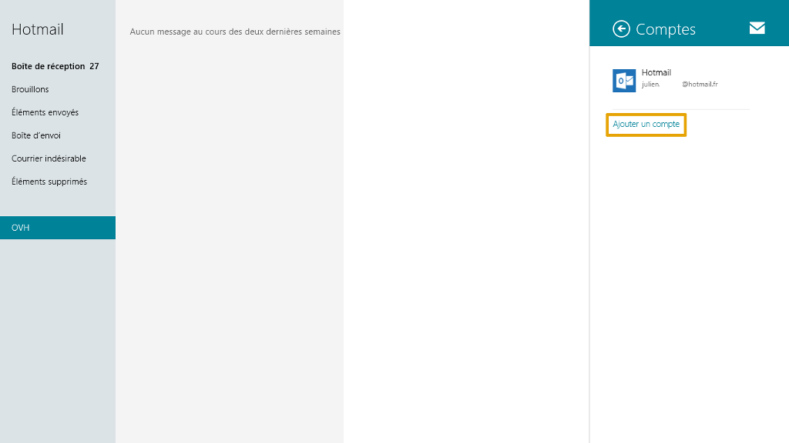
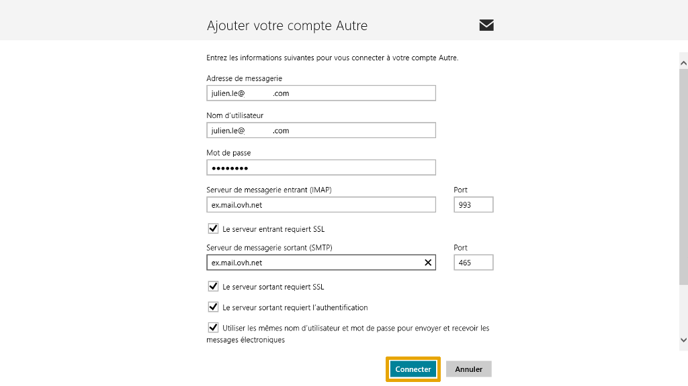

## Parte 1 : Início
Num primeiro tempo, aceda à aplicação "Correio" de Windows 8 no ecrã inicial (Start) do seu sistema operativo.

Na primeira utilização do software ser-lhe-á pedida a indicação de um endereço de email e a palavra-passe associada (numa interface diferente da que é aqui ilustrada).

Se já tem uma conta associada, eis os aspeto da interface que lhe será apresentada.

Coloque o seu cursor na secção da direita e selecione "Parâmetros"

{.thumbnail}

## Parte 2 : Contas
Clique de seguida em "Contas" a fim de adicionar a sua nova conta de email Exchange.

{.thumbnail}

## Parte 3 : Adicionar uma conta
Vemos que um endereço de email já está presente.

Terá a possibilidade de, uma vez a conta Exchange adicionada, aceder à configuração da conta através de um clique na mesma.

Clique em "Adicionar uma conta" para continuar.

{.thumbnail}

## Parte 4 : Tipo de conta
Deve selecionar o tipo de conta de email a adicionar.
Clique em "Exchange" para continuar.

{.thumbnail}

## Parte 5 : Configuração
Nesta nova interface, preencha os diferentes campos necessários.

"Endereço de email": o endereço de email Exchange completo.

"Mot de passe": A palavra-passe definida no seu [Espaço Cliente](https://www.ovh.com/manager/web/login.html) para esta conta Exchange.

Clique em "Ligação" para continuar.

{.thumbnail}

## Parte 5 : Configurações avançadas
Para todas as encomendas efetuadas a partir de 26/04/2016, o servidor Exchange para uma oferta Hosted é: ex2.mail.ovh.net.
Nesta nova interface, preencha os diferentes campos.

"Endereço de email": O endreço de e-mail Exchange completo.

"Endereço do servidor": no nosso exemplo, a conta Exchange é do tipo Hosted, o endereço é portanto ex.mail.ovh.net
Para as ofertas Private, deverá introduzir o nome que escolheu para o servidor durante a instalação do serviço Exchange 2013.

"Domínio": Dado facultativo. Recomenda-se não introduzir nenhum dado.

"Nome de utilizador": deve introduzir o seu endereço de email completo.

"Palavra-passe": A palavra-passe definida no seu [Espaço Cliente](https://www.ovh.com/manager/web/login.html) par esta conta Exchange.

Clique em "Ligação" para continuar.

{.thumbnail}

## Parte 7 : Aviso de segurança
Se uma mensagem de aviso aparecer, clique em "Aplicar estas estratégias" para continuar.

{.thumbnail}

## Parte 8 : Finalização
A sua conta Exchange está agora corretamente configurada.

Eis o aspeto da interface de utilização de emails.

{.thumbnail}

## Parte 1 : Início
Num primeiro tempo, aceda à aplicação "Correio" de Windows 8 no ecrã inicial (Start) do seu sistema operativo.

Na primeira utilização do software ser-lhe-á pedida a indicação de um endereço de email e a palavra-passe associada (numa interface diferente da que é aqui ilustrada).

Se já tem uma conta associada, eis os aspeto da interface que lhe será apresentada.

Coloque o seu cursor na secção da direita e selecione "Parâmetros"

{.thumbnail}

## Parte 2 : Contas
Clique de seguida em "Contas" a fim de adicionar a sua nova conta de email Exchange.

{.thumbnail}

## Parte 3 : Adicionar uma conta
Vemos que um endereço de email já está presente.

Terá a possibilidade de, uma vez a conta Exchange adicionada, aceder à configuração da conta através de um clique na mesma.

Clique em "Adicionar uma conta" para continuar.

{.thumbnail}

## Parte 4 : Tipo de conta
Deve selecionar o tipo de conta de email a adicionar.
Clique em "Outra conta" para continuar.

{.thumbnail}

## Parte 5 : Configuração
Nesta nova interface, preencha os diferentes campos necessários.

"Endereço de email": o endereço de email Exchange completo.

"Mot de passe": A palavra-passe definida no seu [Espaço Cliente](https://www.ovh.com/manager/web/login.html) para esta conta Exchange.

Clique em "Ligação" para continuar.

{.thumbnail}

## Parte 5 : Configurações avançadas
Para todas as encomendas efetuadas a partir de 26/04/2016, o servidor Exchange para uma oferta Hosted é: ex2.mail.ovh.net.
Nesta nova interface, preencha os diferentes campos.

"Endereço de email": O endereço de email Exchange completo.

"Nome de utilizador": O seu endereço de email Exchange completo.

"palavra-passe" : A palavra-passe definida no seu [Espaço Cliente](https://www.ovh.com/manager/web/login.html) para esta conta Exchange.

"Servidor de entrada (IMAP)": No nosso exemplo a conta Exchange é uma conta do tipo Hosted e o endereço de email é, portanto, ex.mail.ovh.net
Para uma oferta Private deverá introduzir o nome do servidor que escolheu durante a instalação do serviço Exchange 2013.
A "Porta" a indicar será 993.

"O servidor de entrada requer SSL": opção deve estar selecionada.

"Servidor de envio (SMTP)": No nosso exemplo a conta Exchange é uma conta do tipo Hosted e o endereço de email é, portanto, ex.mail.ovh.netex.mail.ovh.net
Para uma oferta Private deverá introduzir o nome do servidor que escolheu durante a instalação do serviço Exchange 2013.
A "Porta" a indicar será 465.

"O servidor de envio requer SSL": esta opção deve estar selecionada.

"O servidor de envio requer autenticação": esta opção deve estar selecionada.

"Utilizar o mesmo nome de utilizador e palavra-passe para enviar e receber emails": esta opção deve estar selecionada.

Clique em "Ligar" para continuar.

{.thumbnail}

## Parte 7 : Finalização
A sua conta Exchange está agora corretamente configurada em IMAP.

Eis o aspeto de uma interface de utilização dos emails.

{.thumbnail}

