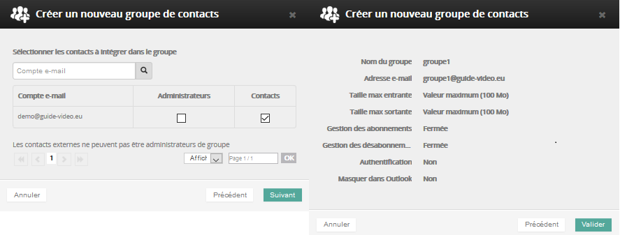

Le groupe permet à plusieurs utilisateurs Exchange de recevoir les e-mails envoyés à  une adresse unique : l'adresse du groupe. Cette adresse doit être unique et les messages qui y seront envoyés seront transférés à tous les membres du groupe.

Cliquez [ici](https://www.ovh.com/fr/emails/hosted-exchange/guides/){.external} pour retrouver nos différents guides.

## Création de la liste de diffusion

### Mise en place depuis le Manager &#58; Partie 1
Vous devez dans un premier vous connecter sur votre [espace client](https://www.ovh.com/manager/web/login.html){.external}.

Une fois connecté, sélectionnez votre service dans le menu de gauche : Microsoft puis Exchange

Dans la partie "Groupes", sélectionnez "Créer un groupe de contact"

{.thumbnail}

### Mise en place depuis le Manager &#58; Partie 2
Une nouvelle interface va apparaître, voici à quoi les éléments correspondent :

"Adresse e-mail" : l'adresse e-mail de votre liste de diffusion. Attention : vous ne pouvez pas renseigner une adresse déjà existante.

"Nom du groupe" : le nom d'affichage qui va apparaître dans votre [espace
client](https://www.ovh.com/manager/web/login.html){.external} ainsi que le nom d'affichage du groupe dans le [Webmail](https://ex.mail.ovh.net/owa/){.external}.

"Taille max entrante-sortante" : vous pouvez définir la taille des pièces jointes pour les e-mails entrants et sortants de la liste de diffusion.

"Gestion des abonnements-désabonnements" : définit le niveau de sécurité d'accès au groupe. Ouvert : tout le monde peut s'inscrire au groupe. Modérée : un administrateur valide l'inscription. Fermée : c'est l'administrateur qui inscrit les membres au groupe.

"Cacher l'adresse dans l'annuaire" : cacher l'adresse dans l'annuaire permet que l'adresse du groupe ne soit pas visible dans la liste des adresses du service Exchange.

"Authentification nécessaire" : si cochée, seuls les membres du groupe peuvent envoyer un message sur l'adresse du groupe.

Cliquez sur "Suivant" pour continuer.

{.thumbnail}

### Mise en place depuis le Manager &#58; Partie 3
Il vous suffit ensuite de valider ces deux étapes :

Dans un premier temps : Définir pour vos abonnés, quelles sont les personnes "Administrateurs" et "Contacts". Attention : uniquement les e-mails renseignés en "Contacts" reçoivent les mails envoyés à la liste de diffusion. Continuez en cliquant sur "Suivant".

Dans un second temps :

Finalisez vos choix avec un clic sur "Valider".

{.thumbnail}

### Mise en place depuis le Manager &#58; Partie 4
Votre groupe apparaît dans [l'espace client](https://www.ovh.com/manager/web/login.html){.external} après quelques minutes.

Les options de paramétrage des groupes sont disponibles depuis la roue crantée de droite.

Si vous souahitez ajouter ou supprimer des contacts, il faut choisir "configurer le groupe" puis "suivant".

{.thumbnail}

## Utilisation de la liste de diffusion

### Exemple d'utilisation depuis OWA &#58; Partie 1
Depuis le [webmail](https://ex.mail.ovh.net/owa/){.external} vous pouvez à présent réaliser le test de votre liste de diffusion.

Envoyez simplement un e-mail vers l'adresse électronique de votre groupe.

{.thumbnail}

### Exemple d'utilisation depuis OWA &#58; Partie 2
Votre mail doit être correctement délivré.

{.thumbnail}