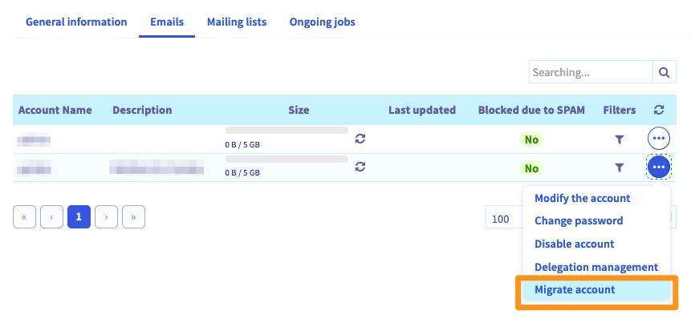
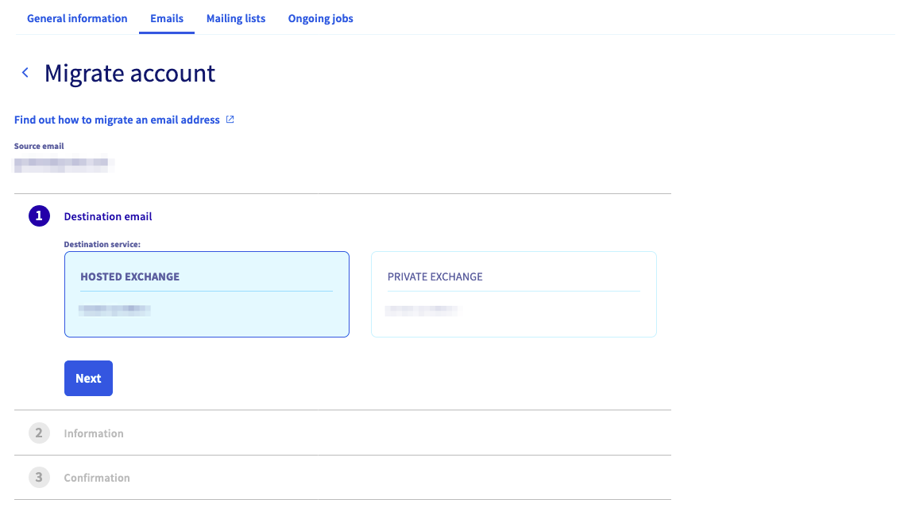

**Dernière mise à jour le 06/08/2020**

## Objectif

OVHcloud propose plusieurs solutions e-mail : MX Plan (vendu seul ou compris dans une offre d'hébergement web), E-mail Pro et Exchange. Celles-ci bénéficient de fonctionnalités propres et peuvent s'adapter à plusieurs usages. Vos besoins évoluent ? OVHcloud met à votre disposition un outil de migration vous permettant de passer d'une solution à une autre.

**Apprenez comment migrer une adresse e-mail MX Plan vers un compte E-mail Pro ou Exchange.**

## Prérequis

- Disposer d'une adresse e-mail MX Plan (via l'offre MX Plan ou incluse dans une offre d'[hébergement web OVHcloud](https://www.ovh.com/fr/hebergement-web/){.external}).
- Disposer d'un service [Exchange](https://www.ovh.com/fr/emails/hosted-exchange/){.external} ou [E-mail Pro](https://www.ovh.com/fr/emails/email-pro/){.external} avec au minimum un compte non configuré (qui apparaîtra sous la forme "@configureme.me").
- Ne pas avoir paramétré de redirection sur l'adresse e-mail MX Plan que vous souhaitez migrer.
- Être connecté à votre [espace client OVHcloud](https://www.ovh.com/auth/?action=gotomanager){.external}.

## En pratique

### Étape 1 : délimiter votre projet

Les solutions E-mail Pro et Exchange disposent d'une base de fonctionnalités commune. Néanmoins, des différences subsistent selon les cas d'utilisation. En choisissant une adresse Exchange, vous disposez de la totalité des fonctions collaboratives, comme la synchronisation du calendrier et des contacts. La solution E-mail Pro, quant à elle, en propose quelques-unes mais celles-ci sont limitées à une utilisation via un webmail uniquement.

Avant de poursuivre, il est donc important de savoir vers quelle offre vous souhaitez migrer vos adresses e-mail MX Plan. Pour vous aider dans ce choix, consultez la page des [solutions e-mails professionnelles d'OVHcloud](https://www.ovh.com/fr/emails/){.external} qui propose un comparatif détaillé des offres. Vous avez la possibilité de cumuler les solutions et donc d'utiliser pour un même nom de domaine un ou plusieurs comptes E-mail Pro et Exchange. Par ailleurs, si vous devez migrer plusieurs comptes, nous vous conseillons de mettre en place un plan de migration.

### Étape 2 : commander vos comptes E-mail Pro ou Exchange

Cette étape est facultative si :
- vous êtes déjà en possession de comptes ;
- vous disposez déjà d'un service Exchange ou E-mail Pro vers lequel vous effectuez cette migration.

Dans le cas contraire, pour réaliser la manipulation, connectez-vous à votre [espace client OVHcloud](https://www.ovh.com/auth/?action=gotomanager){.external}, puis cliquez sur le bouton `Commander`{.action} dans la barre de services à gauche. Sélectionnez ensuite le service que vous voulez commander. Vous serez dirigé vers la page de commande. Suivez les différentes étapes, puis patientez jusqu'à l'installation effective du service. Un e-mail vous sera envoyé dès la fin de celle-ci.

### Étape 3 : réaliser une migration automatique

> [!primary]
>
> Votre compte OVHcloud doit préalablement être contact administrateur et contact technique du service E-mail Pro ou Exchange vers lequel vous migrez.
>
> Pour plus plus d'information sur les changements de contacts, consultez notre guide pour [gérer les contacts de ses services](../../customer/gestion-des-contacts/).
>

La migration peut être effectuée depuis deux interfaces :
- **celle de l'assistant de configuration Hosted Exchange**, uniquement si vous venez de commander un service Hosted Exchange et que vous n'avez encore rien paramétré sur ce dernier ;
- **celle du MX Plan**, dès que vous êtes en possession d'un service E-mail Pro ou Exchange (déjà configuré ou non) et d'une adresse MX Plan que vous souhaitez migrer.

Une fois que vous êtes prêt, poursuivez la lecture de cette documentation selon l'interface sélectionnée. Nous vous rappelons que le délai de migration dépend de la quantité de contenu à migrer vers votre nouveau compte. Celui-ci peut varier de quelques minutes à plusieurs heures.

> [!warning]
>
> Une fois la migration confirmée, vous ne pourrez plus accéder à votre ancienne adresse e-mail MX Plan ni annuler le processus de migration. Nous vous conseillons vivement de réaliser cette opération à un horaire propice.
>
> Même si vous ne pourrez plus accéder à votre adresse e-mail actuelle, les messages déjà réceptionnés ainsi que ceux reçus ne seront pas perdus. Tous seront immédiatement accessibles depuis votre nouveau compte.
>

#### Migration depuis l'assistant de configuration Exchange

Pour y accéder, sélectionnez dans l'[espace client OVHcloud](https://www.ovh.com/auth/?action=gotomanager){.external} le service concerné dans la barre de services à gauche. L'assistant devrait apparaître afin de vous aider à configurer votre nouveau service Exchange. Durant ce processus, vous pourrez sélectionner les comptes e-mails MX Plan à migrer.

Si l'assistant de configuration ne s'affiche pas, les informations générales du service Exchange apparaîtront à la place. Dans ce cas, vous devrez réaliser la migration de vos comptes via l'interface MX Plan.

#### Migration depuis l'interface MX Plan

Pour réaliser la migration depuis cette interface, rendez-vous dans la section `E-mails`{.action} dans la barre de services à gauche de votre espace client OVHcloud. Choisissez alors le service portant le nom de domaine de vos adresses e-mail. Cliquez sur le logo en forme d'engrenage sur la ligne du compte e-mail concerné (également appelé compte source) puis sur `Migrer le compte`{.action}.

{.thumbnail}

Dans la fenêtre qui s'affiche, sélectionnez le service de destination (celui vers lequel vous souhaitez migrer l'adresse) puis cliquez sur `Suivant`{.action}. S'il possède au minimum un compte « libre » (c'est-à-dire encore non paramétré), la migration s'effectuera vers l'un de ces comptes. Dès lors, prenez connaissance des informations qui s'affichent, validez-les, puis cliquez sur `Suivant`{.action} afin de poursuivre la manipulation.

Si vous ne possédez pas de compte « libre », un bouton `Commander des comptes`{.action} apparaîtra. Suivez les étapes, puis patientez le temps que les comptes soient installés pour effectuer de nouveau la manipulation.

Confirmez enfin le mot de passe de l'adresse e-mail source (celle que vous voulez migrer), puis cliquez sur `Migrer`{.action}. Cette manipulation sera à répéter autant de fois que nécessaire pour la migration d'autres comptes.

{.thumbnail}

### Étape 4 : vérifier ou modifier la configuration de votre domaine

À cette étape, vos adresses e-mail doivent déjà être migrées et fonctionnelles. Par sécurité, nous vous invitons à vous assurer que la configuration de votre domaine est correcte en consultant votre espace client.

Pour cela, sélectionnez le service E-mail Pro ou Exchange concerné dans la barre de services à gauche, puis rendez-vous sur l'onglet `Domaines associés`{.action}. Dans le tableau qui s'affiche, la colonne « Diagnostic » vous permettra de voir si la configuration DNS est correcte : une pastille rouge apparaît si la configuration doit être modifiée.

> [!primary]
>
> Si vous venez juste de réaliser la migration ou de modifier un enregistrement DNS de votre domaine, il se peut que l’affichage dans l’[espace client OVHcloud](https://www.ovh.com/auth/?action=gotomanager){.external} nécessite quelques heures pour se mettre à jour.
>

Pour modifier la configuration, cliquez sur la pastille rouge et réalisez la manipulation demandée. Cette dernière nécessite un temps de propagation de 4 à 24 heures maximum avant d’être pleinement effective.

{.thumbnail}

### Étape 5 : utiliser vos adresses e-mail migrées

Il ne vous reste plus qu’à utiliser vos adresses e-mail migrées. Pour cela, OVHcloud met à disposition un applicatif en ligne (_web app_) accessible à l’adresse <https://www.ovh.com/fr/mail/>. Vous devez y renseigner les identifiants relatifs à votre adresse e-mail.

Si vous avez configuré l'un des comptes migrés sur un client de messagerie (comme Outlook), vous devez de nouveau le paramétrer. Les informations de connexion au serveur OVHcloud ont changé suite à la migration. Pour vous aider dans vos manipulations, consultez notre documentation depuis les sections des guides consacrées à E-mail Pro ([https://docs.ovh.com/fr/emails-pro/](https://docs.ovh.com/fr/emails-pro/){.external}) et Hosted Exchange ([https://docs.ovh.com/fr/microsoft-collaborative-solutions/](https://docs.ovh.com/fr/microsoft-collaborative-solutions/){.external}). Si vous n'êtes pas en mesure de reconfigurer le compte dans l'immédiat, l'accès via l'applicatif en ligne est toujours possible.

> [!primary]
>
> Vous pouvez également migrer manuellement des adresses e-mail vers OVHcloud en utilisant notre outil [OVH Mail Migrator (OMM)](https://omm.ovh.net/){.external}. Pour cela, vous devez être en possession des informations (utilisateur, mot de passe, serveurs) de l'e-mail source et de destination.
>

## Aller plus loin

[Gérer les contacts de ses services](https://docs.ovh.com/fr/customer/gestion-des-contacts/){.external}.

[Guides E-mail Pro](https://docs.ovh.com/fr/emails-pro/){.external}.

[Guides Exchange](https://docs.ovh.com/fr/microsoft-collaborative-solutions/){.external}.

Échangez avec notre communauté d'utilisateurs sur [https://community.ovh.com](https://community.ovh.com){.external}.
