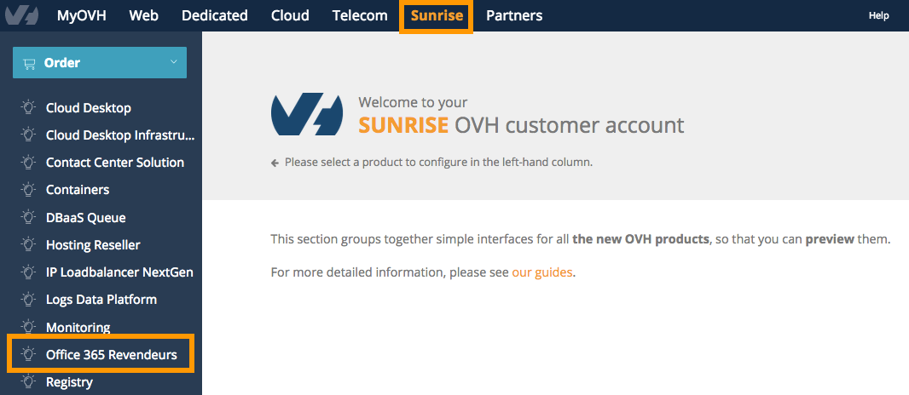

**Stand 19.03.2018**

## Einleitung

Eine Office 365 Lizenz kann auf 5 PCs/Macs, 5 Tablets und 5 Smartphones installiert werden. Sie erhalten regelmäßige Updates, darunter auch die Upgrades auf neue Versionen.

**In dieser Anleitung erfahren Sie, wie Sie den Office 365 Reseller Dienst (CSP2) bei OVH verwalten.**

## Voraussetzungen
- Sie haben eine OVH Kundenkennung (NIC-Handle).
- Sie sind über unsere Website [http://partners.ovh.com/](http://partners.ovh.com/){.external} beim **Partnerprogramm** registriert. 
- Sie verfügen über Office 365 CSP2 Lizenzen.

## Beschreibung

### Zugang zur Verwaltung des Office 365 Reseller Dienstes

Sobald der Office 365 Dienst eingerichtet und verfügbar ist, können Sie ihn über Ihr [OVH Kundencenter](https://ovh.com/auth/?action=gotomanager){.external} verwalten.

Loggen Sie sich hierzu in Ihrem Kundencenter ein und gehen Sie dann in den Bereich `Sunrise`{.action}. Im Menü auf der linken Seite wählen Sie `Office 365 Reseller`{.action} (ggf. Office 365 Revendeurs) und dann den Dienst aus.

> [!primary]
>
> Wenn Sie schon über einen Office 365 CSP2 Dienst von Microsoft verfügen, können Sie dessen Verwaltung an OVH übertragen. So können Sie direkt über Ihr OVH Kundencenter weitere Abonnements hinzufügen. Wählen Sie hierzu bei der Bestellung einer neuen Lizenzgruppe `Delegation einer zuvor bei Microsoft erstellten Plattform`{.action} aus.
>

Hinweis: Wenn Sie über eine Microsoft Partner ID verfügen, können Sie diese ebenfalls in diesem Interface eingeben. So können Sie ein Cashback auf Abonnements erhalten, die Sie über unser Kundencenter bestellen. Dieses Cashback unterliegt den von Microsoft definierten Regeln und hängt von der Menge der bestellten Abonnements ab.

{.thumbnail}

### Die Details Ihres Office 365 Reseller Dienstes (CSP2) einsehen

Im Menü auf der linken Seite klicken Sie auf den Namen Ihres Dienstes, um die Informationen anzuzeigen.

|Bezeichnung|Beschreibung|
|---|---|
|Interner Servicename|Zeigt den Namen Ihres Dienstes an. Dieser ist nur in Ihrem Kundencenter sichtbar.|
|Anzeigename des Dienstes|Hier können Sie den Anzeigenamen Ihres Dienstes im Kundencenter ändern (in Sunrise „Nom d'affichage du service“).|
|Erstellt am|Zeigt das Erstellungsdatum des Dienstes an.|
|Microsoft Verwaltungsportal|Enthält den Link zum Office-Portal, über den Ihre Abonnements verwaltet werden können.|
|Online-Tutorials|Adresse für Online-Anleitungen zu Office (MOOC) als Hilfe bei der Nutzung der verschiedenen Programme der Office 365 Suite.|
|Administrator-Passwort zurücksetzen|Hier können Sie das Passwort für die Verbindung zum Verwaltungsportal von Microsoft ändern.|

{.thumbnail}

### Eine bei OVH gehostete Domain automatisch konfigurieren

OVH stellt Ihnen ein Tool für die einfache Konfiguration von Domains zur Verfügung. Mithilfe dieses Tools können Sie Ihre Domains automatisch mit der OVH DNS-Zone konfigurieren, damit sie mit folgenden Lösungen verwendet werden können:

- Exchange Online
- Skype
- Intune

Wählen Sie hierzu die entsprechende Domain in der Drop-down-Liste und anschließend die gewünschten Lösungen aus. OVH legt dann die entsprechenden DNS-Einträge in der OVH DNS-Zone der Domain an.

{.thumbnail}

### Abonnements verwalten

Über die Abo-Verwaltung können Sie Abonnements für Office 365 Lizenzen bestellen oder kündigen. Die Details zu Ihren aktuellen Abonnements werden in einer Tabelle angezeigt.

|Bezeichnung|Beschreibung|
|---|---|
|ID|Jede bestellte Lizenz verfügt über eine einzigartige Identifikationsnummer (ID).|
|Status|Zeigt den Status Ihrer Lizenz.|
|Name der Lizenz|Zeigt die Art der bestellten Lizenz.|
|Anzahl der Lizenzen|Zeigt die Anzahl der verfügbaren Lizenzen.|
|Erstellungsdatum|Zeigt das Datum an, an dem das Abonnement für die ausgewählte Lizenzart erstellt wurde.|
|Letztes Update|Zeigt das Datum der letzten Aktualisierung des Abonnements (z. B. das letzte Hinzufügen einer Lizenz).|

Über das Bleistift-Symbol kann die Gesamtzahl der Lizenzen  verändert werden, die im Abonnement enthalten sind.  Über das Papierkorb-Symbol kann das Abonnement zusammen mit allen zugehörigen Lizenzen gekündigt werden.

> [!primary]
>
> Für Office 365 Education sind besondere Lizenzbedingungen von Microsoft einzuhalten. Die entsprechenden offiziellen Dokumente stehen Ihnen je nach Region und Sprache [hier](http://www.microsoftvolumelicensing.com/DocumentSearch.aspx?Mode=2&Keyword=AcademicQualEdUserDef){.external} zur Verfügung.
>

{.thumbnail}

### Benutzer verwalten

Nachdem Sie nun über ausreichende Lizenzen verfügen, können Sie die Nutzer dieser Lizenzen verwalten. Dieser Schritt erfolgt direkt über das [Verwaltungsportal von Microsoft](https://portal.office.com/Admin/Default.aspx){.external}.

Um sich dort einzuloggen, geben Sie Ihren Benutzernamen und das Passwort ein, dass Sie in der Bestätigungs-E-Mail von OVH zur Installation Ihrer Lizenzgruppe erhalten haben.

## Weiterführende Informationen

Für den Austausch mit unserer User Community gehen Sie auf [https://community.ovh.com/en/](https://community.ovh.com/en/){.external}.