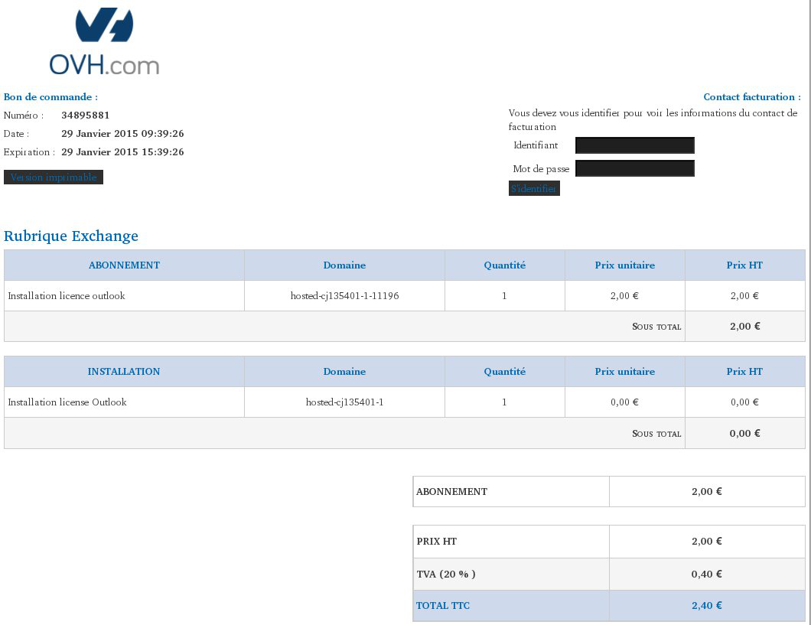
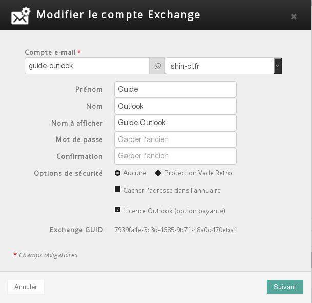

## Licencia Outlook Exchange 2013
OVH ofrece el cliente de correo oficial Outlook por un precio de 2 €/mes + IVA. Dicho cliente de correo estará asociado a una cuenta Exchange 2013 de OVH que usted gestione.

Existen diferentes versiones del programa, que podrá descargar desde el área de cliente web: 

- Outlook 2010 para Windows 32 bits.
- Outlook 2010 para Windows 64 bits.
- Outlook 2013 para Windows 32 bits.
- Outlook 2013 para Windows 64 bits.
- Outlook 2011 para Mac 64 bits.

## Para una plataforma Hosted Exchange
Acceda al [área de cliente](https://www.ovh.com/manager/web/login/), seleccione su plataforma Exchange y haga clic en la pestaña «Cuentas de correo».
Haga clic en el icono con forma de carrito situado en la línea correspondiente a la dirección Exchange con la que quiera utilizar Outlook.

Se abrirá el cuadro de diálogo de la imagen.

{.thumbnail}
Elija la versión de la aplicación y el período de suscripción (un mes o un año), acepte las condiciones de uso y haga clic en «Siguiente».

{.thumbnail}
Después del resumen del pedido, se generará la orden de pedido. Haga clic en «Abonar» para mostrarla. Se abrirá entonces la orden de pedido con las distintas formas de pago disponibles.

{.thumbnail}
Es posible que deba esperar hasta un máximo de dos horas hasta que el enlace de descarga de Outlook esté disponible.

{.thumbnail}

## Para una plataforma Private Exchange
Acceda al [área de cliente](https://www.ovh.com/manager/web/login/), seleccione su plataforma Exchange y haga clic en la pestaña «Cuentas de correo».
Haga clic en el icono «Configuración», con forma de lápiz, situado en la línea correspondiente a la dirección Exchange con la que quiera utilizar Outlook.

{.thumbnail}
En el cuadro de diálogo «Editar la cuenta Exchange», marque la casilla «Licencia Outlook (opción de pago)».

Continúe a la siguiente etapa y acepte la contratación de la licencia Outlook. No se generará ninguna orden de pedido, sino que se facturará (2 €/mes + IVA) junto con la renovación mensual de su plataforma Private Exchange.

{.thumbnail}

## Información general
Acceda al [área de cliente](https://www.ovh.com/manager/web/login/), seleccione su plataforma Exchange y haga clic en la pestaña «Cuentas de correo».

En la columna «Outlook» verá el botón verde «Sí». Haga clic en ese botón para elegir la versión de Outlook y el idioma utilizado.

{.thumbnail}
Si no sabe cuál es su versión de Windows o Mac, consulte las guías oficiales de Microsoft o Apple:

- [Windows](http://windows.microsoft.com/es-es/windows/which-operating-system)
- [Mac](http://support.apple.com/es-es/HT1159)

{.thumbnail}
Se generará el enlace de descarga.

{.thumbnail}
A continuación, haga clic en el enlace para iniciar la descarga. No olvide anotar la clave de seguridad o serial. La necesitará durante la instalación de la aplicación.

Para instalar Outlook 2011 en Mac no es necesaria ninguna clave o serial.

{.thumbnail}

## Información general
El archivo descargado es una ISO, es decir, una imagen de disco. No es posible utilizarla tal cual; necesitará una de las siguientes soluciones para ejecutar la instalación de Outlook:

Lector virtual
En internet podrá encontrar lectores virtuales gratuitos con los que podrá simular un lector en su ordenador.

A continuación solo tendrá que montar el archivo .iso en el lector virtual para hacer creer a su ordenador que está leyendo un disco de instalación.

Grabar el archivo .iso
Si su ordenador tiene grabador de CD o DVD, utilice el programa correspondiente para grabar el archivo .iso. Así dispondrá de un CD o DVD de instalación de Outlook.

No olvide tener a mano la clave de instalación obtenida al generar el enlace de descarga.
La instalación de Outlook no forma parte del perímetro de intervención del soporte Exchange. No podremos ayudarle en ese proceso.

