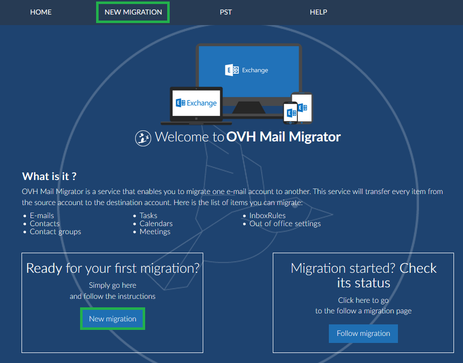

###

Das OMM (OVH Mail Migrator) Tool erlaubt Ihnen die Übertragung des Inhalts Ihres E-Mail-Dienstes auf die OVH Konten Exchange (E-Mail, Kontakte, Kalender, Aufgaben, etc.), E-Mail Pro und MX Plan.
So müssen Sie nicht mehr den oft aufwändigen und komplexen PST Export verwenden.
Um zu beginnen, gehen Sie bitte auf folgende Seite: [OVH Mail Migrator](https://omm.ovh.net){.external}.

## Eine Migration durchführen

Klicken Sie auf `Neue Migration`{.action} um den Prozess zu starten.

{.thumbnail}

## Quell-Account

Wählen Sie den Typ Ihres aktuellen E-Mail-Accounts und ergänzen Sie Ihre Server-Einstellungen.

Falls Ihr Account von OVH gehostet ist, wählen Sie: **Hosted by OVH** (Autodetect). Geben Sie anschließend Ihre E-Mail-Adresse an und klicken Sie auf **Einstellungen erkennen**.

Daraufhin werden Sie nach dem Passwort gefragt.

> [!primary]
>
> Beispiel: Von einem MX Plan nach E-Mail Pro migrieren:
>
> - **Server-Typ:** Hosted by OVH
> - **Login:** Ihre MX Plan-E-Mail-Adresse
> - Klicken Sie auf **Einstellungen erkennen**
> - **Passwort:** Passwort Ihres E-Mail-Accounts
> 

## Ziel-Account

{.thumbnail}

Wählen Sie den gewünschten Typ Ihres neuen E-Mail-Accounts und geben Sie die zugehörige E-Mail-Adresse ein. Die Server-Einstellungen werden automatisch ausgefüllt.

> [!primary]
>
> Beispiel: Von einem MX Plan nach E-Mail Pro migrieren:
> 
> - **Server-Typ:** Hosted by OVH
> - **Login:** Ihre E-Mail Pro-E-Mail-Adresse
> - Klicken Sie auf **Einstellungen erkennen**
> - **Passwort:** Passwort Ihres E-Mail Pro-Accounts

## Optionen

Wählen Sie die Elemente, die sie migrieren möchten:

- **E-Mails**: Migration aller E-Mails und Anhänge. Die Ordnerstruktur wird übernommen.
- **Kalender**: Die Kalender und darin enthaltenen Termine des Accounts werden übernommen. Terminvorschläge und Einladungen werden nicht migriert.
- **Kontakte**: Die Kontakte Ihres Accounts werden migriert.
- **Regeln**: Die Regeln Ihres Accounts werden übernommen (ab Exchange 2010).
- **Kontaktgruppen**: Die Kontaktgruppen Ihres Accounts werden migriert.
- **Automatische Antwort**: Die Einstellungen für Ihre automatischen Antworten (Auto-Reply) werden übernommen.
- **Aufgaben**: Die auf Ihrem Account festgelegten Aufgaben werden übernommen.

{.thumbnail}

## Fertigstellung

Für eine POP/IMAP-Migration auf Exchange kann nur die Option „E-Mails“ gewählt werden.

Sie können auch eine „Mail-Adresse für Benachrichtigungen zur Migration“ eingeben.

Wenn Sie die erforderlichen Angaben ausgefüllt haben, klicken Sie auf: ` Migration starten`{.action}.

Wenn ein falscher Login, Server oder ein falsches Passwort angegeben wird, erscheint eine Fehlermeldung.

{.thumbnail}

Nach der Erstellung des Tasks wird die Migration gestartet.

-  Sie können den Fortschritt Ihrer Migration nachverfolgen.

{.thumbnail}

Wichtig! Notieren Sie die Nummer des Tasks (Migrations-ID), um die Operation wieder auffinden und ihren Fortschritt verfolgen zu können.

## PST-Datei importieren

Sie haben eine PST-Datei und möchten diese in Ihren E-Mail-Account importieren. Gehen Sie hierzu im Menü auf `PST-Migration`{.action}.

{.thumbnail}

Klicken Sie auf `Migration starten`{.action}.

Klicken Sie danach auf `Durchsuchen`{.action} und wählen Sie Ihre PST-Datei.

{.thumbnail}

Wenn Sie Ihre PST-Datei ausgewählt haben, werden Sie erneut nach dem Passwort des Ziel-Accounts gefragt, bevor die Migration gestartet wird.

Beim Start der Migration wird dieser eine Migrations-ID zugeteilt. Die ID wird benötigt, um Ihre Migration zu verfolgen.

## Status einer Migration verfolgen

Sie können den Fortschritt der Migration Ihres Accounts direkt nachverfolgen.
Sie benötigen dazu:

-  Die Identifikationsnummer der Migration, also die bei der Erstellung des Tasks vergebene Migrations-ID (s.o.).
-  Den Login des Quell-Accounts, d.h. die vollständige E-Mail-Adresse.

Tragen Sie die geforderten Angaben ein und klicken Sie auf `Verfolgen`{.action}, um den Status der Migration einzusehen.

{.thumbnail}

Der Fortschritt der Migration wird in einem neuen Fenster angezeigt. So können Sie überprüfen, wie weit die Operation fortgeschritten ist oder ob diese bereits abgeschlossen wurde.

1. ID des Tasks, d.h. die Migrations-ID der Operation.
2. Erstellungsdatum der Migrationsoperation.
3. Letzte Änderung der Migrationsoperation.
4. `Rückgängig machen`{.action}: Mit dieser Option können Sie den Ziel-Account in den ursprünglichen Zustand vor der Migration zurückversetzen.

{.thumbnail}

## Abbrechen

**Abbrechen**: Mit dieser Operation können weitere Vorgänge der Migration abgebrochen werden, die gerade laufende Operation wird jedoch abgeschlossen.

*Beispiel: Die Migration der Kontakte wird gerade durchgeführt. Wenn Sie jetzt auf "Abbrechen"*
*klicken, wird die Migration der Kontakte abgeschlossen. Wurde jedoch zu Beginn auch die Migration der*
*Kalender ausgewählt, wird diese nun nicht mehr durchgeführt*
*und die Migration wird beendet.*

## Rückgängig machen

`Rückgängig machen`{.action} Mit dieser Option können Sie den Ziel-Account in den ursprünglichen Zustand vor der Migration zurückversetzen. Diese Funktion ist nur innerhalb von 48 Stunden nach Abschluss des Migrationsprozesses verfügbar.
