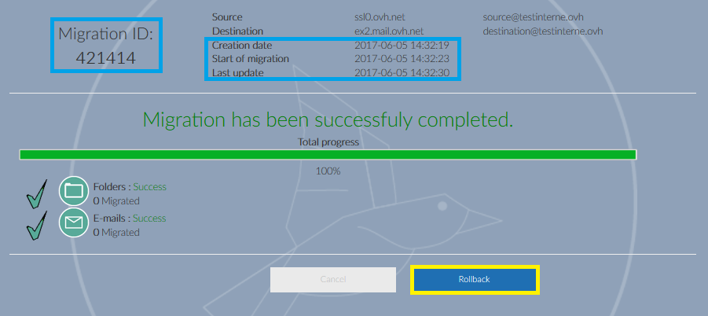

OMM (OVH Mail Migrator) ti permette di trasferire il contenuto dei tuoi account di posta (email, contatti, calendari, attività, ecc...) verso i tuoi account Exchange, Email Pro e MX Plan, in modo da non dover esportare i tuoi dati in PST (operazione che potrebbe richiedere tempo e incontrare limitazioni).

Per prima cosa, accedi alla pagina di [OVH Mail Migrator](https://omm.ovh.net){.external}.

## Inizia una nuova migrazione
Clicca su `Nuova migrazione`{.action} per passare allo step successivo.

{.thumbnail}

### Account sorgente
Scegli il tipo di account che stai utilizzando e inserisci i parametri del tuo server.

Se l'account sorgente è ospitato in OVH, puoi scegliere l'opzione **Hosted by OVH** (Autodetect). Dovrai inserire il tuo indirizzo email e cliccare su **Rileva impostazioni**.

In seguito, ti verrà chiesto di inserire la password.

> [!primary]
>
> Ad esempio, per la migrazione da un MX Plan a Email Pro:
> Tipo di server: Hosted by OVH
> Login: il tuo indirizzo email MX Plan
> Clicca su Rileva impostazioni
> Password: la password del tuo account email
> 

### Account di destinazione

{.thumbnail}

Scegli il tipo del nuovo account e inserisci il tuo indirizzo email e la password. I parametri relativi al server si completeranno automaticamente.

> [!primary]
>
> Ad esempio, per la migrazione da un MX Plan a Email Pro:
> Tipo di server: Hosted by OVH
> Login: il tuo indirizzo Email Pro
> Clicca su Rileva impostazioni
> Password: la password del tuo indirizzo Email Pro
> 

### Opzioni
Seleziona gli elementi che vuoi migrare:

**Email**: i messaggi di posta, con conservazione della gerarchia delle cartelle.

**Calendari**: i calendari associati all'account, con conservazione degli eventi (gli inviti agli eventi non verranno trasferiti).

**Contatti**: i contatti aggiunti sull'account.

**Regole**: le regole definite sull'account (solo con Exchange 2010 Sp1 o superiore).

**Gruppi di contatti**: i gruppi di contatti creati sull'account.

**Risposta automatica**: le regole configurate per le risposte automatiche fuori sede.

**Attività**: le attività previste sull'account.

{.thumbnail}

### Finalizzazione
Per migrare un account POP/IMAP su Email Pro o Exchange, seleziona "Email". È possibile indicare un altro indirizzo di posta per ricevere le notifiche relative alla migrazione.

Una volta inserite le informazioni, clicca su `Inizia la migrazione`{.action} per avviare l'operazione.

Se i dati inseriti per login, password o server non sono corretti compare un messaggio di errore.

{.thumbnail}

La migrazione inizia subito dopo la creazione del task.

- È possibile seguire l'avanzamento della migrazione.

{.thumbnail}

> [!success]
>
> - 
> Importante: annota il numero del task (task ID) per ritrovare e seguire l'avanzamento della migrazione del tuo account.
> 
> 

## Importa i file PST
Importare un file di tipo .pst sul tuo account email è possibile tramite il menu `Migrazione PST`{.action}.

{.thumbnail}

Clicca su `Inizia la migrazione`{.action}

Clicca su `Scegli file`{.action} e carica il tuo file PST.

{.thumbnail}

Prima che la migrazione venga avviata, ti verrà chiesto di inserire nuovamente la password dell'account di destinazione.

A operazione iniziata verrà mostrato l'identificativo di migrazione necessario per seguirne l'avanzamento.

## Segui una migrazione in corso
Per verificare lo stato della migrazione del tuo account, sono necessari:

- l'ID della migrazione in corso (vedi paragrafo precedente)
- l'indirizzo email sorgente

Inserisci le informazioni richieste e clicca su `Segui`{.action}.

{.thumbnail}

Si apre una nuova finestra in cui puoi monitorare l'operazione, per verificarne lo stato o il completamento.

- 
    1. Identificativo dell'operazione di migrazione.
- 
    1. Data della richiesta di migrazione.
- 
    1. Ultimo aggiornamento della migrazione.
- 
    1. `Rollback`{.action}: ti permette di riportare l'account al suo stato iniziale (pre-migrazione).

{.thumbnail}

### Annullamento
**Annulla**: completa la migrazione in corso e annulla le operazioni in attesa.

*Esempio: hai richiesto di migrare i tuoi contatti e i tuoi calendari.* *Se clicchi su "Annulla" mentre la migrazione dei contatti è in corso, questa operazione viene completata* *mentre il trasferimento dei calendari viene annullato e la migrazione terminerà.*

### Rollback
La funzione `Rollback`{.action} ti permette di riportare l'account di destinazione al suo stato iniziale (pre-migrazione). Questa funzione è disponibile solo per 48 ore a partire dalla conclusione del processo di migrazione.