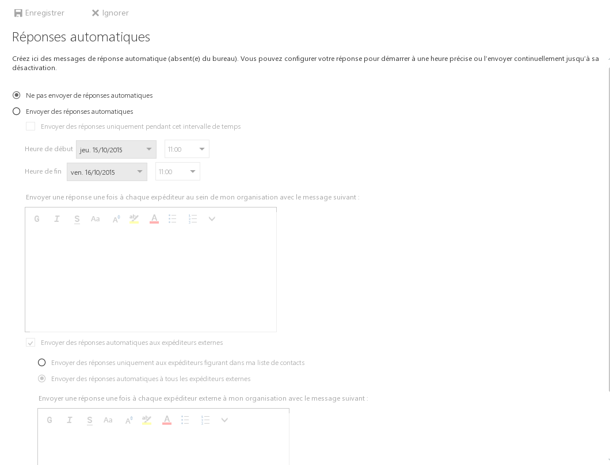

## Allgemeines
Mit dieser Funktion können Sie automatische Antworten für geplante Abwesenheiten oder sonstige spezifische Zwecke einrichten.

## Wie erstelle ich eine automatische Antwort?

Loggen Sie sich zunächst in die [Outlook Web App (OWA)](https://ex.mail.ovh.net/owa/){.external} ein. Klicken Sie dann rechts oben auf das kleine Zahnrad, um das Menü "Einstellungen" zu öffnen, und wählen Sie dann den Punkt "Automatische Antworten" aus.
Sie gelangen zu den "Automatischen Antworten" auch über "Einstellungen" > "Optionen" > "E-Mail".

{.thumbnail}

Wählen Sie beim nun erscheinenden Interface "Automatische Antworten senden" aus und definieren Sie den Zeitraum für den Versand der automatischen Antworten nach Bedarf.

In dem Content-Editor können Sie Ihre Nachricht ganz nach Wunsch eingeben und formatieren (Größe, Schriftart, Link einfügen etc.).

{.thumbnail}

## Antworttypen
Sie können verschiedene Arten von automatischen Antworten (oder Auto-Replies) einrichten:

- Nur an Absender innerhalb Ihrer Organisation senden.

Die automatischen Antworten werden in diesem Fall nur an Exchange-Nutzer innerhalb Ihrer Exchange-Plattform gesendet.

Und/oder

- An Absender innerhalb und außerhalb Ihrer Organisation senden.

Mit dieser Option können Sie eine spezifische automatische Antwortnachricht an die Absender innerhalb Ihrer Organisation (Ihre Kollegen) senden und eine ganz andere Antwort an Absender außerhalb Ihres Unternehmens (Ihre Kunden, Freunde, etc.).

{.thumbnail}

## Weiterführende Informationen
Wenn eine automatische Antwort aktiviert ist, wird jede eingehende Mail normal empfangen und im Posteingang abgelegt.

Wenn Sie ein Zeitfenster für den Versand der automatischen Antworten vorgeben, erscheint ein zusätzlicher Button im oberen Menüband.

Hier können Sie die festgelegten "Automatischen Antworten" direkt deaktivieren.

{.thumbnail}

- Achtung: Um Spam zu vermeiden, werden Ihre automatischen Antworten nur einmal an jeden Absender geschickt.