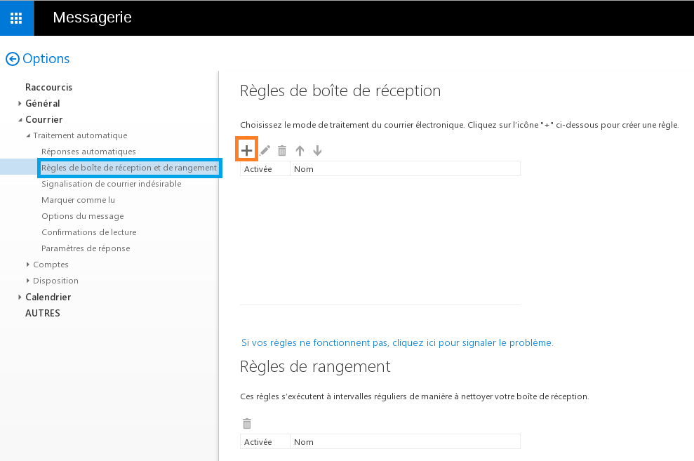
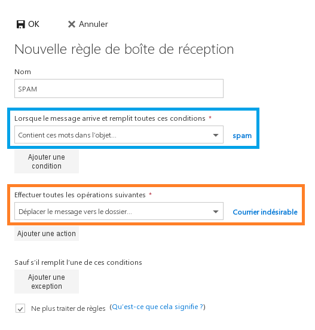

## Aktywacja - Etap 1
Opisujemy, jak dodać przekierowanie e-mail w interfejsie [Webmail Exchange](https://ex.mail.ovh.net/owa/).

Zaloguj się podając adres e-mail i przypisane do niego hasło.

Po zalogowaniu wybierz ikonkę w formie koła zębatego, a następnie "Opcje".

{.thumbnail}

## Aktywacja - Etap 2
Wybierz zakładkę "Skrzynka odbiorcza i reguły oczyszczania" i ikonkę o postaci "+".

{.thumbnail}

## Aktywacja - Etap 3
Pojawi się nowy interfejs.

Wypełnij wymagane pola:

Nazwa: nazwa reguły.

Gdy nadejdzie wiadomość spełniająca wszystkie te warunki: filtr dla wiadomości do przekierowania.

Wykonaj wszystkie następujące czynności: wybór operacji do zrealizowania (przekierowanie, usunięcie, przeniesienie...).

{.thumbnail}
Pojawi się nowe okno, w którym można wybrać adres e-mail, na który mają być przekierowywane e-maile.

Masz 2 możliwości:

- Wpisz ręcznie adres e-mail

- Wybierz kontakt z listy

Kliknij na "Ok", aby zatwierdzić wybór.

{.thumbnail}

## Aktywacja - Etap 4
Możesz dodać wyjątki. Na przykład: nie przekierowywać e-maila, jeśli został on wysłany z określonego adresu e-mail.

Dokończ tworzenie reguły klikając na "OK".

## Aktywacja - Etap 5
Reguła wyświetla się teraz poprawnie.

Z prawej strony wyświetla się podsumowanie wybranych opcji.

Na tym etapie możesz usunąć regułę.

{.thumbnail}

## Aktywacja reguły anty-spamowej / antywirusowej
Poniżej opisujemy przykład reguły filtrującej spam w katalogu "Wiadomości-śmieci".

Zgodnie z polityką OVH spam nie jest usuwany. Chcemy uniknąć usuwania poprawnych wiadomości.

Wiadomości są oznaczane jako SPAM, jeśli włączyłeś filtr antyspamowy podczas konfigurowania usługi exchange w panelu klienta. 

Oto przykład reguły, którą można uruchomić:

Nazwa: nazwa reguły

Gdy nadejdzie wiadomość spełniająca wszystkie te warunki:: "Zawiera te wyrazy w temacie", dodaj słowo "[spam]" lub "[wirus]".

Wykonaj wszystkie następujące czynności: "Przenieś wiadomość do folderu" i wybierz folder "Wiadomości-śmieci".

{.thumbnail}

