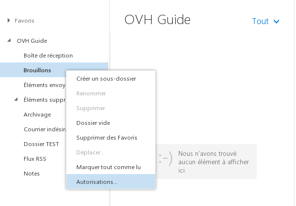

Deux choses sont à réaliser par le premier collaborateur pour partager un dossier. D'abord donner les autorisations de partage sur son compte e-mail. Puis donner les autorisations de partage sur le dossier en question. Le second collaborateur devra, quand à lui, récupérer le dossier en question. Les manipulations se réalisent dans le webmail Exchange

Cliquez [ici](https://www.ovh.com/fr/emails/hosted-exchange/guides/){.external} pour retrouver nos différents guides.

## Point de vue de l'utilisateur qui partage le dossier

### Autorisations de partage boite e-mail Partie 1
Dans notre exemple, un dossier sera partagé depuis le compte [ovhguide@support](mailto:ovhguide@support){.external}- exchange.eu vers [ovhguide2@support-exchange.eu](mailto:ovhguide2@support-exchange.eu){.external}. En premier lieu : donnez les autorisations de partage sur votre boite e-mail. Pour cela, réalisez un clic droit sur le nom de la boîte e-mail et cliquez sur "autorisations". Une nouvelle fenêtre apparaît.

{.thumbnail}

### Autorisations de partage boite e-mail Partie 2
Cliquez sur le  **+**  afin d'ajouter un collaborateur qui recevra le partage du compte e-mail. Une nouvelle interface apparaît ensuite.

{.thumbnail}

### Autorisations de partage boite e-mail Partie 3
Ajoutez l'utilisateur comme cela est décrit dans les 3 étapes ci-contre, puis cliquez sur "ajouter".

{.thumbnail}

### Autorisations de partage boite e-mail Partie 4
Ensuite, donnez à cet utilisateur les droits nécessaires :

Vous souhaitez que l'utilisateur [ovhguide2@support-exchange.eu](mailto:ovhguide2@support-exchange.eu){.external} n'accède uniquement qu'au dossier  **"brouillons"**  de la boite : [ovhguide@support](mailto:ovhguide@support){.external}- exchange.eu.

Concernant les autorisations :

Niveau d'autorisation : Aucun Il est nécessaire de cocher : Dossier visible.

Les autorisations ne seront données que sur le dossier en question.

Validez en cliquant sur le bouton  "ok".

{.thumbnail}

### Mise en place autorisations de partage sur le dossier
Donnez maintenant les droits sur un dossier, en l'occurrence le dossier "Brouillons"

De la même manière que précédemment, cliquez droit sur le dossier "Brouillons" puis

cliquez sur "autorisations"

Il vous est possible de réaliser la manipulation avec le dossier de votre choix.

Vous devrez réaliser les mêmes manipulations que précédemment, à savoir ajouter un collaborateur puis lui donner des droits nécessaires sur le dossier en question.

Vous pouvez donner différents droits comme :  Propriétaire, Éditeur, Auteur, Collaborateur...

{.thumbnail}

## Point de vue de l'utilisateur qui recoit le dossier partage

### Recuperation du dossier partage Partie 1
Sur le [Webmail Exchange](https://ex.mail.ovh.net/owa/){.external} du second utilisateur, ajoutez le dossier partagé.

Réalisez un clic droit sur votre compte e-mail, puis sélectionnez "ajouter un dossier partagé".

{.thumbnail}

### Recuperation du dossier partage Partie 2
Renseignez le compte de l'utilisateur ayant réalisé le partage du dossier.

### Recuperation du dossier partage Partie 3
Notre dossier "brouillons" apparaît maintenant correctement dans [OWA](https://ex.mail.ovh.net/owa/){.external}.

{.thumbnail}