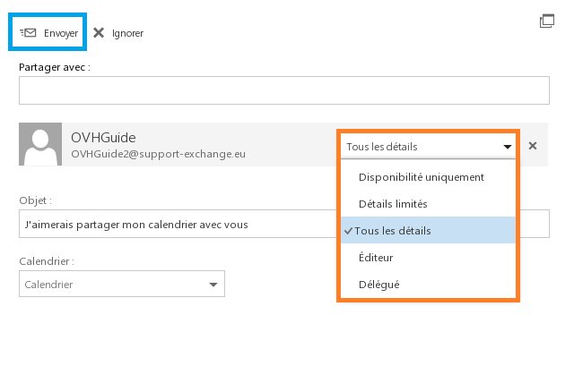

## Freigabe Kalender - Schritt 1
In unserem Beispiel soll der Kalender von ovhguide@support-exchange.eu für ovhguide2@support-exchange.eu freigegeben werden.
Klicken Sie auf das blaue Menü-Symbol links oben und anschließend auf "Kalender".

{.thumbnail}
Machen Sie dann im nun erscheinenden Interface im Menü links einen Rechtsklick auf den Hauptkalender und klicken Sie auf "Kalender freigeben".

{.thumbnail}

## Freigabe Kalender - Schritt 2
Unter "Freigeben für" geben Sie denjenigen Kollegen an, mit dem Sie Ihren Kalender teilen möchten. Dieser Kollege muss in jedem Fall ebenfalls über ein Exchange Konto auf derselben Domain verfügen.

Wenn Sie den Benutzer hinzugefügt haben, müssen Sie die gewünschten Berechtigungen auswählen. 

Um den Kalender dann tatsächlich freizugeben, müssen Sie lediglich auf "Senden" klicken.

{.thumbnail}

## Abruf des geteilten Kalenders über die Bestätigungs-E-Mail
Wenn Sie sich in Ihr [Exchange Webmail](https://ex.mail.ovh.net/owa) einloggen, sehen Sie eine E-Mail von der Person, die ihren Kalender für Sie freigegeben hat.

- Sie können die Freigabe des Kalenders nun direkt über die empfangene E-Mail bestätigen.
- Sie können auch Ihren eigenen Kalender mit der Person, die Ihnen die Mail gesendet hat, teilen.

{.thumbnail}

## Abruf des geteilten Kalenders über OWA
Im Abschnitt "Kalender" Ihres OWA Interface ist der geteilte Kalender sofort verfügbar.

In unserem Beispiel sehen Sie den Kalender von ovhguide@support-exchange.eu nun auf dem Konto von ovhguide2@support-exchange.eu.

{.thumbnail}

