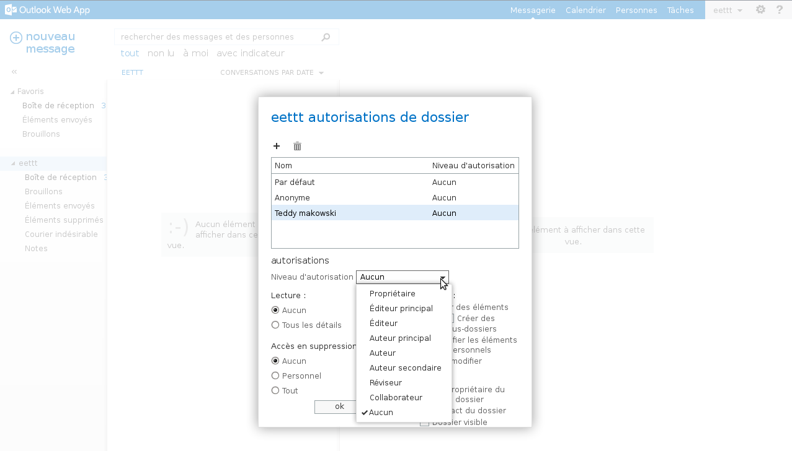
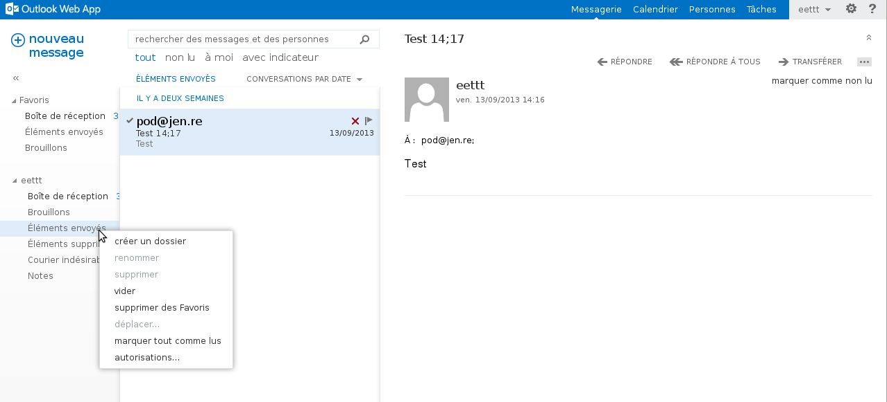

## Mise en place sur Outlook Web Application 2016

### Point de vue de l'utilisateur qui partage le dossier

#### Partie 1
Dans notre exemple, un dossier sera partagé depuis le compte [ovhguide@support](mailto:ovhguide@support){.external}- exchange.eu vers [ovhguide2@support-exchange.eu](mailto:ovhguide2@support-exchange.eu){.external}. En premier lieu : donnez les autorisations de partage sur votre boite e-mail. Pour cela, réalisez un clic droit sur le nom de la boîte e-mail et cliquez sur "autorisations". Une nouvelle fenêtre apparaît.

{.thumbnail}

#### Partie 2
Cliquez sur le  **+**  afin d'ajouter un collaborateur qui recevra le partage du compte e-mail. Une nouvelle interface apparaît ensuite.

{.thumbnail}

#### Partie 3
Ajoutez l'utilisateur comme cela est décrit dans les 3 étapes ci-contre, puis cliquez sur "ajouter".

{.thumbnail}

#### Partie 4
Ensuite, donnez à cet utilisateur les droits nécessaires :

Vous souhaitez que l'utilisateur [ovhguide2@support-exchange.eu](mailto:ovhguide2@support-exchange.eu){.external} n'accède uniquement qu'au dossier  **"brouillons"**  de la boite : [ovhguide@support](mailto:ovhguide@support){.external}- exchange.eu.

Concernant les autorisations :

Niveau d'autorisation : Aucun Il est nécessaire de cocher : Dossier visible.

Les autorisations ne seront données que sur le dossier en question.

Validez en cliquant sur le bouton  "ok".

{.thumbnail}

#### Partie 5

Donnez maintenant les droits sur un dossier, en l'occurrence le dossier "Brouillons"

De la même manière que précédemment, cliquez droit sur le dossier "Brouillons" puis cliquez sur "autorisations".

Il vous est possible de réaliser la manipulation avec le dossier de votre choix.

Vous devrez réaliser les mêmes manipulations que précédemment, à savoir ajouter un collaborateur puis lui donner des droits nécessaires sur le dossier en question.

Vous pouvez donner différents droits comme :  Propriétaire, Éditeur, Auteur, Collaborateur...

{.thumbnail}

### Point de vue de l'utilisateur qui recoit le dossier partage

#### Partie 1
Sur le [Webmail Exchange](https://ex.mail.ovh.net/owa/){.external} du second utilisateur, ajoutez le dossier partagé.

Réalisez un clic droit sur votre compte e-mail, puis sélectionnez "ajouter un dossier partagé".

{.thumbnail}

Renseignez le compte de l'utilisateur ayant réalisé le partage du dossier. Notre dossier "brouillons" apparaît maintenant correctement dans [OWA](https://ex.mail.ovh.net/owa/){.external}.

{.thumbnail}

## Mise en place sur Outlook Web Application 2013

### Point de vue de l'utilisateur qui partage le dossier

#### Partie 1
D'abord, donnez les autorisations de partage sur votre boite e-mail. Pour cela, réalisez un clic droit sur le nom de la boîte e-mail et cliquez sur "autorisations". Une nouvelle fenêtre apparaît.

En haut à droite de l'interface, "eettt" est le nom notre premier utilisateur

{.thumbnail}

#### Partie 2
Cliquez sur le  **+**  afin d'ajouter un collaborateur qui recevra le partage du compte e-mail. Une nouvelle interface apparaît ensuite.

{.thumbnail}

#### Partie 3
Ajoutez l'utilisateur comme cela est décrit dans les 3 étapes ci-contre, puis cliquez sur "ajouter".

{.thumbnail}

#### Partie 4
Ensuite, donnez à cet utilisateur les droits nécessaires, par exemple éditeur principal.

Validez en cliquant sur le bouton  "ok".

{.thumbnail}

#### Partie 5
Donnez maintenant les droits sur un dossier, en l'occurrence le dossier "Eléments envoyés"

De la même manière que précédemment, cliquez droit sur le dossier "Eléments envoyés" puis cliquez sur "autorisations"

Il vous est possible de réaliser la manipulation avec le dossier de votre choix.

Vous devrez réaliser les mêmes manipulations que précédemment, à savoir ajouter un collaborateur puis lui donner des droits nécessaires sur le dossier en question.

{.thumbnail}

### Point de vue de l'utilisateur qui recoit le dossier partage

Sur le [Webmail Exchange](https://ex.mail.ovh.net/owa/){.external} du second utilisateur, ajoutez le dossier partagé.

Réalisez un clic droit sur votre compte e-mail, puis sélectionnez "ajouter un dossier partagé".

{.thumbnail}

Renseignez le compte de l'utilisateur ayant réalisé le partage du dossier.

{.thumbnail}

Notre dossier "Eléments envoyés" apparaît maintenant correctement dans [OWA](https://ex.mail.ovh.net/owa/){.external}.

{.thumbnail}