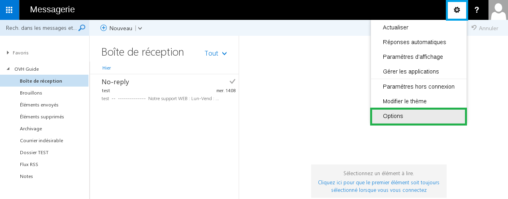

## Creación, etapa 1
A continuación, le explicamos cómo crear una redirección de correo desde el webmail [Outlook Web App (OWA)](https://ex.mail.ovh.net/owa/).

Identifíquese con su dirección completa de correo electrónico y contraseña. 

Una vez que se haya conectado, abra el menú de «Configuración» haciendo clic en el icono con forma de rueda dentada y, a continuación, seleccione «Opciones».

{.thumbnail}

## Creación, etapa 2
Seleccione la opción «Reglas de la bandeja de entrada y limpieza» y haga clic en el icono «+».

{.thumbnail}

## Creación, etapa 3
En el cuadro de diálogo, cumplimente los siguientes campos: 

Nombre: El nombre que quiera asignar a la regla. 

Cuando llega el mensaje y cumple todas estas condiciones: El filtro para el mensaje que desea redirigir. 

Siga todos estos procedimientos: Selección de la operación que desea realizar (redirigir, eliminar, mover, etc.).

{.thumbnail}
En la nueva ventana, seleccione o introduzca la dirección de correo a la que desea redirigir los mensajes de correo electrónico. 

Hay dos opciones: 

- Introducir una dirección de correo manualmente.

- Buscar en «Contactos».

Haga clic en «Aceptar» para validar su elección.

{.thumbnail}

## Creación, etapa 4
Es posible añadir excepciones como, por ejemplo, no redirigir los mensajes que se reciben desde una dirección de correo determinada. 

Haga clic en «Aceptar» para terminar de crear la regla.

## Creación, etapa 5
La regla se ha creado correctamente. 

A la derecha se muestra un resumen de las opciones seleccionadas. 

Si lo desea, puede eliminar aquellas reglas que ya no utiliza.

{.thumbnail}

## Creación de una regla contra el spam y los virus
En la imagen puede ver un ejemplo de las reglas que se pueden crear para enviar el spam a una carpeta de «Correo no deseado». 

OVH no elimina nunca el spam para evitar falsos positivos. 

Sin embargo, si ha activado el antispam durante la configuración del servicio Exchange desde su área de cliente, OVH sí etiquetará estos mensajes como tal. 

En la regla del ejemplo: 

Nombre: El nombre que quiera asignar a la regla.

Cuando llega el mensaje y cumple todas estas condiciones: Seleccione «Incluye estas palabras en el asunto...» y añada la palabra «spam» o «virus».

Siga todos estos procedimientos: Seleccione «Mover el mensaje a la carpeta...» y elija la carpeta de «Correo no deseado».

{.thumbnail}

