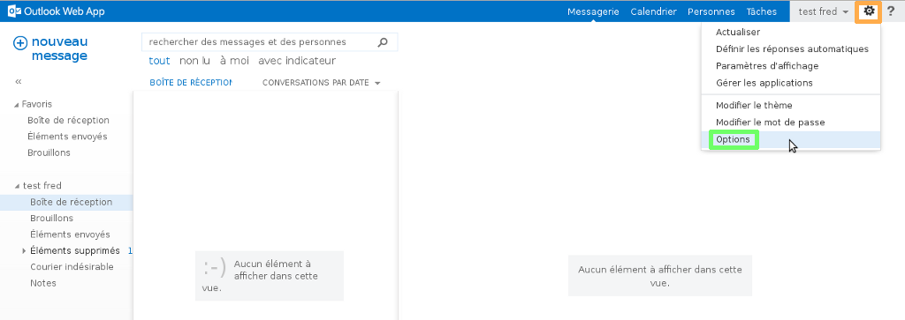
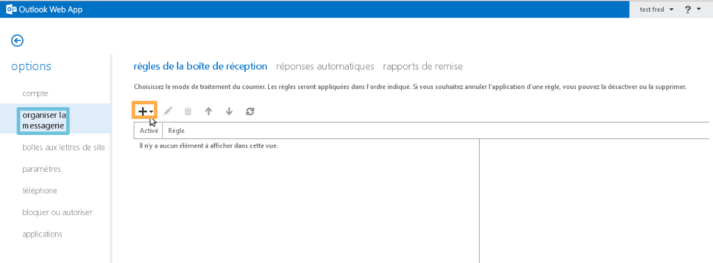
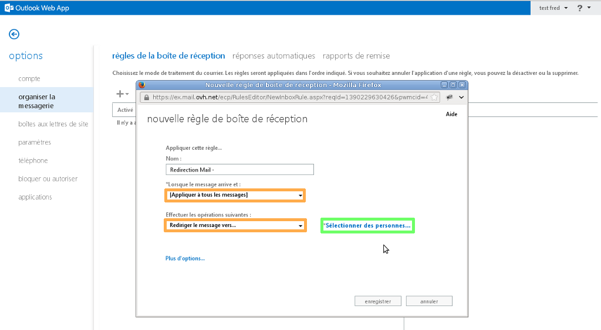
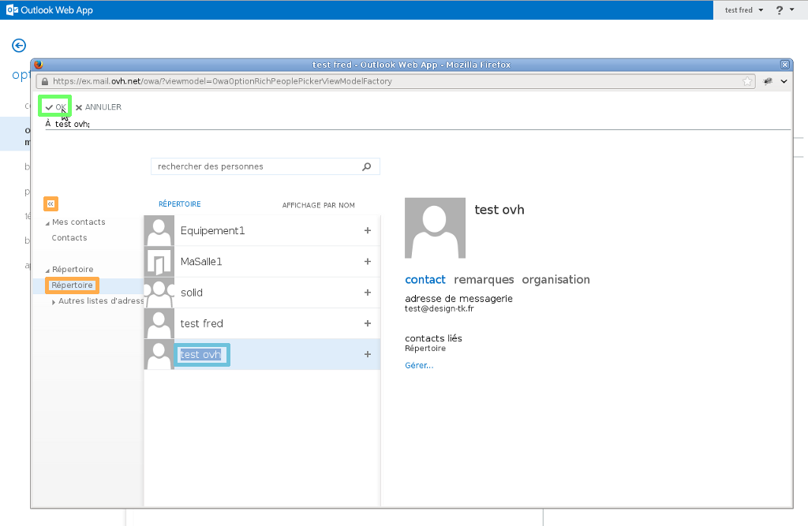
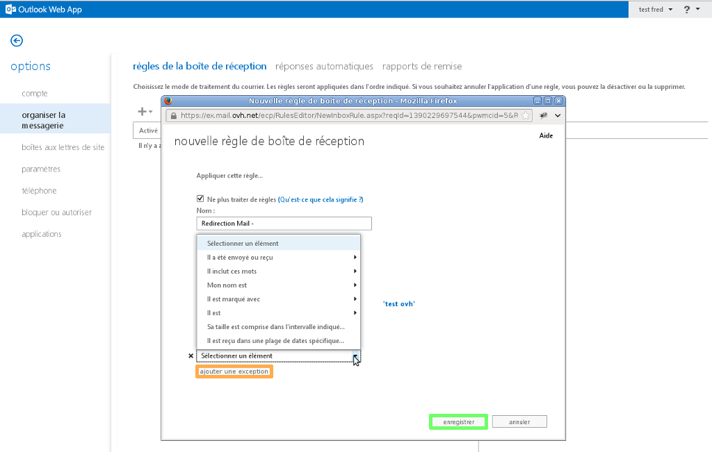
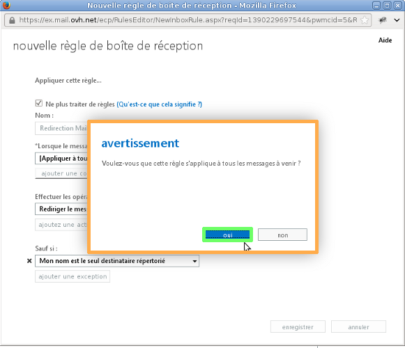
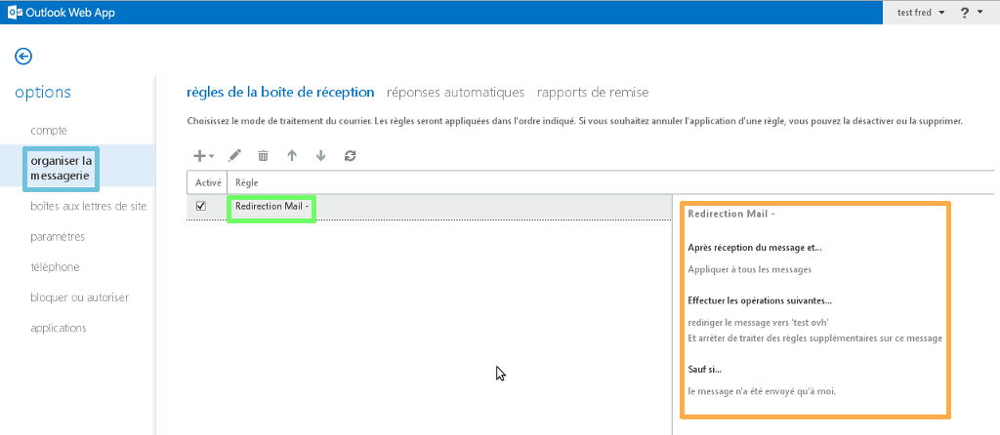
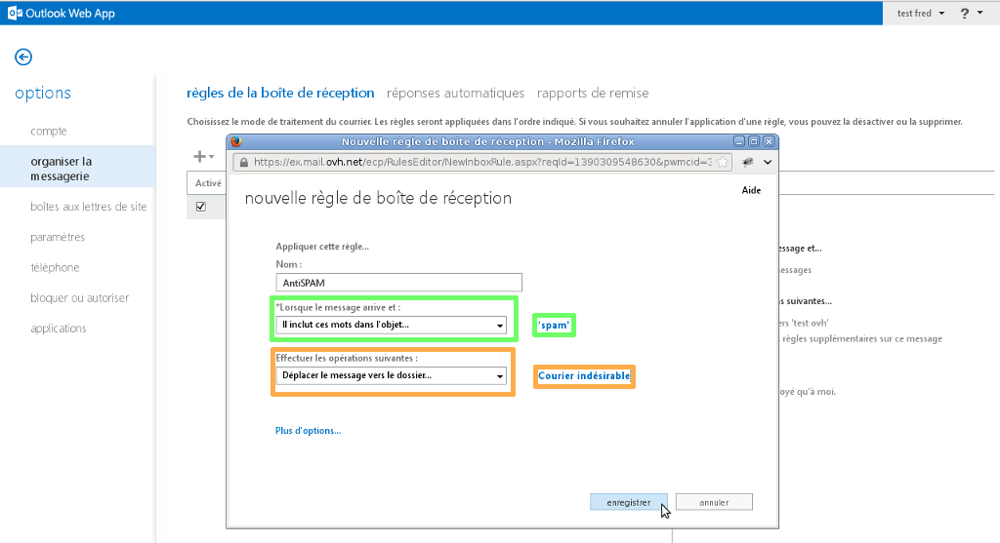

## Mise en place sur Outlook Web Application 2016 

### Mise en place Étape 1
Voici comment ajouter votre redirection e-mail depuis l'interface du [Webmail Exchange](https://ex.mail.ovh.net/owa/){.external}.

Identifiez-vous avec votre adresse e-mail entière et le mot de passe de votre compte e-mail.

Une fois connecté sélectionnez l'icône en forme d'engrenage, puis sélectionnez "Options".

{.thumbnail}

### Mise en place Étape 2
Sélectionnez ensuite l'onglet "Règles de boîte de réception et de rangement" puis l'icône en forme de "+".

{.thumbnail}

### Mise en place Étape 3
Une nouvelle interface apparaît.

Renseignez les champs demandés :

**Nom** :  le nom d'affichage de votre règle.

**Lorsque le message arrive et remplit toutes ces conditions** :  filtre pour le message à rediriger.

**Effectuer toutes les opérations suivantes** :  choix de l'opération à réaliser (redirection, suppression, déplacement...).

{.thumbnail}

Une nouvelle fenêtre s'ouvre afin de sélectionner ou saisir l'adresse e-mail vers la-quelle les e-mails seront redirigés.

Vous avez alors 2 possibilités :

- Saisir une adresse e-mail manuellement
- Rechercher un contact dans votre liste

Cliquez sur "Ok" pour valider votre choix.

{.thumbnail}

### Mise en place Étape 4
Vous avez la possibilité d'ajouter des exceptions, par exemple ne pas rediriger l'e-mail s'il a été reçu d'une adresse e-mail en particulier.

Finalisez votre règle en cliquant sur "OK".

### Mise en place Étape 5
Votre règle apparaît maintenant correctement.

Un résumé des options choisies s'affiche à droite.

À ce stade, vous pouvez supprimer la règle si elle n'a plus lieu d'être.

{.thumbnail}

### Exemple Filtre SPAM/Virus

Voici un exemple de règle réalisable afin de filtrer les spams dans un dossier "Courrier indésirable".

La politique d'OVH fait en sorte de ne jamais supprimer vos spams, afin d'éviter les faux positifs.

Il sont cependant tagués comme tels si vous avez activer l'antispam lors de la configuration du service exchange depuis votre espace client.

Voici un exemple de règle qu'il est possible de mettre en place :

**Nom** :  le nom d'affichage de votre règle.

**Lorsque le message arrive et remplit toutes ces conditions** :  "Il inclut ces mots dans l'objet..." ajoutez ensuite le terme "[spam]" ou "[virus]"

**Effectuer toutes les opérations suivantes** :  "Déplacer le message vers le dossier..." sélectionnez le dossier "Courrier indésirable"

{.thumbnail}

## Mise en place sur Outlook Web Application 2013

### Mise en place Partie 1
Voici comment ajouter votre redirection e-mail depuis l'interface du [Webmail Exchange](https://ex.mail.ovh.net/owa/){.external}.

Identifiez-vous avec votre adresse e-mail entière et le mot de passe de votre compte e-mail.

Une fois connecté sélectionnez l'icône en forme d'engrenage, puis sélectionnez "Options".

{.thumbnail}

### Mise en place Partie 2
Sélectionnez ensuite l'onglet "organiser la messagerie" puis l'icône en forme de "+".

Sélectionnez l'option "Créer une règle pour les messages entrants" pour continuer.

{.thumbnail}

### Mise en place Partie 3
Une nouvelle interface apparaît.

Renseignez les champs demandés :

**Nom** :  le nom d'affichage de votre règle.

**Lorsque le message arrive et** :  filtre pour le message à rediriger.

**Effectuer les opérations suivantes** :  choix de l'opération à réaliser (redirection, suppression, déplacement...).

Cliquez sur "Sélectionner des personnes..." pour choisir vers qui rediriger les e-mails.

{.thumbnail}

### Mise en place Partie 4
Sélectionnez les contacts vers qui vous souhaitez rediriger vos e-mails.

Cliquez sur "Ok" pour valider votre choix.

{.thumbnail}

### Mise en place Partie 5
Vous avez la possibilité d'ajouter des exceptions, par exemple ne pas rediriger l'e-mail s'il a été reçu d'une adresse e-mail en particulier.

Finalisez votre règle en cliquant sur "enregistrer".

{.thumbnail}

### Mise en place Partie 6
Cliquez sur "oui" pour valider le message d'avertissement qui apparaît.

{.thumbnail}

### Mise en place Partie 7
Votre règle apparaît maintenant correctement.

Un résumé des options choisies s'affiche à droite.

À ce stade, vous pouvez supprimer la règle si elle n'a plus lieu d'être.

{.thumbnail}

### Exemple Filtre SPAM/Virus

Voici un exemple de règle réalisable afin de filtrer les spams dans un dossier "Courrier indésirable".

La politique d'OVH fait en sorte de ne jamais supprimer vos spams, afin d'éviter les faux positifs.

Il sont cependant tagués comme tels.

Voici un exemple de règle qu'il est possible de mettre en place :

**Nom** :  le nom d'affichage de votre règle.

**Lorsque le message arrive et** :  "Il inclut ces mots dans l'objet..." ajoutez ensuite le terme "spam" ou "Virus"

**Effectuer les opérations suivantes** :  "Déplacer le message vers le dossier..." sélectionnez le dossier "Courrier indésirable"

{.thumbnail}