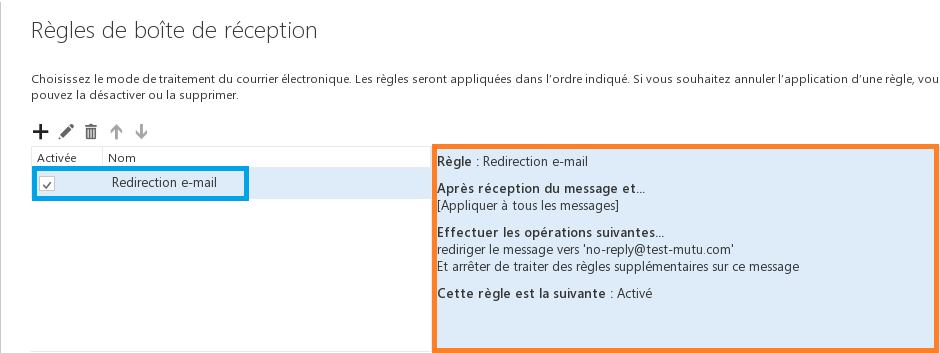

## 1 žingsnis
[Exchange žiniatinklio sąsajoje](https://ex.mail.ovh.net/owa/) peradresavimas nustatomas tokia tvarka:

Prisijunkite prie sąsajos nurodydami savo el. pašto adresą ir slaptažodį.

Prisijungę spragtelėkite krumpliaračio piktogramą dešiniajame viršutiniame kampe, tuomet pasirinkite Parinktys.

{.thumbnail}

## 2 žingsnis
Pasirinkite skirtuką Organise email ir piktogramą „+“.

{.thumbnail}

## 3 žingsnis
Bus parodytas naujas langas.

Užpildykite laukus:

Name: rodomas vardas.

When the message arrives: pasirinkite pranešimo filtravimą.

Do the following: pasirinkite operaciją, kurią norite atlikti, pvz., forward (peradresavimas).

{.thumbnail}
Naujai atsidariusiame lange galėsite pasirinkti ar įvesti el. pašto adresą, į kurį reikia peradresuoti el. laiškus.

Jūs turite 2 galimybes:

- Rankiniu būdu įvesti adresą

- Pasirinkti kontaktą iš sąrašo

Patvirtinkite paspaudę OK.

{.thumbnail}

## 4 žingsnis
Jūs galite pridėti išimtis, pavyzdžiui, nepersiųsti el. laiškų, gautų iš tam tikro adreso.

Išsaugokite savo taisyklę paspaudę OK.

## 5 žingsnis
Jūsų taisyklė yra sukonfigūruota.

Parinkčių santrauka parodyta dešinėje.

Ateityje jūs galėsite iš karto pašalinti šią konfigūraciją.

{.thumbnail}

## Anti-spam/anti-virus taisyklės
Čia pateikiamas pavyzdys, kaip filtruoti nepageidaujamus el. laiškus ir talpinti juos į nepageidaujamų el. laiškų aplanką.

OVH netikrina klientų gaunamų SPAM pranešimų, kad reikalingi el. laiškai nebūtų ištrinti per klaidą.

Jūs galite nustatyti, pavyzdžiui, šią konfigūraciją: 

Name: nurodyti nustatymų pavadinimą.

When you see this message: „It includes these words in the subject ...“, įveskite žodį [spam] ar [virus]

Do the following : „Move the message to folder ...“, pasirinkite Nepageidaujamų el. laiškų (Junk) aplanką.

{.thumbnail}

