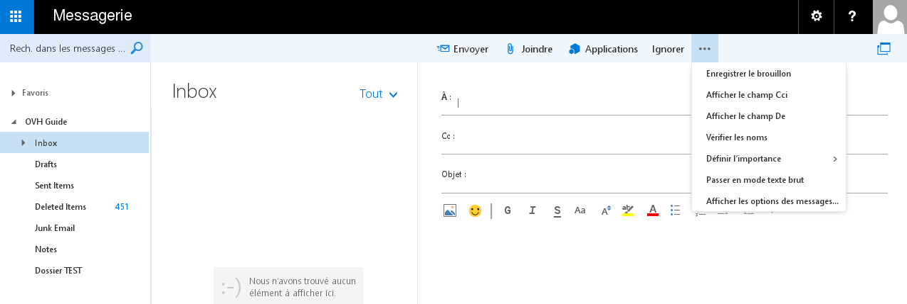
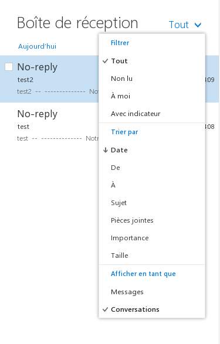
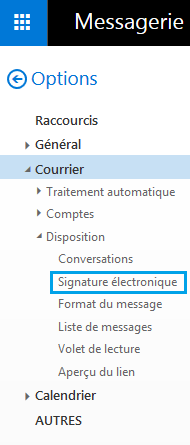
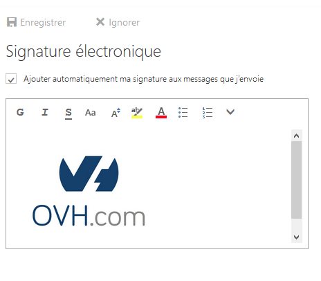
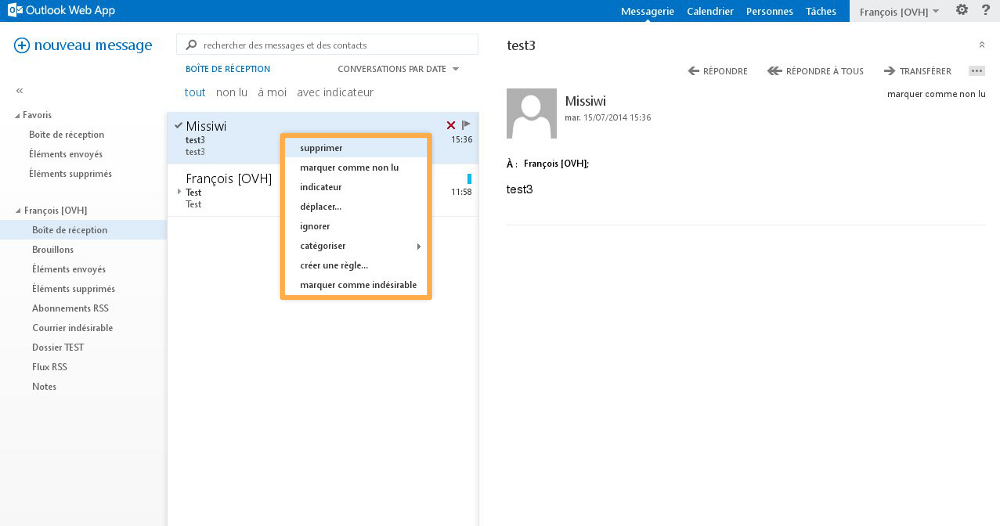

**Was ist die Outlook Web App (OWA)?**

OWA ist die Exchange Webmail-Oberfläche. Mit diesem Interface können Sie über einen einfachen Webbrowser auf Ihren Exchange Account mit sämtlichen Funktionen zugreifen.

Das kann beispielsweise nützlich sein, wenn Sie kein mit Exchange kompatibles E-Mail-Programm zur Verfügung haben.

**Wie verbindet man sich mit OWA?**

Der anzugebende Benutzername ist die vollständige Exchange Adresse, auf die Sie zugreifen möchten.

Das dazugehörige Passwort wurde bei der Erstellung der Exchange Adresse in Ihrem [Web Kundencenter ](https://www.ovh.com/manager/web/login.html) festgelegt.

Hosted Exchange Angebot:

- [https://ex.mail.ovh.net](https://ex.mail.ovh.net)
- [https://ex2.mail.ovh.net](https://ex2.mail.ovh.net)
- [https://ex3.mail.ovh.net](https://ex3.mail.ovh.net)

Private Exchange Angbebot: Die Zugriffs-URL ist abhängig vom bei der Erstellung der Dienstleistung gewählten Hostnamen Ihres Servers.

{.thumbnail}

Wenn Sie sich zum ersten Mal mit der OWA verbinden, müssen Sie Ihre Zeitzone auswählen.

{.thumbnail}

## Outlook Web App 2016

### Funktion

#### E-Mails
Wenn die Verbindung hergestellt ist, können Sie auf alle E-Mail-Funktionen zugreifen.

Wenn Sie sich in einen anderen bereich begeben (Kalender, Personen, Aufgaben), können Sie jederzeit wieder in den Bereich E-Mail zurückkehren.

Um auf die verschiedenen Bereiche zuzugreifen, klicken Sie auf das blaue Viereck links oben.

{.thumbnail}
Um eine neue Nachricht zu erstellen, klicken Sie bitte auf "Neu".

{.thumbnail}
Wenn Sie dann auf den kleinen schwarzen Pfeil klicken, gibt es zwei Optionen:

- E-Mail

- Ereignis

{.thumbnail}

In der Spalte links finden Sie die verschiedenen Systemordner sowie auch personalisierte Ordner (in unserem Beispiel"Dossier TEST").

{.thumbnail}

#### Neue E-Mail
Sie können zum Beispiel einen Anhang zu Ihrer E-Mail hinzufügen, [zusätzliche Applikationen](http://office.microsoft.com/de-de/store/applikationen-fuer-outlook-FX102825292.aspx?app=outlook.exe) in Verbindung mit OWA nutzen oder Empfangs- und Lesebestätigungen aktivieren.

Außerdem finden Sie dort die klassischen Bearbeitungsoptionen für den Inhalt (Schriftart, Größe, Farbe usw.).

Ergänzende Informationen
Die Größe eines Anhangs ist in OWA auf 35 MB beschränkt. Die ActiveSync Synchronisierungs-App beschränkt die Größe von Anhängen auf 10 MB (dies betrifft vor allem mit ActiveSync kompatible Smartphones). Bei der Verwendung eines kompatiblen E-Mail-Programms (zum Beispiel Outlook) können maximal 100 MB große Anhänge versandt werden.

{.thumbnail}

#### Systemordner und personalisierte Ordner
Standardmäßig werden folgende Systemordner angezeigt:

- Posteingang
- Entwürfe
- Gesendete Elemente
- Gelöschte Elemente
- Junk-E-Mails
- RSS Streams
- Notizen

{.thumbnail}

Systemordner können nicht umbenannt, verschoben oder gelöscht werden. Dabei handelt es sich um feststehende, nicht änderbare Regeln.

Wenn Sie einen Rechtsklick auf den Anzeigenamen Ihres Exchange Accounts oder auf einen Ordner machen, werden Ihnen verschiedene Optionen angeboten:

Neuen Ordner erstellen: erstellt einen personalisierten Ordner an der Stelle, an der der Rechtsklick durchgeführt wurde, in unserem Beispiel auf der gleichen Ebene wie die anderen Systemordner.

Umbenennen: benennt einen personalisierten Ordner um.

Löschen: löscht einen personalisierten Ordner.

Leeren: leert einen Systemordner oder personalisierten Ordner. Dessen gesamter Inhalt wird in den Ordner "Gelöschte Elemente" verschoben.

Zu Favoriten hinzufügen: fügt den ausgewählten Ordner zu den "Favoriten" hinzu.

Verschieben: verschiebt den ausgewählten personalisierten Ordner in einen anderen Ordner.

Alle als gelesen markieren: markiert alle nicht gelesenen E-Mails in einem Ordner als gelesen.

Freigegebenen Ordner hinzufügen: fügt einen Zugriff auf einen Ordner hinzu, den ein anderer Benutzer Ihrer Exchange Plattform mit Ihnen teilt (diese Option erscheint nicht bei einem Rechtsklick auf einen Systemordner oder personalisierten Ordner).

Berechtigungen: erlaubt die Erteilung von Zugriffsrechten auf den ausgewählten Systemordner oder personalisierten Ordner für einen anderen Benutzer Ihrer Exchange Plattform. Wenn die Berechtigungen erteilt wurden, muss der Benutzer, der die Freigabe erhalten soll, die im vorherigen Absatz beschriebene Funktion (Freigegebenen Ordner hinzufügen) im OWA Interface seines Exchange Accounts durchfüren.

#### Inhalt eines Ordners
In dem nebenstehenden Screenshot sehen Sie die Anzeige des Inhalts eines ausgewählten Ordners. In unserem Beispiel handelt es sich um den Systemordner "Posteingang", in dem sich zwei Test-E-Mails befinden.

Im oberen Bereich dieser Spalte finden Sie ein Suchfeld zum schnellen Auffinden von E-Mails oder Kontakten mit verschiedenen Sortierungsoptionen:

Alle: zeigt sämtliche E-Mails an.

Nicht gelesen: zeigt nur die nicht gelesenen E-Mails an.

An mich: zeigt nur die E-Mails an, die direkt an Sie adressiert wurden.

Mit Kennzeichnung: zeigt nur die E-Mails mit einer Kennzeichnung an (Symbol ⚐ im Titel der E-Mail).

Sortieren nach: erlaubt Ihnen die Sortierung der E-Mail-Liste nach verschiedenen Kriterien (Datum, Empfänger, Markiert, Größe usw.).

{.thumbnail}

#### E-Mail-Optionen
Folgende Optionen stehen bei einem Rechtsklick auf eine E-Mail zur Verfügung:

Antworten: ermöglicht eine direkte Antwort an den letzten Absender.

Allen antworten: ermöglicht eine Antwort an alle Kontakte unter "An" und "CC".

Weiterleiten: ermöglicht die Weiterleitung der Nachricht an eine andere E-Mail-Adresse.

Löschen: löscht die ausgewählte E-Mail.

Archivieren: archiviert die Nachricht in einem Ordner "Archiv". Der Name dieses Ordners kann personalisiert werden.

Als (un)gelesen markieren: markiert die ausgewählte E-Mail als (un)gelesen.

Anheften: die Nachricht wird an oberster Position im Ordner angeheftet. Wenn Sie die Nachricht angeheftet haben, lautet die Option im Menü: Lösen.

Als beendet markieren: diese Option wird nur angezeigt, wenn eine Kennzeichnung (⚐) für die E-Mail erstellt wurde, und markiert diese als beendet.

Als Junk-E-Mail markieren: markiert die ausgewählte E-Mail und deren Absender als unerwünscht / Spam. Die E-Mail wird dann automatisch in den Systemordner "Junk-E-Mail" verschoben. Sie können die Liste der zugelassenen und blockierten Benutzer in den Einstellungen einsehen, und zwar unter "Einstellungen" (Zahnradsymbol), "Optionen", "Blockieren oder zulassen".

Ignorieren: ignoriert die ausgewählte E-Mail und den dazugehörigen Thread. Die E-Mail und der sie enthaltende Thread werden dann in den Systemordner "Gelöschte Elemente" verschoben. Zukünftige an diesen Thread gesandte E-Mails werden automatisch in den Systemordner "Gelöschte Elemente" verschoben.

Verschieben: verschiebt die ausgewählte E-Mail in einen bestimmten Ordner.

Kategorisieren: kategorisiert die ausgewählte E-Mail und markiert diese farblich. Sie können auch Ihre Kategorien verwalten und die verwendeten Farben ändern.

Regel erstellen...: erstellt eine Regel für den E-Mail-Empfang und legt damit das Verhalten Ihres Exchange Accounts für zukünftige empfangene E-Mails fest.

{.thumbnail}

#### Inhalt einer E-Mail
In nebenstehendem Screenshot sehen Sie die Anzeige des Inhalts einer ausgewählten E-Mail, das Profilbild des Absenders der E-Mail, Datum und Uhrzeit des Empfangs der Nachricht und verschiedene zusätzliche Optionen:

Allen antworten: Antwort an alle Personen, die die E-Mail erhalten haben und im Feld "An" aufgeführt sind.

"..." (Mehr Optionen): blendet zusätzliche Optionen ein.

{.thumbnail}

#### Zusätzliche Optionen:
Antworten: Antwort an den Absender der letzten E-Mail in der Konversation.

Allen antworten: Antwort an alle Personen, die die E-Mail erhalten haben und im Feld "An" aufgeführt sind.

Weiterleiten: Weiterleitung der gesamten E-Mail inklusive Anhang an eine andere Adresse.

Allen mit Besprechung antworten: Erstellung einer Terminanfrage für eine Besprechung, die alle Teilnehmer bestätigen müssen.

Per Chatnachricht antworten: diese Option ist derzeit noch nicht verfügbar. Diese Funktion wird bei der Einführung der Lync App verfügbar sein.

Allen per Chatnachricht antworten: diese Option ist derzeit noch nicht verfügbar. Diese Funktion wird bei der Einführung der Lync App verfügbar sein.

Löschen: löscht die ausgewählte E-Mail.

Alle Nachrichten von ... löschen: löscht alle Nachrichten des Absenders.

Als Junk-E-Mail markieren: markiert die ausgewählte E-Mail und deren Absender als unerwünscht / Spam. Die E-Mail wird dann automatisch in den Systemordner "Junk-E-Mail" verschoben. Sie können die Liste der zugelassenen und blockierten Benutzer in den Einstellungen einsehen, und zwar unter "Einstellungen" (Zahnradsymbol), "Optionen", "Blockieren oder zulassen".

Als (un)gelesen markieren: markiert die ausgewählte E-Mail als (un)gelesen.

Drucken: öffnet die ausgewählte E-Mail in einem neuen Fenster, über das Sie den Druckvorgang anstoßen können.

Nachrichtendetails anzeigen: blendet den Header der ausgewählten E-Mail ein. Mit dieser Option können Sie den Weg zurückverfolgen, den die E-Mail bis zum Eintreffen auf unseren Servern genommen hat (durchlaufene E-Mail-Server, Datum, Uhrzeit...). Unser technischer Support kann Sie in bestimmten Fällen bitten, ihm zu Diagnosezwecken diesen E-Mail-Header zuzusenden.

In separatem Fenster öffnen: öffnet die ausgewählte E-Mail in einem neuen Fenster.

{.thumbnail}

### Kalender

#### Allgemeines
Über den Button "Kalender" können Sie Ihre Kalender einsehen, verwalten oder erstellen. Außerdem können Sie auch auf geteilte Kalender zugreifen oder Ihre Kalender für andere Nutzer freigeben.

{.thumbnail}

#### Neu
Über diesen Button können Sie Ihrem eigenen oder einem geteilten Kalender ein Ereignis hinzufügen.

Wie beim Verfassen einer neuen E-Mail haben Sie auch hier verschiedene Optionen im Hinblick auf den Inhalt des Ereignisses, das Sie einem ausgewählten Kalender hinzufügen möchten.

{.thumbnail}

### Personen

#### Allgemeines
Wenn Sie auf den Button "Personen" klicken, werden Ihre Kontakte angezeigt und Sie können neue Kontakte oder Gruppen für Ihren Exchange Account erstellen.

{.thumbnail}
In der linken Spalte finden Sie die Kontakte Ihres Exchange Accounts sowie die zur Exchange Plattform oder dem globalen Adressbuch gehörenden Kontakte sowie schließlich auch die Adressen der Ressourcen-Accounts unter "Verzeichnis".

{.thumbnail}

#### Neu
Mit diesem Button können Sie einen neuen Kontakt oder eine neue Kontaktgruppe erstellen.

{.thumbnail}
Kontaktangaben

Bei der Erstellung eines neuen Kontakts haben Sie die Möglichkeit, zusätzliche Informationen wie Name, Vorname, Telefonnummer usw. hinzuzufügen.

{.thumbnail}

Bei der Erstellung einer Kontaktgruppe werden Sie aufgefordert, Teilnehmer zu dieser Gruppe hinzuzufügen. Sie können sowohl E-Mail-Adressen aus Ihrem Adressbuch hinzufügen als auch externe Adressen von Hand eintragen.

Danach können Sie E-Mails an Ihre Kontaktgruppe senden. Solche Nachrichtne gehen dann an alle von Ihnen eingetragenen Mitglieder der Kontaktgruppe.

{.thumbnail}

### Aufgaben

#### Zusätzliche Informationen
OWA erlaubt nicht die Durchführung von Kontaktfreigaben, dazu ist ein kompatibles E-Mail-Programm wie zum Beispiel Outlook erforderlich.

#### Allgemeines
Über den Button Aufgaben können Sie neue Aufgaben in Zusammenhang mit Ihrem Exchange Konto erstellen, verwalten und anzeigen.

In der mittleren Spalte sehen Sie den Inhalt des Aufgabenordners, in der Spalte rechts die Details der ausgewählten Aufgabe.

{.thumbnail}

#### Neue Aufgabe
Mit diesem Button können Sie eine neue Aufgabe im ausgewählten Aufgabenordner erstellen. Geben Sie einen Titel und ein Ablaufdatum an und fügen Sie weitere Details nach Bedarf ein.

{.thumbnail}

#### Aufgabenordner
In der linken Spalte werden sämtliche Aufgabenordner aufgeführt. Sie können auch einen Rechtsklick auf das Menü "Meine Aufgaben" durchführen, um einen personalisierten Aufgabenordner zu erstellen.

{.thumbnail}

### Name

#### Zusätzliche Informationen
OWA erlaubt nicht die Durchführung von Aufgabenfreigaben, dazu ist ein kompatibles E-Mail-Programm wie zum Beispiel Outlook erforderlich.

#### Optionen
Über diesen Button haben Sie Zugriff auf folgende Funktionen:

- Ändern: ändert das Profilbild Ihres Exchange Accounts.

- Abmelden: meldet den Exchange Account ab und zeigt die OWA Anmeldeseite an.

{.thumbnail}

#### Profilbild
Klicken Sie auf den Button "Ändern" und wählen Sie eine Datei auf Ihrem Computer als Profilbild aus.

### Optionen
In dieser Rubrik haben Sie Zugriff auf die allgemeinen Einstellungen Ihres Exchange Accounts und auf die zusätzlichen Optionen:

Aktualisieren: aktualisiert den Exchange Account. Wenn Ihnen beispielsweise jemand vor wenigen Augenblicken eine E-Mail zugesandt hat, können Sie mit diesem Button die Anzeige des Posteingangs neu laden.

Apps verwalten: in dieser Rubrik können Sie zusätzliche Applikationen oder Plugins zu OWA hinzufügen. Einige Applikationen werden von unseren Technikern standardmäßig installiert und können nicht gelöscht werden.

Offline-Einstellungen: aktiviert oder deaktiviert den Zugriff auf Ihren Exchange Account im Offline-Modus. Dies ist beispielsweise praktisch, wenn Sie auf Ihren Exchange Account zugreifen möchten, während Sie sich nicht mit dem Internet verbinden können.

Design ändern: ändert das Anzeige-Theme und die Farben von OWA.

Optionen: zeigt die zusätzlichen Optionen Ihres Exchange Accounts an. Diese werden im nächsten Abschnitt detailliert vorgestellt.

{.thumbnail}
"Hilfe" (Fragezeichen-Icon): Microsoft Hilfe.

{.thumbnail}

### Zusätzliche Optionen Ihres Exchange Accounts:
Allgemein: Hier finden Sie die allgemeinen Informationen zu Ihrem Exchange Account und zum OWA Interface. Außerdem können Sie Ihr Passwort ändern und ausgewählte Informationen aktualisieren.

- Zusatzinformation: Eine Änderung von Name, Vorname, Anzeigename und Exchange Adresse kann ausschließlich über Ihr [Web Kundencenter](https://www.ovh.com/manager/web/login.html) vorgenommen werden.

E-Mail: Legen Sie hier die Regeln für Ihren Posteingang fest, erstellen Sie automatische Antworten und lesen Sie Sendeberichte zu Ihrem Exchange Account.

Kalender: Hier können Sie verschiedene Einstellungen Ihres Kalenders bearbeiten, z. B. Benachrichtigungen, Erinnerungen etc.

{.thumbnail}

### Signatur

#### Einbinden eines Bildes
Das gewünschte Bild muss online stehen und über einen Webbrowser zugänglich sein.
Drag & Drop eines lokal gespeicherten Bildes ist nicht möglich.
Öffnen Sie im oben beschriebenen Menü "Optionen" den Menübereich "E-Mail", dann "Disposition" puis "Elektronische Signatur".

Öffnen Sie Ihren Webbrowser und geben Sie die Adresse ein, auf der das gewünschte Bild zu finden ist (z. B.: www.meine-domain.com/name-des-bildes)

Klicken Sie auf Ihr Bild und kopieren Sie es per Drag & Drop in das Signaturfeld.

{.thumbnail}
Anbei sehen Sie ein in eine Signatur eingefügtes Bild. Wenn Sie auf das Bild klicken, können Sie es auch direkt skalieren.

{.thumbnail}
Setzen Sie ein Häkchen bei "Signatur automatisch in eigene gesendete Nachrichten einschließen"

#### Weiterführende Informationen
Im [Office Store](http://office.microsoft.com/de-de/store/applikationen-fuer-outlook-FX102825292.aspx?app=outlook.exe) finden Sie zusätzliche Applikationen. Diese können nicht alle mit Standardrechten hinzugefügt werden, einige Applikationen erfordern Administratorrechte. Wenn Sie eine Applikation installieren möchten, die Administratorrechte benötigt, kontaktieren Sie bitte unseren Exchange Support, damit wir Ihre Anfrage prüfen können.

## Outlook Web App 2013

### Auswahl der Zeitzone
Bei Ihrer ersten Verbindung mit OWA werden Sie aufgefordert, Ihre Zeitzone auszuwählen.

{.thumbnail}

#### E-Mails
Mit dem Button "E-Mail" können Sie Ihre Exchange Mailbox einblenden.

In der Spalte auf der linken Seite finden Sie Buttons zur Erstellung neuer E-Mails und Systemordner beziehungsweise personalisierter Ordner ("Dossier TEST" in unserem Beispiel).

Mit dem «  Symbol unterhalb des Buttons "Neue E-Mail" können Sie die gesamte Spalte (bis auf "Neue E-Mail") ausblenden.

{.thumbnail}

#### Neue E-Mail
Sie können zum Beispiel einen Anhang zu Ihrer E-Mail hinzufügen, [zusätzliche Applikationen](http://office.microsoft.com/de-de/store/applikationen-fuer-outlook-FX102825292.aspx?app=outlook.exe) in Verbindung mit OWA nutzen oder Empfangs- und Lesebestätigungen aktivieren.

Dort finden Sie auch die klassischen Bearbeitungsoptionen für den Inhalt (Schriftart, Größe, Farbe usw.).

Ergänzende Informationen
Die Größe eines Anhangs ist in OWA auf 35 MB beschränkt. Die ActiveSync Synchronisierungs-App beschränkt die Größe von Anhängen auf 10 MB, dies betrifft vor allem mit ActiveSync kompatible Smartphones. Bei der Verwendung eines kompatiblen E-Mail-Programms (zum Beispiel Outlook) können maximal 100 MB große Anhänge versandt werden.

{.thumbnail}

#### Systemordner und personalisierte Ordner
Standardmäßig werden folgende Systemordner angezeigt:

- Posteingang
- Entwürfe
- Gesendete Elemente
- Gelöschte Elemente
- RSS Abos
- Junk-E-Mails
- RSS Streams
- Notizen

Systemordner können nicht umbenannt, verschoben oder gelöscht werden. Dabei handelt es sich um feststehende, nicht änderbare Regeln.

Wenn Sie einen Rechtsklick auf den angezeigten Namen Ihres Exchange Accounts oder auf einen Ordner machen, werden Ihnen verschiedene Optionen angeboten:

Neuen Ordner erstellen: erstellt einen personalisierten Ordner an der Stelle, an der der Rechtsklick durchgeführt wurde, in unserem Beispiel auf der gleichen Ebene wie die anderen Systemordner.

Umbenennen: benennt einen personalisierten Ordner um.

Löschen: löscht einen personalisierten Ordner.

Leeren: leert einen Systemordner oder personalisierten Ordner. Dessen gesamter Inhalt wird in den Ordner "Gelöschte Elemente" verschoben.

Zu Favoriten hinzufügen: fügt den ausgewählten Ordner zu den Favoriten hinzu.

Verschieben: verschiebt den ausgewählten personalisierten Ordner in einen anderen Ordner.

Alle als gelesen markieren: markiert alle nicht gelesenen E-Mails in einem Ordner als gelesen.

Freigegebenen Ordner hinzufügen...: fügt einen Zugriff auf einen Ordner hinzu, den ein anderer Benutzer Ihrer Exchange Plattform mit Ihnen teilt (diese Option erscheint nicht bei einem Rechtsklick auf einen Systemordner oder personalisierten Ordner).

Berechtigungen...: erlaubt die Erteilung von Zugriffsrechten auf den ausgewählten Systemordner oder personalisierten Ordner für einen anderen Benutzer Ihrer Exchange Plattform. Wenn die Berechtigungen erteilt wurden, muss der Benutzer, der die Freigabe erhalten soll, die im vorherigen Absatz beschriebene Funktion (Freigegebenen Ordner hinzufügen...) im OWA Interface seines Exchange Accounts durchfüren.

{.thumbnail}

#### Inhalt eines Ordners
In dem nebenstehenden Screenshot sehen Sie die Anzeige des Inhalts eines ausgewählten Ordners. In unserem Beispiel handelt es sich um den Systemordner "Posteingang", in dem sich zwei Test-E-Mails befinden.

Im oberen Bereich dieser Spalte finden Sie ein Suchfeld zum schnellen Finden von E-Mails, Kontakten oder Sortierungsoptionen:

Unterhaltungen nach Datum: erlaubt Ihnen die Sortierung der E-Mail-Liste nach verschiedenen Kriterien (Datum, Empfänger, Markiert, Größe...).

Alle: zeigt sämtliche E-Mails an.

Nicht gelesen: zeigt nur die nicht gelesenen E-Mails an.

An mich: zeigt nur die E-Mails an, die direkt an Sie adressiert sind.

Mit Kennzeichnung: zeigt nur die E-Mails mit einer Kennzeichnung an (⚐ Symbol im Titel der E-Mail).

{.thumbnail}

#### E-Mail-Optionen
Folgende Optionen stehen bei einem Rechtsklick auf eine E-Mail zur Verfügung:

Löschen: löscht die ausgewählte E-Mail.

Als gelesen markieren: markiert die ausgewählte E-Mail als gelesen.

Als beendet markieren: diese Option wird nur angezeigt, wenn eine Kennzeichnung (⚐) für die E-Mail erstellt wurde, und markiert diese als beendet.

Verschieben: verschiebt die ausgewählte E-Mail in einen bestimmten Ordner.

Ignorieren: ignoriert die ausgewählte E-Mail und den dazugehörigen Thread. Die E-Mail und der sie enthaltende Thread werden dann in den Systemordner "Gelöschte Elemente" verschoben. Zukünftige an diesen Thread gesandte E-Mails werden automatisch in den Systemordner "Gelöschte Elemente" verschoben.

Kategorisieren: kategorisiert die ausgewählte E-Mail und markiert diese farblich. Sie können auch Ihre Kategorien verwalten und die verwendeten Farben ändern.

Regel erstellen...: erstellt eine Regel für den E-Mail-Empfang und legt damit das Verhalten Ihres Exchange Accounts für zukünftige empfangene E-Mails fest.

Als Junk-E-Mail markieren: markiert die ausgewählte E-Mail und deren Absender als unerwünscht / Spam. Die E-Mail wird dann automatisch in den Systemordner "Junk-E-Mail" verschoben. Sie können die Liste der zugelassenen und blockierten Benutzer in den Einstellungen einsehen, und zwar unter "Einstellungen" (Zahnradsymbol), "Optionen", "Blockieren oder zulassen".

{.thumbnail}

#### Inhalt einer E-Mail
In dem nebenstehenden Screenshot sehen Sie die Anzeige des Inhalts einer ausgewählten E-Mail, das Profilbild des Absenders der E-Mail, Datum und Uhrzeit des Empfangs der Nachricht und verschiedene zusätzliche Optionen:

Antworten: Antwort an den Absender der E-Mail.

Allen antworten: Antwort an alle Personen, die die E-Mail erhalten haben und im Feld "An" aufgeführt sind.

Weiterleiten: Weiterleitung der gesamten E-Mail inklusive Anhang an eine andere Adresse.

"..." (Mehr Optionen): blendet zusätzliche Optionen ein.

{.thumbnail}

#### Zusätzliche Optionen:
Per Instant Message antworten: diese Option ist derzeit noch nicht verfügbar. Diese Funktion wird bei der Einführung der Lync App verfügbar sein.

Allen per Instant Message antworten: diese Option ist derzeit noch nicht verfügbar. Diese Funktion wird bei der Einführung der Lync App verfügbar sein.

Löschen: löscht die ausgewählte E-Mail.

Kategorisieren: kategorisiert die ausgewählte E-Mail und markiert diese farblich. Sie können auch Ihre Kategorien verwalten und die verwendeten Farben ändern.

Als Junk-E-Mail markieren: markiert die ausgewählte E-Mail und deren Absender als unerwünscht / Spam. Die E-Mail wird dann automatisch in den Systemordner "Junk-E-Mail" verschoben. Sie können die Liste der zugelassenen und blockierten Benutzer in den Einstellungen einsehen, und zwar unter "Einstellungen" (Zahnradsymbol), "Optionen", "Blockieren oder zulassen".

In einem neuen Fenster öffnen: öffnet die ausgewählte E-Mail in einem neuen Fenster.

Drucken: öffnet die ausgewählte E-Mail in einem neuen Fenster, über das Sie den Druckvorgang anstoßen können.

Regel erstellen...: erstellt eine Regel für den E-Mail-Empfang und legt damit das Verhalten Ihres Exchange Accounts für zukünftige empfangene E-Mails fest.

Nachrichtendetails anzeigen: blendet den Header der ausgewählten E-Mail ein. Mit dieser Option können Sie den Weg zurückverfolgen, den die E-Mail bis zum Eintreffen auf unseren Servern genommen hat (durchlaufene E-Mail-Server, Datum, Uhrzeit...). Unser technischer Support kann Sie in bestimmten Fällen bitten, ihm zu Diagnosezwecken diesen E-Mail-Header zuzusenden.

{.thumbnail}

### Kalender

#### Allgemeine Informationen
Mit dem "Kalender" Button können Sie Ihre Kalender erstellen, einsehen und verwalten. Diese Rubrik erlaubt auch die Freigabe von Kalendern und den Zugriff auf freigegebene Kalender.

{.thumbnail}

#### Neues Ereignis
Mit dem Button "Neues Ereignis" können Sie ein Ereignis zu Ihrem Kalender oder einem freigegebenen Kalender hinzufügen.

Wie beim Verfassen einer neuen E-Mail stehen Ihnen verschiede Optionen für die Bearbeitung des Inhalts des hinzugefügten Ereignisses zur Verfügung.

{.thumbnail}

### Personen

#### Allgemeine Informationen
Mit dem Button "Personen" können Sie die Kontakte Ihres Exchange Accounts anzeigen lassen und neue Kontakte oder Kontaktordner erstellen.

In der linken Spalte finden Sie die Kontakte Ihres Exchange Accounts sowie die zur Exchange Plattform oder dem globalen Adressbuch gehörenden Kontakte und die Adressen der Ressourcen-Accounts.

{.thumbnail}

#### Neuer Kontakt
Mit dem Button "Neuer Kontakt" können Sie einen neuen Kontakt oder eine neue Kontaktgruppe erstellen.

{.thumbnail}

#### Kontaktangaben
Bei der Erstellung eines neuen Kontakts haben Sie die Möglichkeit, zusätzliche Informationen wie Name, Vorname, Telefonnummer usw. hinzuzufügen.

{.thumbnail}

#### Kontaktgruppe
Bei der Erstellung einer Kontaktgruppe werden Sie aufgefordert, Teilnehmer zu dieser Gruppe hinzuzufügen. Sie können sowohl E-Mail-Adressen aus Ihrem Adressbuch hinzufügen als auch externe Adressen von Hand eintragen.

Anschließend können Sie auswählen, dass eine E-Mail an Ihre Kontaktgruppe gesendet werden soll. Diese E-Mail geht dann an alle von Ihnen eingetragenen Mitglieder der Kontaktgruppe.

{.thumbnail}

### Aufgaben

#### Allgemeine Informationen
Mit dem Button Aufgaben können Sie Aufgaben für Ihren Exchange Account erstellen, einsehen und verwalten.

In der mittleren Spalte wird der Inhalt des ausgewählten Aufgabenordners angezeigt, in der rechten Spalte die Details der ausgewählten Aufgabe.

{.thumbnail}

#### Neue Aufgabe
Mit dem Button Neue Aufgabe können Sie eine neue Aufgabe im ausgewählten Aufgabenordner erstellen. Geben Sie einen Titel und ein Ablaufdatum an und fügen Sie weitere Details nach Bedarf ein.

{.thumbnail}

#### Aufgabenordner
In der linken Spalte werden sämtliche Aufgabenordner aufgeführt. Sie können auch einen Rechtsklick auf das Menü "Meine Aufgaben" durchführen, um einen personalisierten Aufgabenordner zu erstellen.

{.thumbnail}

### Profil

#### Zusätzliche Informationen
OWA erlaubt nicht die Durchführung von Aufgabenfreigaben, dazu ist ein kompatibles E-Mail-Programm wie zum Beispiel Outlook erforderlich.

#### Optionen
Über diesen Button haben Sie Zugriff auf folgende Funktionen:

- Ändern: ändert das Profilbild Ihres Exchange Accounts.

- Abmelden: meldet den Exchange Account ab und zeigt die OWA Anmeldeseite an.

{.thumbnail}

#### Profilbild
Klicken Sie auf "Durchsuchen..." und wählen Sie auf Ihrem Computer das Foto aus, das bei Ihrem Profil angezeigt werden soll.

{.thumbnail}

#### Optionen
In dieser Rubrik haben Sie Zugriff auf die allgemeinen Einstellungen Ihres Exchange Accounts und auf die zusätzlichen Optionen:

Aktualisieren: aktualisiert den Exchange Account. Wenn Ihnen beispielsweise jemand vor wenigen Augenblicken eine E-Mail zugesandt hat, können Sie mit diesem Button die Anzeige des Posteingangs neu laden.

Automatische Antworten festlegen: dient der Einrichtung von automatischen Antworten für Ihren Exchange Account.

Anzeigeeinstellungen: hier finden Sie verschiedene Anzeigeoptionen für das OWA Interface. Anordnung der E-Mails, Thread-Einstellungen, Anzeige der E-Mail-Tabs, Aktivierung der Light-Version von OWA, Microsoft Signalisierung.

Apps verwalten: in dieser Rubrik können Sie zusätzliche Applikationen oder Plugins zu OWA hinzufügen. Einige Applikationen werden von unseren Technikern standardmäßig installiert und können nicht gelöscht werden.

Offline-Einstellungen: aktiviert oder deaktiviert den Zugriff auf Ihren Exchange Account im Offline-Modus. Dies ist beispielsweise praktisch, wenn Sie auf Ihren Exchange Account zugreifen möchten, während Sie sich nicht mit dem Internet verbinden können.

Design ändern: ändert das Anzeige-Theme und die Farben von OWA.

Kennwort ändern: ändert das Passwort Ihres Exchange Accounts. Alternativ können Sie dies auch in Ihrem [Web Kundencenter](https://www.ovh.com/manager/web/login.html) durchführen.

Optionen: zeigt die zusätzlichen Optionen Ihres Exchange Accounts an. Diese werden im nächsten Abschnitt detailliert vorgestellt.

"Hilfe" (Fragezeichen-Icon): Microsoft Hilfe.

{.thumbnail}

### Zusätzliche Optionen Ihres Exchange Accounts
In dieser Rubrik haben Sie Zugriff auf folgende Optionen:

Account: hier finden Sie die allgemeinen Angaben Ihres Exchange Accounts. Sie können an dieser Stelle auch dessen Passwort und verschiedene Account-Angaben ändern.

- Zusatzinformation: die Änderung von Name, Vorname, Anzeigename und Exchange Adresse kann ausschließlich über Ihr [Web Kundencenter](https://www.ovh.com/manager/web/login.html) durchgeführt werden.

E-Mail organisieren: hier können Sie Regeln für Ihren Posteingang festlegen, automatische Antworten einrichten und die Sendeberichte Ihres Exchange Accounts einsehen.

Site-Mailbox: diese Option ist derzeit noch nicht verfügbar. Diese Funktion wird bei der Einführung der Lync App verfügbar sein.

Einstellungen: weitere Einstellungsmöglichkeiten für Ihren E-Mail-Account und dessen Anzeige, Nachrichtenoptionen, Kalender, regionale Optionen, Änderung des Passworts des Exchange Accounts.

Telefon: hier können Sie die Mobilgeräte einsehen, auf denen Ihr Exchange Account konfiguriert ist. Sie können ein Mobilgerät aus der Liste löschen, es aus der Ferne vollständig zurücksetzen oder sperren.

Blockieren oder zulassen: hier können Sie die zugelassenen und blockierten Absender und Empfänger von E-Mails verwalten. Wenn Sie eine E-Mail als unerwünscht ("Spam") markieren, wird der Absender dieser E-Mail blockiert und in die entsprechende Liste aufgenommen.

Applikation: in dieser Rubrik können Sie zusätzliche Applikationen oder Plugins zu OWA hinzufügen. Einige Applikationen werden von unseren Technikern standardmäßig installiert und können nicht gelöscht werden.

Zusatzinformationen: im [Office Store](http://office.microsoft.com/de-de/store/applikationen-fuer-outlook-FX102825292.aspx?app=outlook.exe) finden Sie zusätzliche Applikationen. Diese können nicht alle mit Standardrechten hinzugefügt werden, einige Applikationen erfordern Administratorrechte. Wenn Sie eine Applikation installieren möchten, die Administratorrechte benötigt, kontaktieren Sie bitte unseren Exchange Support, damit wir Ihre Anfrage prüfen können.

{.thumbnail}