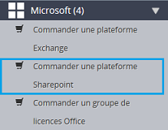
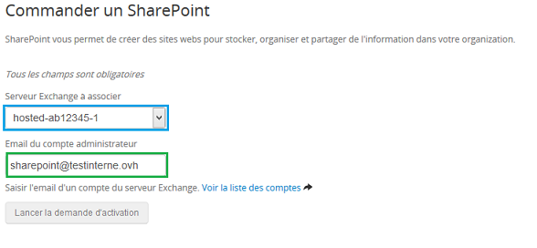
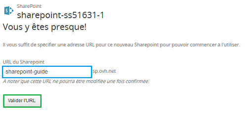

## 
Requisitos: Tener contratada una solución Exchange Hosted 2013 o 2016.
Conéctese al [área de cliente de OVH](https://www.ovh.com/manager/web/login/).

En la columna izquierda, seleccione el menú «Microsoft» y haga clic en «Contratar una plataforma SharePoint».

{.thumbnail}
Seleccione el servidor Hosted Exchange correspondiente e indique una dirección de correo electrónico que ya exista en ese servicio.

A continuación, haga clic en «Enviar la solicitud de activación».

{.thumbnail}
El sistema le redirigirá a nuestro sitio web para finalizar el pedido.

{.thumbnail}
Haga clic en «Continuar» para aceptar los contratos relacionados con SharePoint y generar la orden de pedido.

Una vez abonada, la entrega del servicio SharePoint se realiza en un plazo máximo de 4 horas.

## 
Cuando el servicio esté disponible, será necesario activarlo.

Recibirá por correo electrónico un mensaje con el asunto «Configurar el servicio Microsoft SharePoint» informándole de que ya puede proceder a la activación.

Puede consultar el mensaje desde su área de cliente en «Mi cuenta» > «Mensajes recibidos».

{.thumbnail}

## Finalización de la activación
Para finalizar la activación, acceda a su área de cliente y, en la columna izquierda, seleccione «Microsoft» y «SharePoint».

{.thumbnail}
Indique aquí la URL de su SharePoint. Se realizará una verificación. Si la URL indicada está disponible, se activará podrá confirmarla.

{.thumbnail}
Una vez confirmada la URL, deberá esperar hasta 4 horas a que finalice la activación.

## 
Para gestionar el servicio SharePoint, acceda al área de cliente de OVH y, en la columna izquierda, haga clic en «Microsoft» > «Sharepoint».

{.thumbnail}
Información general

En esta pestaña se muestra la siguiente información:

- Referencia del servicio.
- «Acceso»: URL del servicio y servidor Exchange asociado al SharePoint.
- «Consumo»: Información relativa al espacio de almacenamiento.

{.thumbnail}
Usuarios

En esta pestaña encontrará lo siguiente:

- «Restaurar los permisos de administrador»: Este botón permite restablecer los permisos de administrador de un usuario en caso de realizar alguna manipulación errónea desde la interfaz de SharePoint.

- Tabla de usuarios.

Por defecto la cuenta introducida al realizar el pedido es la de usuario llano. Si desea cambiarla a administrador, puede hacerlo desde la rueda dentada situada al final de la línea correspondiente.

Desde ese mismo lugar puede también cambiar la contraseña de conexión.

Si quiere añadir un usuario de SharePoint adicional, haga clic en la rueda dentada situada al final de la cuenta Exchange correspondiente y seleccione «Activar SharePoint». Esta acción implica la contratación de una nueva licencia.

{.thumbnail}
Si quiere utilizar SharePoint en modo de lectura, no es necesario activar un nuevo usuario. Por defecto, todas las cuentas Exchange asociadas a la plataforma pueden conectarse en modo de lectura.

